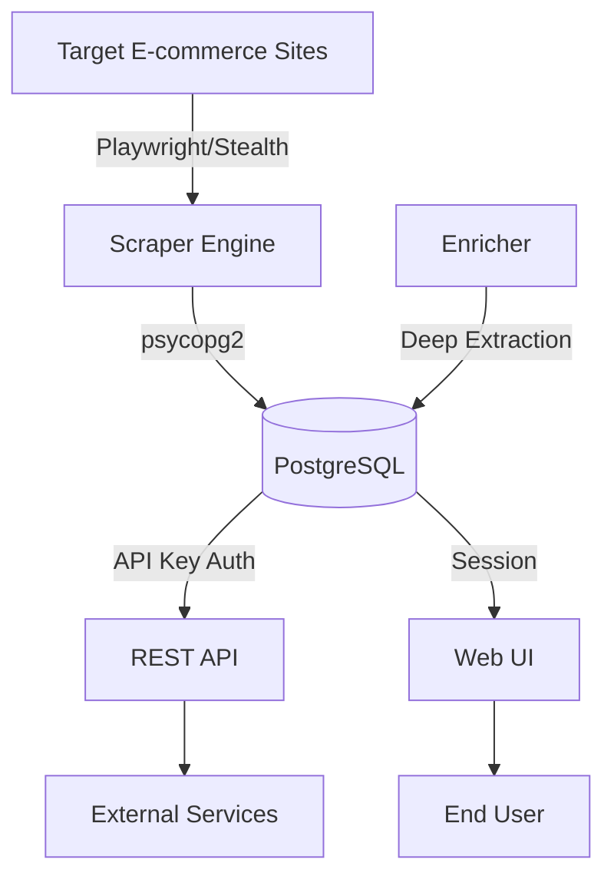
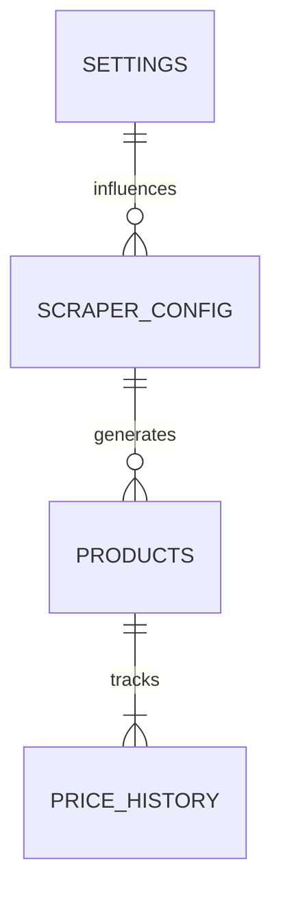

<details>
<summary>Relevant source files</summary>

The following files were used as context for generating this wiki page:

- [README.md](README.md)
- [scraper/scraper.py](scraper/scraper.py)
- [scraper/enrich.py](scraper/enrich.py)
- [CLAUDE.md](CLAUDE.md)
- [AGENTS.md](AGENTS.md)
- [webui/templates/index.html](webui/templates/index.html)
- [webui/templates/config.html](webui/templates/config.html)
- [fetcher/fetcher.py](fetcher/fetcher.py)
</details>

# Overview & Key Features

The Web Scraper Platform is a production-ready system designed for multi-site e-commerce data extraction, price monitoring, and product enrichment. It utilizes a modern tech stack including Playwright for headless browser automation, PostgreSQL for data persistence, and a dual-interface approach comprising a Flask-based Web UI and a FastAPI REST API.

The platform's primary scope is to automate the tracking of product data (title, price, URL) across various e-commerce sites, provide stealth capabilities to bypass bot protection, and offer tools for programmatic or manual monitoring of price drops.

Sources: [README.md:1-15](README.md#L1-L15), [CLAUDE.md:3-8](CLAUDE.md#L3-L8)

## Core Architecture

The system is built as a containerized application managed by Docker and Supervisor. It consists of several decoupled modules that handle scraping, data serving, and UI interactions.

### Component Overview

| Component | Responsibility | Technology |
|-----------|----------------|------------|
| **Scraper Engine** | Core logic for site crawling and data extraction | Playwright, Python |
| **REST API** | Programmatic access to products and configurations | FastAPI |
| **Web UI** | Dashboard and configuration management | Flask, Bootstrap |
| **Database** | Persistent storage for products, history, and settings | PostgreSQL |
| **Fetcher** | Stateless worker for remote rendering (optional) | Playwright |
| **Enricher** | One-shot product detail extraction | Playwright, Heuristics |

Sources: [CLAUDE.md:11-25](CLAUDE.md#L11-L25), [scraper/scraper.py:28-40](scraper/scraper.py#L28-L40), [fetcher/fetcher.py:1-15](fetcher/fetcher.py#L1-L15)

### System Data Flow

The following diagram illustrates how data flows from target websites through the scraping engine into the database and out to users.



*The diagram shows the lifecycle of scraped data from ingestion to consumption.*
Sources: [scraper/scraper.py:245-280](scraper/scraper.py#L245-L280), [README.md:55-65](README.md#L55-L65), [scraper/enrich.py:10-20](scraper/enrich.py#L10-L20)

## Key Features

### Multi-Site Scraping & Auto-Discovery
The platform supports scraping multiple sites concurrently using CSS selectors defined in `scraper_config`. It features two primary pagination modes:
*  **Query-based**: Standard `?page=N` iteration.
*  **Subcategory discovery**: Automatically follows category links to find products across a site's hierarchy.

Sources: [scraper/scraper.py:400-450](scraper/scraper.py#L400-L450), [webui/templates/config.html:130-150](webui/templates/config.html#L130-L150)

### Stealth & Bot Protection
To maintain access to protected sites, the system implements:
*  **Stealth Mode**: Integration with `playwright-stealth` to bypass services like Akamai, Cloudflare, and PerimeterX.
*  **Heuristic Detection**: A `/detect` endpoint that identifies bot protection types (e.g., Akamai, Cloudflare) and suggests enabling stealth mode.
*  **Proxy Support**: Support for SOCKS5/HTTP proxies per site configuration.

Sources: [scraper/scraper.py:825-860](scraper/scraper.py#L825-L860), [README.md:17-25](README.md#L17-L25), [webui/templates/config.html:180-200](webui/templates/config.html#L180-L200)

### Product Enrichment
While the main scraper focuses on category listings, the `enrich.py` module performs deep extraction on individual product pages. It uses heuristics to extract:
*  JSON-LD Structured Data (`Product` nodes)
*  Open Graph metadata (`og:description`)
*  Standard Meta descriptions

```python
# Heuristic extraction logic from enrich.py
_EXTRACT_JS = """
(detailSelector) => {
  // 1. JSON-LD Product description (most reliable)
  // 2. Open Graph / 3. standard meta description
  const og = document.querySelector('meta[property="og:description"]');
  if (og && og.content) return clean(og.content);
}
"""
```

Sources: [scraper/enrich.py:65-95](scraper/enrich.py#L65-L95)

## Data Model (PostgreSQL)

The system uses a relational schema to track product evolution over time.

| Table | Description |
|-------|-------------|
| `products` | Current state of scraped items (title, price, description). |
| `price_history` | Temporal records of price changes for trend analysis. |
| `scraper_config` | Site-specific rules, selectors, and stealth settings. |
| `settings` | Global application parameters (concurrent pages, intervals). |

Sources: [README.md:125-185](README.md#L125-L185), [scraper/scraper.py:195-240](scraper/scraper.py#L195-L240)

## Advanced Configuration

Global system behavior is managed via the `settings` table, which can be modified through the Web UI.



*Entity relationship summary showing the hierarchy of configuration to data.*
Sources: [scraper/scraper.py:45-75](scraper/scraper.py#L45-L75), [README.md:125-135](README.md#L125-L135)

### Key Global Settings
*  **Concurrent Pages**: 1-10 simultaneous browser instances.
*  **Scrape Interval**: Seconds between full runs (default 3600s).
*  **Alert Thresholds**: Minimum percentage or absolute drop required to trigger notifications.

Sources: [scraper/scraper.py:45-75](scraper/scraper.py#L45-L75)

## Security and Credentials

The platform emphasizes security through automatic credential generation and strict environment variable usage.
*  **Auto-generation**: Database passwords and API keys are generated on the first startup and stored in the `/credentials` directory.
*  **API Security**: All REST endpoints (except `/health`) require an `X-API-Key` header verified via `hmac.compare_digest`.
*  **SSRF Protection**: URL validation prevents requests to private/internal IP addresses (e.g., 127.0.0.1, 10.0.0.0/8).

Sources: [scraper/scraper.py:130-160](scraper/scraper.py#L130-L160), [scraper/scraper.py:730-745](scraper/scraper.py#L730-L745), [README.md:85-105](README.md#L85-L105), [SECURITY.md:15-20](SECURITY.md#L15-L20)

## Conclusion
The Web Scraper Platform provides a comprehensive suite for e-commerce monitoring, balancing ease of use via the Web UI with high-performance scraping capabilities. Its use of Playwright and heuristic-based enrichment ensures high data quality even on modern, JavaScript-heavy retail websites.
