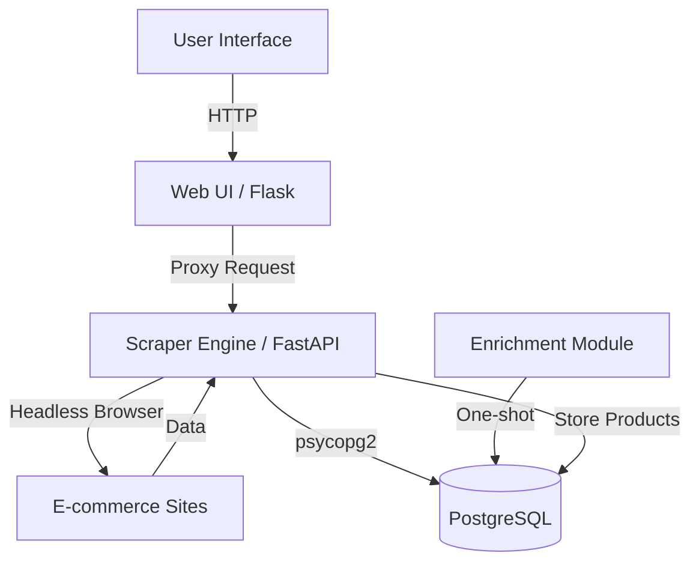
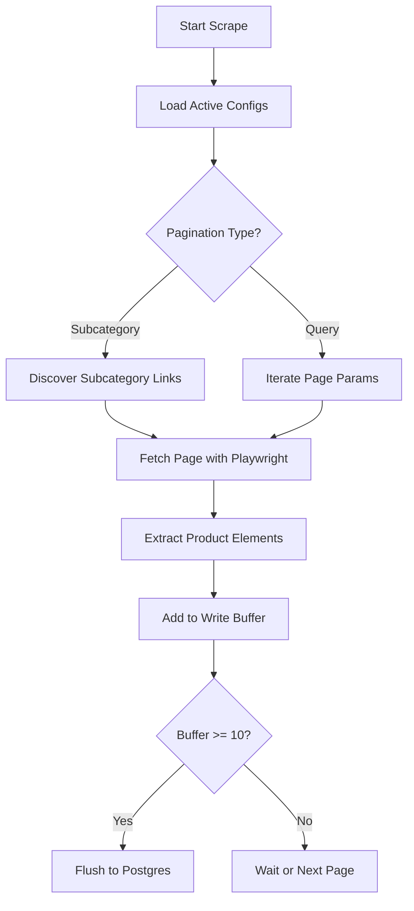

Relevant source files

The following files were used as context for generating this wiki page:

- [README.md](README.md)
- [scraper/scraper.py](scraper/scraper.py)
- [webui/app.py](webui/app.py)
- [webui/templates/index.html](webui/templates/index.html)
- [webui/templates/config.html](webui/templates/config.html)
- [scraper/enrich.py](scraper/enrich.py)
- [CLAUDE.md](CLAUDE.md)

# Overview & Key Features

The Web Scraper Platform is a production-ready system designed for multi-site e-commerce scraping, data enrichment, and price monitoring. It integrates a headless browser engine using Playwright with a PostgreSQL backend, a Flask-based Web UI for management, and a FastAPI-powered REST API for external consumption.

Sources: [README.md:5-15](README.md#L5-L15), [CLAUDE.md:3-5](CLAUDE.md#L3-L5)

The platform's primary scope includes automated product discovery, stealth-enabled scraping to bypass bot protections (like Cloudflare and Akamai), and price history tracking. It is structured to run as a containerized stack, utilizing Docker Compose for orchestration.

Sources: [README.md:17-25](README.md#L17-L25), [CLAUDE.md:21-28](CLAUDE.md#L21-L28)

## Core Architecture

The system follows a multi-component architecture where the Scraper Engine, Web UI, and Database interact through defined protocols and shared credentials.

### Component Relationship
The diagram below illustrates the high-level data flow between the User, the Control Plane (Web UI), the Scraper Engine, and the Database.

*Note: The Web UI acts as a control plane, proxying requests to the Scraper Engine for configuration and manual triggers.*
Sources: [webui/app.py:27-30](webui/app.py#L27-L30), [scraper/scraper.py:202-210](scraper/scraper.py#L202-L210), [scraper/enrich.py:12-25](scraper/enrich.py#L12-L25)

### Key Components

| Component | Technology | Description |
|-----------|------------|-------------|
| **Scraper Engine** | Playwright, FastAPI | Executes scraping tasks, handles stealth modes, and manages the scraping loop. |
| **Web UI** | Flask, Bootstrap 5 | Provides a dashboard for monitoring stats and a configuration interface for site management. |
| **Enrichment Module**| Python, Playwright | Visits specific product pages to extract detailed source text and JSON-LD data. |
| **Database** | PostgreSQL | Stores product data, price history, site configurations, and system settings. |

Sources: [CLAUDE.md:7-12](CLAUDE.md#L7-L12), [README.md:58-62](README.md#L58-L62), [scraper/scraper.py:46-52](scraper/scraper.py#L46-L52)

## Scraping & Stealth Features

The platform is designed to handle modern web protections through specialized modules and configurations.

### Stealth and Bot Protection
The scraper utilizes `playwright-stealth` and specific browser arguments to avoid detection. It can identify common protections like Akamai, Cloudflare, PerimeterX, and Distil.
Sources: [scraper/scraper.py:101-107](scraper/scraper.py#L101-L107), [scraper/scraper.py:730-745](scraper/scraper.py#L730-L745)

*  **Heuristic Detection:** The `/detect` endpoint runs JS-based heuristics to identify product containers, titles, prices, and links automatically.
*  **Stealth Mode:** When enabled, the engine applies stealth patches to the Playwright browser context to mimic human behavior.

Sources: [scraper/scraper.py:650-728](scraper/scraper.py#L650-L728), [webui/templates/config.html:200-230](webui/templates/config.html#L200-L230)

### Scraping Logic Flow
The engine supports both query-based pagination and subcategory auto-discovery.

Sources: [scraper/scraper.py:410-480](scraper/scraper.py#L410-L480), [scraper/scraper.py:530-545](scraper/scraper.py#L530-L545)

## Data Management & Schema

The system maintains a relational structure to track product changes over time.

### Database Schema Overview
The database includes tables for products, their price history, and scraper configurations.

| Table | Primary Key | Description |
|-------|-------------|-------------|
| `products` | `id` | Stores current product state, including `current_price` and metadata. |
| `price_history` | `id` | Tracks every price change for every product for historical analysis. |
| `scraper_config` | `id` | Contains CSS selectors, base URLs, and site-specific settings (proxy, stealth). |
| `settings` | `key` | Global system configurations like `scrape_interval` and `concurrent_pages`. |

Sources: [README.md:120-175](README.md#L120-L175), [scraper/scraper.py:230-280](scraper/scraper.py#L230-L280)

### Data Enrichment
The `enrich.py` module performs one-shot, resumable tasks to gather deep product details that are not available on listing pages, such as full descriptions from JSON-LD or meta tags.
Sources: [scraper/enrich.py:12-25](scraper/enrich.py#L12-L25), [scraper/enrich.py:84-115](scraper/enrich.py#L84-L115)

## Security & Configuration

Security is managed through automatic credential generation and restricted API access.

### Authentication & Secrets
*  **API Key:** Generated on first startup and stored in `/credentials/api_key`. All REST endpoints (except `/health`) require the `X-API-Key` header.
*  **Engine Key:** A separate `X-Engine-Key` is used for communication between the Web UI and the Scraper Engine.
*  **Path Validation:** The Web UI implements strict path validation using regex (`PATH_RE`) to prevent Server-Side Request Forgery (SSRF).

Sources: [webui/app.py:85-100](webui/app.py#L85-L100), [scraper/scraper.py:165-175](scraper/scraper.py#L165-L175), [README.md:85-95](README.md#L85-L95)

### Advanced System Settings

| Setting | Type | Default | Description |
|---------|------|---------|-------------|
| `concurrent_pages` | int | 2 | Number of pages scraped simultaneously. |
| `scrape_interval` | int | 3600 | Seconds between full scraping runs. |
| `headless` | bool | True | Whether to run the browser without a UI. |
| `min_drop_percent` | float | 5.0 | Minimum price drop to trigger an alert. |

Sources: [scraper/scraper.py:53-90](scraper/scraper.py#L53-L90)

## Summary

The Web Scraper Platform provides a robust environment for e-commerce data collection. By combining a flexible configuration system with advanced stealth capabilities and automated selector detection, it enables developers to monitor multiple sites with minimal manual intervention. The integration of price history and automated data enrichment ensures that the gathered data is both historically accurate and contextually rich for downstream services.

Sources: [README.md:5-25](README.md#L5-L25), [CLAUDE.md:3-5](CLAUDE.md#L3-L5)
