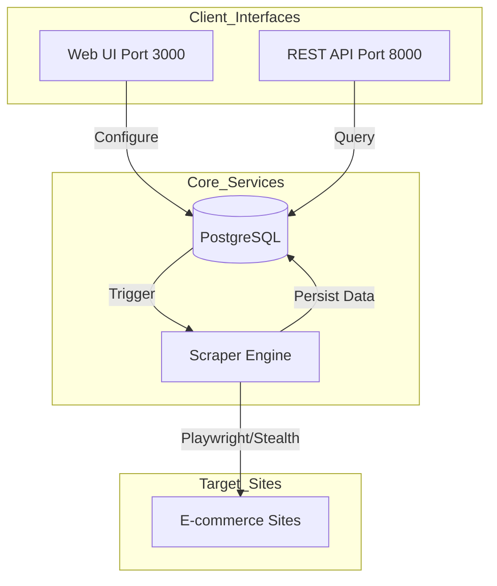
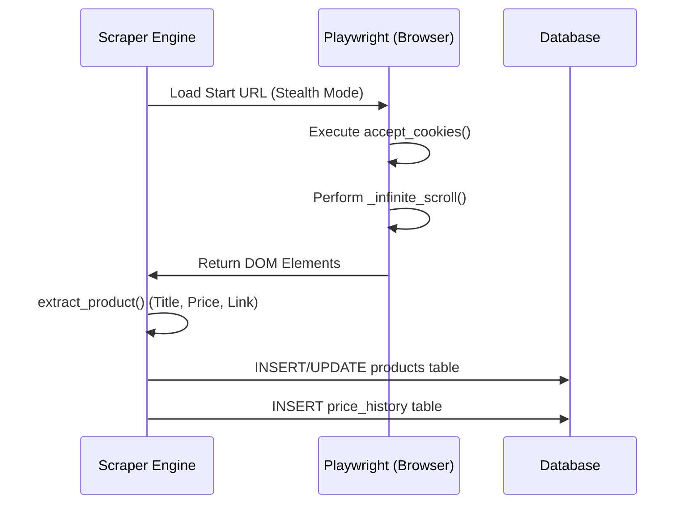

<details>
<summary>Relevant source files</summary>

The following files were used as context for generating this wiki page:

- [README.md](README.md)
- [scraper/scraper.py](scraper/scraper.py)
- [CLAUDE.md](CLAUDE.md)
- [CONTRIBUTING.md](CONTRIBUTING.md)
- [AGENTS.md](AGENTS.md)
- [webui/templates/config.html](webui/templates/config.html)

</details>

# Quick Start Guide

The Web Scraper Platform is a production-ready solution designed for multi-site e-commerce scraping, price monitoring, and data exposure via REST API and WebUI. It leverages Playwright for headless browser scraping and PostgreSQL for persistent data storage, featuring built-in stealth modes to bypass common bot protections like Cloudflare and Akamai.

Sources: [README.md:1-20](README.md#L1-L20), [CLAUDE.md:3-8](CLAUDE.md#L3-L8)

## Initial Setup and Deployment

The platform is designed to run primarily via Docker, ensuring a consistent environment for the scraper engine, database, and user interface.

### Environment Configuration
Users must create a `.env` file containing critical path and localization variables. Only three variables are strictly required for the initial launch.

```bash
# Example .env configuration
DOCKER=/path/to/docker/data   # volume storage location
DOMAIN=example.com            # custom hostname
TZ=Europe/Stockholm           # system timezone
```

Sources: [README.md:104-110](README.md#L104-L110)

### Directory Structure
Before starting the containers, the following host directories must exist to persist data:
*  `scraper/postgres`: Database files
*  `scraper/logs`: Application logs
*  `scraper/playwright-cache`: Browser cache
*  `scraper/credentials`: Auto-generated secrets

Sources: [README.md:35-37](README.md#L35-L37)

### Service Startup
The platform uses Docker Compose to orchestrate three primary services:
1.  `postgres`: Internal database service on port 5432.
2.  `scraper` (WebUI): Accessible on port 3000.
3.  `scraper` (REST API): Accessible on port 8000.

Sources: [README.md:52-57](README.md#L52-L57), [CLAUDE.md:32-38](CLAUDE.md#L32-L38)

## Credential Management

Credentials are auto-generated on the first system start to ensure security. These are stored in the `DOCKER/scraper/credentials/` directory.

| File | Description | Source |
| :--- | :--- | :--- |
| `db_password` | PostgreSQL password | [README.md:65](README.md#L65) |
| `api_key` | REST API authentication key | [README.md:66](README.md#L66) |
| `discord_webhook` | URL for price drop notifications (Manual setup) | [README.md:67](README.md#L67) |

### Retrieving Generated Secrets
After the initial `docker compose up -d`, secrets can be retrieved from the logs or the file system:

```bash
# Retrieve API key from filesystem
cat /path/to/docker/data/scraper/credentials/api_key

# Check database password in logs
docker compose logs postgres
```

Sources: [README.md:44-45](README.md#L44-L45), [README.md:71-72](README.md#L71-L72)

## System Architecture

The following diagram illustrates the interaction between the scraping engine, the storage layer, and the user interfaces.



The Scraper Engine utilizes Playwright to fetch data from target sites, which is then stored in PostgreSQL. Users interact with this data through a Flask-based WebUI or a FastAPI-based REST API.
Sources: [CLAUDE.md:10-38](CLAUDE.md#L10-L38), [scraper/scraper.py:270-300](scraper/scraper.py#L270-L300)

## Configuring a New Scraper

Scraping behavior is defined via Site Configurations. These can be added manually through the WebUI or using pre-defined templates for popular sites like Inet.se, Komplett.se, and Webhallen.com.

### Mandatory Selectors
To scrape a site, the following CSS selectors must be defined:
*  **Product Selector**: The container for an individual product item.
*  **Title Selector**: The element containing the product name.
*  **Price Selector**: The element containing the price string.
*  **Link Selector**: The anchor tag pointing to the product page.

Sources: [webui/templates/config.html:68-85](webui/templates/config.html#L68-L85), [scraper/scraper.py:345-360](scraper/scraper.py#L345-L360)

### Scraper Execution Logic
The scraper operates in different modes based on the site's structure, primarily handling standard pagination or subcategory discovery.



Sources: [scraper/scraper.py:440-480](scraper/scraper.py#L440-L480), [scraper/scraper.py:530-560](scraper/scraper.py#L530-L560)

## REST API Usage

All API endpoints (except `/health`) require authentication via the `X-API-Key` header.

### Common Endpoints
| Method | Endpoint | Description |
| :--- | :--- | :--- |
| `GET` | `/products` | List all scraped products |
| `GET` | `/products?search=...` | Filter products by name |
| `GET` | `/deals` | Retrieve products with significant price drops |
| `POST` | `/scrape` | Manually trigger a scraping run |

Sources: [README.md:78-87](README.md#L78-L87), [scraper/scraper.py:882-895](scraper/scraper.py#L882-L895)

## Development Setup

For developers contributing to the project, a local environment can be established without Docker:

1.  **Install Dependencies**:

```bash
    pip install -r requirements.txt
    playwright install chromium
    ```

2.  **Environment Setup**:

```bash
    cp .env.example .env
    # Edit .env with local DB details
    ```

3.  **Run Services Individually**:
  *  API: `uvicorn api.api:app --reload`
  *  Web UI: `flask --app webui.app run`

Sources: [CLAUDE.md:12-21](CLAUDE.md#L12-L21), [CONTRIBUTING.md:27-38](CONTRIBUTING.md#L27-L38)

## Summary
The Web Scraper Platform provides a managed ecosystem for automated data extraction. By combining Playwright's browser automation with a structured PostgreSQL schema, it allows for sophisticated tracking of e-commerce prices. Users can get started quickly using Docker and built-in site templates, with the flexibility to expand via the REST API or custom CSS selectors.

Sources: [README.md:1-25](README.md#L1-L25), [AGENTS.md:5-15](AGENTS.md#L5-L15)
