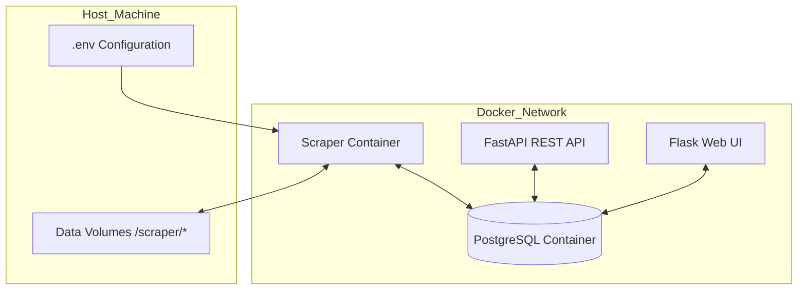
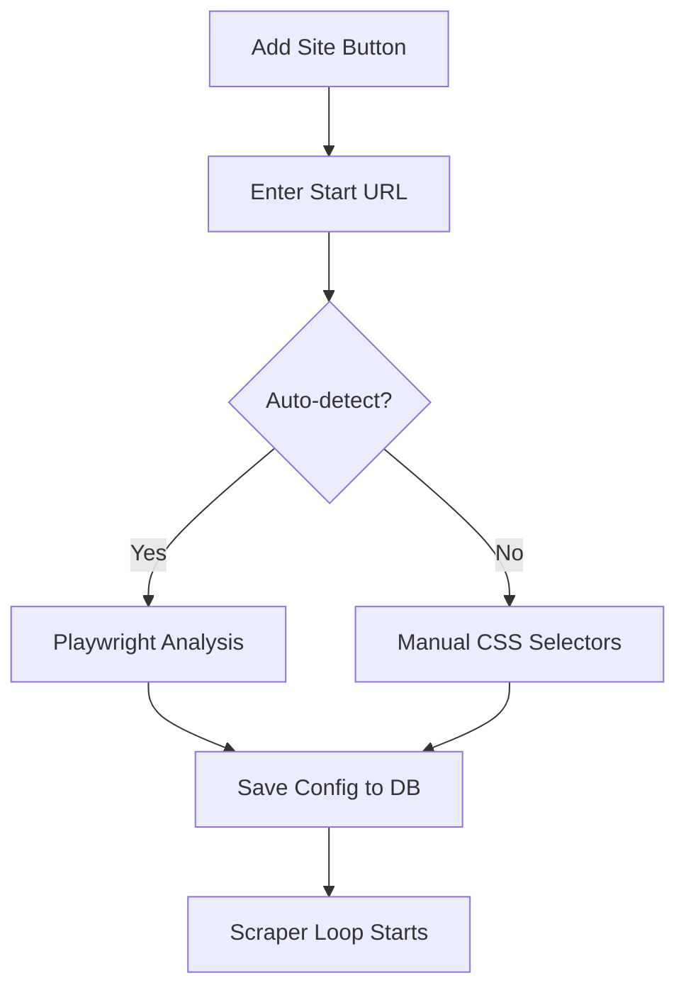

<details>
<summary>Relevant source files</summary>

The following files were used as context for generating this wiki page:

- [README.md](README.md)
- [scraper/scraper.py](scraper/scraper.py)
- [CLAUDE.md](CLAUDE.md)
- [AGENTS.md](AGENTS.md)
- [CONTRIBUTING.md](CONTRIBUTING.md)
- [webui/templates/config.html](webui/templates/config.html)
</details>

# Quick Start Guide

The Web Scraper Platform is a production-ready system designed for multi-site e-commerce scraping, price monitoring, and data exposure via a REST API and WebUI. It utilizes a tech stack consisting of Python 3 (Flask and FastAPI), Playwright for headless browser automation, and PostgreSQL for persistent data storage.

This guide provides the necessary steps to deploy the platform using Docker, configure environment variables, and begin scraping product data. The system is designed to be "plug-and-play" with auto-generated credentials on first startup and built-in stealth modes to bypass common bot protection services like Akamai and Cloudflare.

Sources: [README.md:1-13](README.md#L1-L13), [CLAUDE.md:3-8](CLAUDE.md#L3-L8)

## Initial Deployment

The platform is primarily distributed as a Docker-based solution, allowing all services (PostgreSQL, WebUI, and REST API) to be started with a single command.

### Deployment Steps
1.  **Environment Setup**: Create a `.env` file containing the base directory for data storage and regional settings.
2.  **Directory Initialization**: Manually create the required subdirectories for database storage, logs, and credentials to ensure correct volume mapping.
3.  **Service Launch**: Execute the Docker compose stack.

```bash
# 1. Setup .env
cat > .env <<'EOF'
DOCKER=/path/to/docker/data
DOMAIN=example.com
TZ=Europe/Stockholm
EOF

# 2. Create directories
mkdir -p /path/to/docker/data/scraper/{postgres,logs,playwright-cache,credentials}

# 3. Start stack
docker compose up -d
```

Sources: [README.md:20-42](README.md#L20-L42), [CONTRIBUTING.md:28-35](CONTRIBUTING.md#L28-L35)

### Service Architecture
The following diagram illustrates the interaction between the primary services and the shared storage volumes.



The system exposes the Web UI on port `3000` and the REST API on port `8000` (or `8765` depending on internal mapping).
Sources: [README.md:46-52](README.md#L46-L52), [CLAUDE.md:23-28](CLAUDE.md#L23-L28)

## Credential Management

Credentials are automatically generated during the first startup and stored as plain text files within the `credentials` directory. This ensures a secure-by-default installation without requiring manual password configuration in `.env` files.

| File | Source | Purpose |
| :--- | :--- | :--- |
| `db_password` | `postgres` container | Password for the PostgreSQL `scraper` user |
| `api_key` | `scraper` container | `X-API-Key` required for REST API authentication |
| `engine_key` | `scraper` container | Internal key used for service-to-service communication |
| `webui_password` | `scraper` container | Password for WebUI Basic Authentication (username: admin) |

Sources: [README.md:56-65](README.md#L56-L65), [scraper/scraper.py:165-177](scraper/scraper.py#L165-L177), [webui/app.py:84-90](webui/app.py#L84-L90)

To retrieve generated credentials after initialization:

```bash
# API key for REST API access
cat /path/to/docker/data/scraper/credentials/api_key

# WebUI password for Basic Auth (username: admin)
cat /path/to/docker/data/scraper/credentials/webui_password
```

The WebUI on port 3000 is protected by Basic Auth (username: `admin`, password from `webui_password` file).

Sources: [README.md:67-70](README.md#L67-L70), [webui/app.py:106-120](webui/app.py#L106-L120)

## Configuration and Usage

Once the platform is running, users interact with it primarily through the WebUI for site configuration or the REST API for data consumption.

### Adding a Scraper Site
Users can configure new sites via the WebUI by navigating to `/config`. The system provides templates for popular Swedish retailers and an "Auto-detect" feature that uses Playwright heuristics to identify CSS selectors for titles, prices, and links.



Sources: [webui/templates/config.html:43-125](webui/templates/config.html#L43-L125), [scraper/scraper.py:837-975](scraper/scraper.py#L837-L975)

### API Interaction
All API endpoints (except `/health`) require the `X-API-Key` header.

*  **List Products**: `GET /products`
*  **Search**: `GET /products?search=RTX`
*  **Check Health**: `GET /health` (No authentication required)

Sources: [README.md:76-88](README.md#L76-L88), [scraper/scraper.py:1140-1144](scraper/scraper.py#L1140-L1144)

## System Requirements and Settings

The `scraper/scraper.py` module maintains a set of configurable parameters that can be adjusted via the "Advanced Settings" section in the WebUI.

| Setting | Type | Default | Description |
| :--- | :--- | :--- | :--- |
| `concurrent_pages` | Integer | 2 | Number of simultaneous Playwright pages |
| `scrape_interval` | Integer | 3600s | Delay between full scraping cycles |
| `headless` | Boolean | True | Whether to run browser without a GUI |
| `min_drop_percent`| Float | 5.0% | Threshold for price drop alerts |

Sources: [scraper/scraper.py:46-78](scraper/scraper.py#L46-L78)

The application logic follows a specific flow for every scraping run:
1.  Initialize connection pool and verify database schema.
2.  Load active site configurations from `scraper_config` table.
3.  Launch Playwright with specified stealth arguments (e.g., `--disable-blink-features=AutomationControlled`).
4.  Execute scraping, apply cookie consent bypass, and flush data to `products` and `price_history` tables.

Sources: [scraper/scraper.py:180-200](scraper/scraper.py#L180-L200), [scraper/scraper.py:537-560](scraper/scraper.py#L537-L560)

## Troubleshooting
*  **Postgres Permission Issues**: If the database fails to start, ensure the data directory is owned by UID 999: `sudo chown -R 999:999 ${DOCKER}/scraper/postgres`.
*  **Missing API Key**: Check the file directly at `/path/to/docker/data/scraper/credentials/api_key`.
*  **Scraping Failures**: Use the "Detect" button in the WebUI to test if selectors are still valid. Check `docker compose logs scraper` for Playwright errors.

Sources: [README.md:105-125](README.md#L105-L125), [CONTRIBUTING.md:11-16](CONTRIBUTING.md#L11-L16)

The Web Scraper Platform provides a robust foundation for automated data collection. By combining Docker containerization with automated selector detection and stealth browser techniques, it simplifies the transition from local development to production-scale scraping.
