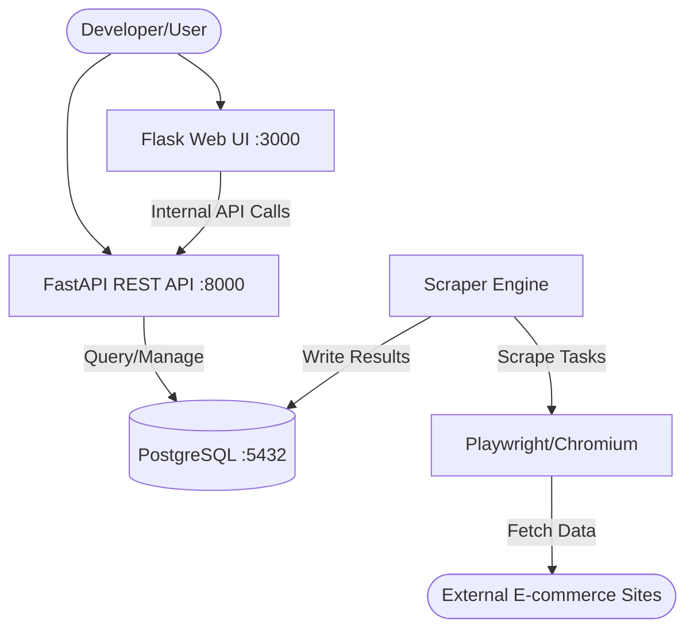

<details>
<summary>Relevant source files</summary>

The following files were used as context for generating this wiki page:

- [CONTRIBUTING.md](CONTRIBUTING.md)
- [CLAUDE.md](CLAUDE.md)
- [AGENTS.md](AGENTS.md)
- [README.md](README.md)
- [scraper/scraper.py](scraper/scraper.py)
</details>

# Local Development Setup

Local development setup for the Web Scraper Platform involves configuring a multi-service architecture that includes a Python-based scraper engine, a FastAPI REST API, a Flask Web UI, and a PostgreSQL database. The environment can be managed either through direct host installation for individual component development or via Docker Compose for a full-stack experience.

The platform relies on Playwright for headless browser automation and utilizes environment variables for all sensitive configuration and credential management.

Sources: [CLAUDE.md](CLAUDE.md), [README.md](README.md), [scraper/scraper.py](scraper/scraper.py)

## Environment Configuration

Before running the services, specific environment variables and directory structures must be established. The system uses a `.env` file for primary configuration and automatically generates certain credentials on the first startup if they are not provided.

### Mandatory Environment Variables
| Variable | Description |
| :--- | :--- |
| `DOCKER` | Path to the local directory where persistent volumes are stored. |
| `TZ` | Timezone for the containers (e.g., `Europe/Stockholm`). |
| `DOMAIN` | Hostname for the setup (optional). |

### Required Directory Structure
The following directories must be manually created in the path defined by the `DOCKER` variable to allow for volume mounting:
- `/scraper/postgres`: Database data files.
- `/scraper/logs`: Application and scraper logs.
- `/scraper/playwright-cache`: Browser binaries and cache.
- `/scraper/credentials`: Automatically generated API keys and DB passwords.

Sources: [CONTRIBUTING.md:24-27](CONTRIBUTING.md#L24-L27), [README.md:46-51](README.md#L46-L51), [README.md:105-109](README.md#L105-L109)

## Component Architecture

The development environment consists of three primary logic blocks interacting with a central PostgreSQL database.



The diagram above illustrates the flow of data from external websites through the Playwright-driven Scraper Engine into the PostgreSQL database, which is then served via the REST API and Web UI.
Sources: [CLAUDE.md:17-23](CLAUDE.md#L17-L23), [README.md:73-77](README.md#L73-L77), [scraper/scraper.py:270-340](scraper/scraper.py#L270-L340)

## Setup Methods

### 1. Docker Compose (Recommended)
This method starts the full production-parity stack.

1.  **Initialize Environment**:

```bash
    cp .env.example .env
    # Edit .env with your DOCKER path and TZ
    ```

2.  **Start Stack**:

```bash
    docker compose up -d
    ```

3.  **Retrieve Credentials**:
  On the first run, the system generates an API key and database password.

```bash
    docker compose logs postgres   # View generated DB password
    docker compose logs scraper    # View generated API key
    ```

Sources: [CONTRIBUTING.md:23-32](CONTRIBUTING.md#L23-L32), [README.md:44-67](README.md#L44-L67)

### 2. Manual Host Installation
For developers wishing to run components individually for debugging.

1.  **Install Dependencies**:

```bash
    pip install -r requirements.txt
    playwright install chromium
    ```

2.  **Start Services**:
  - **API Server**: `uvicorn api.api:app --reload`
  - **Web UI**: `flask --app webui.app run`
  - **Scraper**: `python scraper/scraper.py` (requires a running PostgreSQL instance)

Sources: [CLAUDE.md:10-15](CLAUDE.md#L10-L15), [AGENTS.md:10-15](AGENTS.md#L10-L15)

## Development Workflow and Standards

The project follows strict development guidelines to ensure stability and security.

### Code Standards
- **Python**: Must adhere to PEP 8 style guides.
- **JavaScript**: Managed via provided ESLint configurations.
- **Permissions**: The `entrypoint.sh` script enforces restrictive permissions on the `credentials/` directory at every startup.
- **Error Reporting**: Unexpected exceptions are reported to GitHub via `report_error_to_github()` if `GITHUB_ERROR_REPORT_TOKEN` is configured.

### Database Schema Reference
Local development often requires direct database interaction. The primary tables are:
- `scraper_config`: Stores site-specific selectors and scrape intervals.
- `products`: Stores currently tracked product data and prices.
- `price_history`: Historical price points for trend analysis.
- `settings`: Global application settings managed via the Web UI.

Sources: [CONTRIBUTING.md:45-51](CONTRIBUTING.md#L45-L51), [CLAUDE.md:26-36](CLAUDE.md#L26-L36), [README.md:144-200](README.md#L144-L200)

## Troubleshooting the Setup

| Issue | Resolution |
| :--- | :--- |
| **Postgres won't start** | Ensure the local data directory has the correct UID/GID: `sudo chown -R 999:999 ${DOCKER}/scraper/postgres` |
| **API 401 Unauthorized** | Verify the `X-API-Key` header matches the key found in `${DOCKER}/scraper/credentials/api_key`. |
| **Playwright Errors** | In Docker, ensure the `playwright-cache` volume is correctly mapped. On host, run `playwright install`. |

Sources: [README.md:126-140](README.md#L126-L140), [scraper/scraper.py:440-455](scraper/scraper.py#L440-L455)

### Summary
Local development of the Web Scraper Platform is centered around a containerized architecture that minimizes manual configuration through auto-generated credentials and pre-defined Docker services. Developers can choose between a full-stack Docker deployment or individual component execution, provided the core environmental requirements and PostgreSQL dependencies are met.
