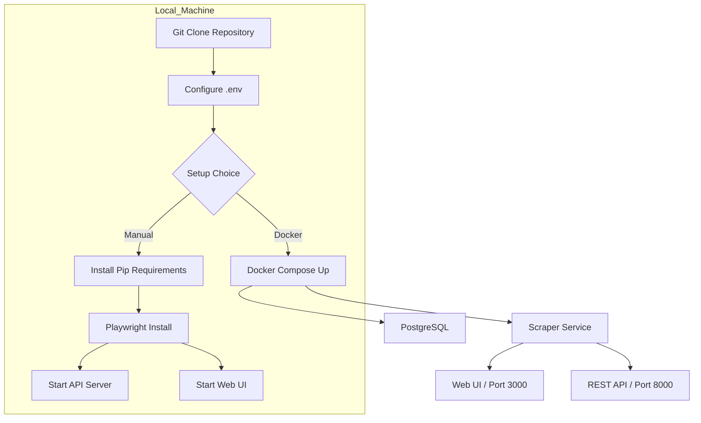
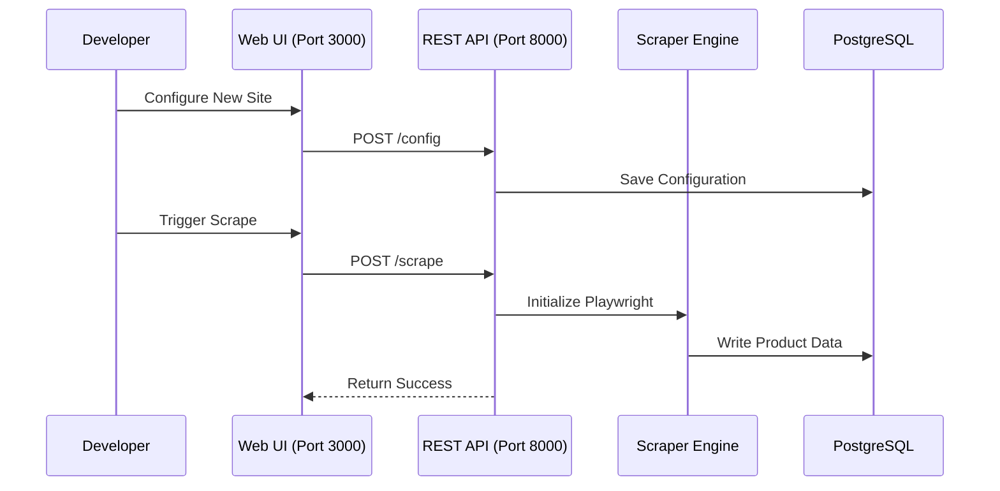

<details>
<summary>Relevant source files</summary>

The following files were used as context for generating this wiki page:

- [README.md](README.md)
- [CONTRIBUTING.md](CONTRIBUTING.md)
- [CLAUDE.md](CLAUDE.md)
- [AGENTS.md](AGENTS.md)
- [scraper/scraper.py](scraper/scraper.py)
</details>

# Local Development Setup

This page provides the necessary steps and technical details to set up the Web Scraper platform for local development. The project is a production-ready web scraping platform utilizing a Python-based backend (Flask and FastAPI), Playwright for browser automation, and PostgreSQL for data persistence.

The development environment can be managed either through a native Python installation for individual component development or via Docker Compose for a full-stack orchestration.

Sources: [README.md:1-12](README.md#L1-L12), [CLAUDE.md:1-5](CLAUDE.md#L1-L5)

## Prerequisites and Tech Stack

Before starting the setup, ensure your local machine meets the following requirements:

*  **Python 3**: The core logic is written in Python.
*  **Playwright**: Used for headless browser scraping with Chromium.
*  **PostgreSQL**: The primary database for product data and configurations.
*  **Docker & Docker Compose**: Recommended for service orchestration.
*  **Supervisor**: Used within the container to manage multiple processes.

Sources: [CLAUDE.md:7-12](CLAUDE.md#L7-L12), [AGENTS.md:7-12](AGENTS.md#L7-L12)

### Component Architecture

The system consists of several interconnected modules that must be initialized during development:



The diagram above illustrates the two primary paths for setting up the local development environment.

Sources: [CONTRIBUTING.md:21-38](CONTRIBUTING.md#L21-L38), [CLAUDE.md:14-23](CLAUDE.md#L14-L23)

## Installation Steps

### 1. Repository Initialization
First, fork and clone the repository to your local environment.

```bash
git clone https://github.com/YOUR_USERNAME/scraper.git
cd scraper
```

Sources: [CONTRIBUTING.md:21-23](CONTRIBUTING.md#L21-L23)

### 2. Environment Configuration
Create a `.env` file from the provided example. This file is required to define data paths and timezones.

```bash
cp .env.example .env
# Edit .env with your preferred editor
```

| Variable | Description | Example |
|----------|-------------|---------|
| `DOCKER` | Path where volumes (DB, logs, credentials) are stored | `/path/to/docker/data` |
| `DOMAIN` | Hostname for the application (optional) | `example.com` |
| `TZ` | System timezone | `Europe/Stockholm` |

Sources: [CONTRIBUTING.md:26-29](CONTRIBUTING.md#L26-L29), [README.md:104-111](README.md#L104-L111)

### 3. Manual Service Execution
For developers who prefer running services outside of Docker, the following commands initialize the environment and start the servers independently:

```bash
# Install dependencies
pip install -r requirements.txt
playwright install chromium

# Start REST API (FastAPI)
uvicorn api.api:app --reload

# Start Web UI (Flask)
flask --app webui.app run
```

Sources: [CLAUDE.md:14-23](CLAUDE.md#L14-L23), [AGENTS.md:14-23](AGENTS.md#L14-L23)

## Docker-Based Development

Using Docker Compose is the most efficient way to ensure all dependencies (PostgreSQL, Playwright, and environment permissions) are correctly configured.

### Service Orchestration
The `docker compose up -d` command starts the following stack:

| Container | Port | Description |
|-----------|------|-------------|
| `postgres` | 5432 | Internal database access. Port 5432 is exposed on localhost for MCP access. |
| `scraper` | 3000 | The Flask-based Web UI. |
| `scraper` | 8000 | The FastAPI REST API. |

Sources: [README.md:65-71](README.md#L65-L71), [scraper/scraper.py:843-851](scraper/scraper.py#L843-L851)

### Credential Generation
On the first startup, the platform automatically generates credentials in the `DOCKER/scraper/credentials/` directory:
*  `db_password`: Generated by the postgres container.
*  `api_key`: Required for all REST API endpoints except `/health`.
*  `engine_key`: Internal key for scraper communication.

Sources: [README.md:75-88](README.md#L75-L88), [scraper/scraper.py:161-177](scraper/scraper.py#L161-L177)

## Development Conventions

When contributing to the repository, adhere to the following standards:

*  **Permissions**: The `entrypoint.sh` script sets restrictive permissions on the credentials directory at every startup.
*  **Secrets Management**: All secrets (DB credentials, API keys) must be passed via environment variables. Never commit `.env` files.
*  **Shell Scripts**: Use `set -euo pipefail` at the top of all shell scripts for safety.
*  **Style**: Follow PEP 8 for Python and use the provided ESLint configuration for JavaScript.

Sources: [CONTRIBUTING.md:49-55](CONTRIBUTING.md#L49-L55), [CLAUDE.md:31-35](CLAUDE.md#L31-L35), [AGENTS.md:31-34](AGENTS.md#L31-L34)

### Data Flow Diagram



This diagram shows the typical development flow when testing new scraper configurations through the local UI and API.

Sources: [scraper/scraper.py:648-690](scraper/scraper.py#L648-L690), [README.md:126-150](README.md#L126-L150)

## Conclusion

Local development of the Scraper platform requires a combination of Python service management and database orchestration. By following the Docker-based setup, developers can ensure that the complex dependencies of Playwright and PostgreSQL are handled automatically, allowing for immediate focus on scraper logic and UI enhancements.
