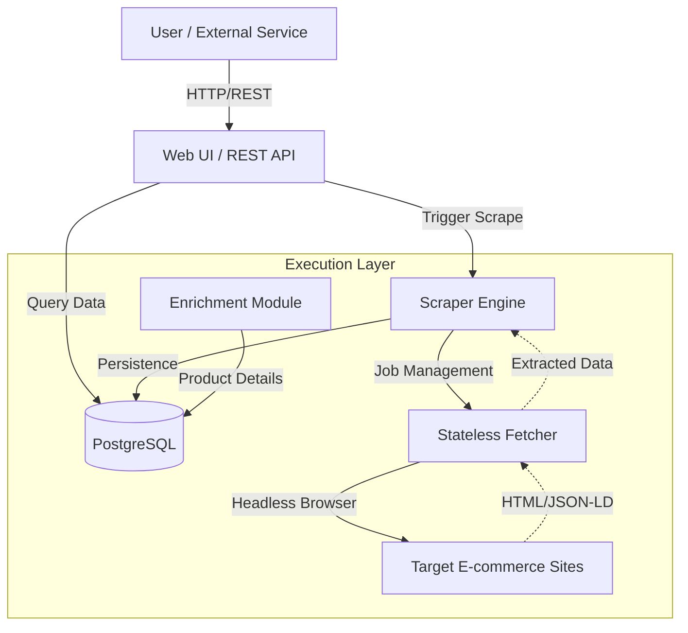
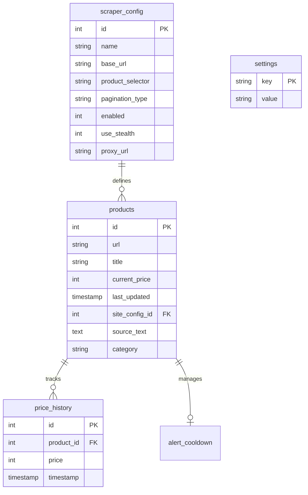
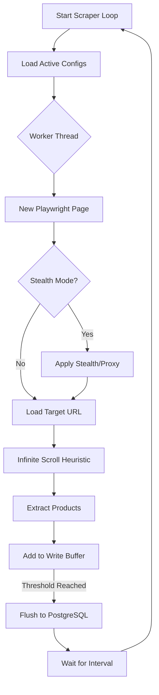

Relevant source files

The following files were used as context for generating this wiki page:

- [README.md](README.md)
- [scraper/scraper.py](scraper/scraper.py)
- [webui/app.py](webui/app.py)
- [fetcher/fetcher.py](fetcher/fetcher.py)
- [scraper/enrich.py](scraper/enrich.py)
- [CLAUDE.md](CLAUDE.md)
- [AGENTS.md](AGENTS.md)

# System Architecture Overview

## Introduction
The Web Scraper Platform is a production-ready system designed for multi-site e-commerce scraping, price monitoring, and data enrichment. It utilizes a containerized architecture to manage product data extraction via headless browsers, store historical price information in a PostgreSQL database, and provide both a REST API and a Web UI for management and consumption.

The system is structured into three primary layers: the **Control Plane** (Web UI and REST API), the **Execution Layer** (Scraper Engine and Fetchers), and the **Data Layer** (PostgreSQL). It supports advanced features such as stealth mode to bypass bot protection, automatic selector detection, and asynchronous data enrichment.
Sources: [README.md:1-15](README.md#L1-L15), [CLAUDE.md:3-8](CLAUDE.md#L3-L8), [AGENTS.md:3-8](AGENTS.md#L3-L8)

## Core Components
The architecture is composed of several specialized modules that interact to perform automated scraping tasks and serve data to end-users.

| Component | Technology | Description |
|-----------|------------|-------------|
| **Web UI** | Flask | Provides a graphical interface for configuration, monitoring, and data visualization. |
| **REST API** | FastAPI / Flask | Exposes endpoints for programmatic access to product data, deals, and stats. |
| **Scraper Engine** | Playwright / Python | Orchestrates the scraping logic, handles concurrent pages, and manages database persistence. |
| **Fetcher** | Playwright | A stateless component that performs headless browser rendering and extraction based on job leases. |
| **Enrichment Module** | Playwright / Python | Resumable process that visits individual product pages to extract detailed descriptions and metadata. |
| **Database** | PostgreSQL | Stores site configurations, product details, price history, and system settings. |

Sources: [README.md:11-20](README.md#L11-L20), [CLAUDE.md:10-25](CLAUDE.md#L10-L25), [scraper/scraper.py:25-50](scraper/scraper.py#L25-L50), [fetcher/fetcher.py:1-25](fetcher/fetcher.py#L1-L25)

### High-Level System Flow
The following diagram illustrates the interaction between the user, the control interface, the scraping engine, and the external target websites.

The diagram shows the flow of requests from the user through the Web UI/API to the Scraper Engine, which coordinates with Fetchers and the database to extract and store data from external sites.
Sources: [scraper/scraper.py:650-680](scraper/scraper.py#L650-L680), [fetcher/fetcher.py:35-50](fetcher/fetcher.py#L35-L50), [webui/app.py:110-150](webui/app.py#L110-L150)

## Data Layer and Schema
The system relies on a PostgreSQL database for all persistent state, including scraping configurations and historical price data.

### Database Entities

The ER diagram defines the relationships between site configurations, the products discovered, and their individual price histories.
Sources: [README.md:158-215](README.md#L158-L215), [scraper/scraper.py:175-250](scraper/scraper.py#L175-L250)

## Execution Logic

### Scraper Engine and Fetcher Interaction
The system uses a job-based model where the engine or a "Work-like" service (referenced in the Fetcher as `ENGINE_URL`) manages tasks that stateless fetchers lease and execute.

1.  **Lease:** Fetchers request a batch of rendering jobs.
2.  **Render:** Fetchers use Playwright to load URLs, handle SPA content, and bypass bot protection.
3.  **Extract:** Data is extracted using CSS selectors or JSON-LD heuristics.
4.  **Report:** Results are posted back to the engine for storage.

Sources: [fetcher/fetcher.py:1-20](fetcher/fetcher.py#L1-L20), [scraper/scraper.py:380-450](scraper/scraper.py#L380-L450)

### Scraping Process Flow

This flowchart details the internal logic of `scraper.py`, including stealth application, scrolling, and buffered database writes.
Sources: [scraper/scraper.py:400-550](scraper/scraper.py#L400-L550), [scraper/scraper.py:585-610](scraper/scraper.py#L585-L610)

## Data Enrichment and AI Grounding
The `enrich.py` module serves as a resumable background process to transform discovered product URLs into data-rich records. This is critical for downstream consumers like a "product-describer."

*  **Heuristic Extraction:** It prioritizes JSON-LD `Product` nodes, falling back to Open Graph (`og:description`) and standard meta tags.
*  **SPA Support:** It utilizes `RENDER_WAIT_MS` (default 12,000ms) to ensure client-side structured data is injected before extraction.
*  **State Management:** It uses the `source_text` column in the `products` table to track progress, where an empty string indicates a failed discovery and `NULL` indicates a pending task.

Sources: [scraper/enrich.py:15-50](scraper/enrich.py#L15-L50), [scraper/enrich.py:85-110](scraper/enrich.py#L85-L110)

## Security and Authentication
The system implements security at multiple levels:

*  **API Security:** All REST endpoints (except `/health`) require an `X-API-Key` provided via header.
*  **Inter-Service Security:** Communication between the Web UI and Scraper Engine is protected by an `X-Engine-Key`.
*  **Web UI Security:** Protected by Basic Authentication (`WEBUI_USERNAME` and `WEBUI_PASSWORD`).
*  **SSRF Protection:** The scraper validates all URLs against a list of private/internal network ranges to prevent Server-Side Request Forgery.

Sources: [README.md:73-85](README.md#L73-L85), [scraper/scraper.py:75-100](scraper/scraper.py#L75-L100), [webui/app.py:85-115](webui/app.py#L85-L115)

## Conclusion
The architecture of the Web Scraper Platform provides a robust framework for high-volume data collection. By decoupling the control interface from the headless browser execution layer and utilizing a central PostgreSQL instance for state, the system achieves a balance between operational visibility and scraping performance. Features like stealth mode and automated selector detection further enhance its utility in a production environment.
Sources: [README.md:1-10](README.md#L1-L10), [CLAUDE.md:3-10](CLAUDE.md#L3-L10)
