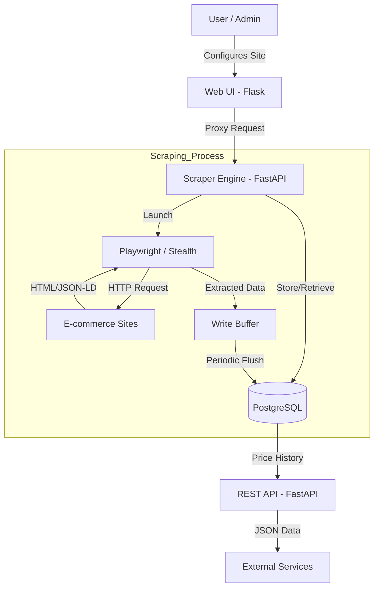
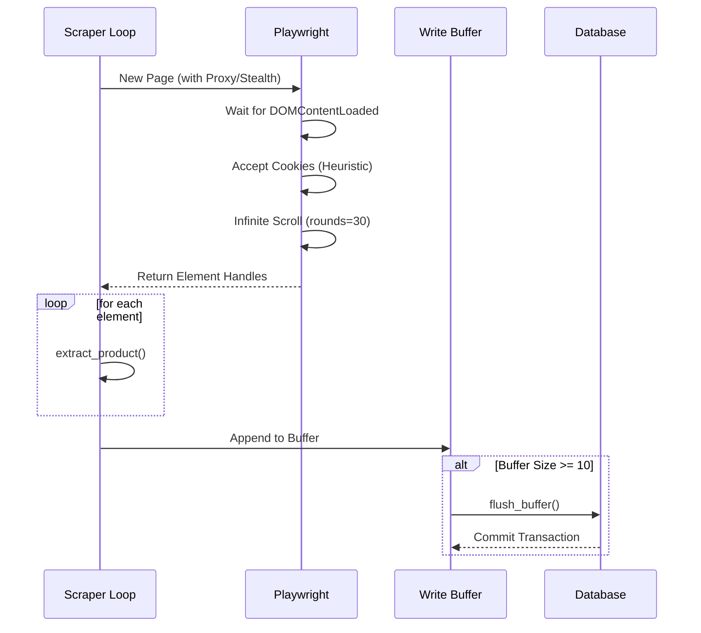

Relevant source files

The following files were used as context for generating this wiki page:

- [README.md](README.md)
- [scraper/scraper.py](scraper/scraper.py)
- [webui/app.py](webui/app.py)
- [fetcher/fetcher.py](fetcher/fetcher.py)
- [scraper/enrich.py](scraper/enrich.py)
- [CLAUDE.md](CLAUDE.md)
- [AGENTS.md](AGENTS.md)

# System Architecture Overview

The Web Scraper Platform is a production-ready system designed for multi-site e-commerce scraping, price monitoring, and data enrichment. It leverages a microservices-inspired architecture containerized via Docker, comprising a PostgreSQL database, a Playwright-based scraping engine, a FastAPI REST API, and a Flask-based Web UI.

The system is designed to handle complex scraping tasks including bypassing bot protections (Akamai, Cloudflare) via stealth modes, managing asynchronous browser instances for performance, and providing automated data enrichment to extract detailed product descriptions.

Sources: [README.md:1-20](README.md#L1-L20), [CLAUDE.md:1-25](CLAUDE.md#L1-L25), [AGENTS.md:1-20](AGENTS.md#L1-L20)

## Core Components

The architecture consists of four primary service layers that interact to facilitate the scraping lifecycle:

### 1. Data Layer (PostgreSQL)
The central repository for the system. It stores scraper configurations, discovered products, price history, and global application settings. It uses a `ThreadedConnectionPool` for efficient concurrent access from the scraping engine.

Sources: [scraper/scraper.py:126-145](scraper/scraper.py#L126-L145), [README.md:105-155](README.md#L105-L155)

### 2. Scraping Engine (Scraper & Fetcher)
The "muscle" of the system. 
*  **Scraper:** Manages the main scraping loops, handles CSS selector logic, and manages the database buffer flush.
*  **Fetcher:** A stateless Playwright-based worker that performs the actual rendering and extraction of product data (titles, prices, source text).
*  **Enrichment:** A specialized module that visits individual product pages to extract detailed source text that listing pages lack.

Sources: [scraper/scraper.py:270-350](scraper/scraper.py#L270-L350), [fetcher/fetcher.py:1-30](fetcher/fetcher.py#L1-L30), [scraper/enrich.py:1-25](scraper/enrich.py#L1-L25)

### 3. API & Control Plane
*  **REST API:** A FastAPI-based service providing programmatic access to product data, deals, and stats. It requires `X-API-Key` authentication.
*  **Web UI:** A Flask-based interface for managing configurations, monitoring status, and triggering manual scrapes. It proxies requests to the underlying Scraper Engine.

Sources: [webui/app.py:80-150](webui/app.py#L80-L150), [README.md:65-90](README.md#L65-L90), [CLAUDE.md:15-30](CLAUDE.md#L15-L30)

## System Data Flow

The following diagram illustrates the interaction between a user, the Web UI, the Scraping Engine, and the target E-commerce websites.

The diagram shows the flow from user configuration through the Playwright rendering process and final storage in the PostgreSQL database.
Sources: [scraper/scraper.py:465-500](scraper/scraper.py#L465-L500), [webui/app.py:100-130](webui/app.py#L100-L130), [fetcher/fetcher.py:275-300](fetcher/fetcher.py#L275-L300)

## Database Schema

The system relies on five main tables to manage the scraping state and results.

| Table | Purpose | Key Fields |
|-------|---------|------------|
| `scraper_config` | Defines how to scrape specific sites | `product_selector`, `price_selector`, `use_stealth`, `proxy_url` |
| `products` | Stores latest product state | `url`, `current_price`, `source_text`, `category` |
| `price_history` | Tracks price changes over time | `product_id`, `price`, `timestamp` |
| `settings` | Global system configuration | `concurrent_pages`, `scrape_interval`, `headless` |
| `alert_cooldown` | Manages notification frequency | `product_id`, `last_alert` |

Sources: [README.md:105-155](README.md#L105-L155), [scraper/scraper.py:160-225](scraper/scraper.py#L160-L225)

## Scraping Logic and Extraction

The system utilizes two primary methods for discovering and extracting product data:

### Extraction Sequence
1.  **Browser Initialization:** Launches Chromium with specific arguments to avoid detection (`--no-sandbox`, `AutomationControlled` disabled).
2.  **Stealth Application:** Applies `playwright-stealth` to mimic human behavior if the site configuration requires it.
3.  **Heuristic Discovery:** For enrichment and detail pages, the system attempts to find data in order of reliability:
  *  Custom CSS `detail_selector` if provided (highest priority; site-specific).
  *  `JSON-LD` Product nodes with `description` field (most reliable for e-commerce).
  *  Open Graph (`og:description`) meta tags.
  *  Standard HTML Meta Description tags.

Sources: [scraper/scraper.py:105-120](scraper/scraper.py#L105-L120), [fetcher/fetcher.py:58-135](fetcher/fetcher.py#L58-L135), [scraper/enrich.py:87-116](scraper/enrich.py#L87-L116)

### Scraping Sequence Diagram
This diagram details the internal process of a single scraping task, including the retry logic and database buffering.

The sequence shows how the scraper manages page interactions and batch-writes to the database to minimize connection overhead.
Sources: [scraper/scraper.py:350-450](scraper/scraper.py#L350-L450), [fetcher/fetcher.py:230-260](fetcher/fetcher.py#L230-L260)

## Security and Authentication

The system implements security at multiple levels:
*  **SSRF Protection:** The engine validates URLs against private network ranges (10.0.0.0/8, 127.0.0.0/8, etc.) to prevent Server-Side Request Forgery.
*  **API Security:** All REST endpoints (except `/health`) require an `X-API-Key`.
*  **Internal Communication:** The Web UI communicates with the Scraper Engine using an `X-Engine-Key` for HMAC-based verification.
*  **Secret Management:** Credentials (API keys, DB passwords) are auto-generated on first start and stored in a restricted `/credentials` directory.

Sources: [scraper/scraper.py:90-103](scraper/scraper.py#L90-L103), [webui/app.py:60-78](webui/app.py#L60-L78), [README.md:55-63](README.md#L55-L63), [CLAUDE.md:20-25](CLAUDE.md#L20-L25)

## Conclusion

The Web Scraper Platform provides a robust architecture for automated data gathering. By separating the browser rendering (Playwright) from the management logic (FastAPI/Flask) and utilizing a centralized PostgreSQL database for state, the system ensures reliability and scalability. The inclusion of stealth modes and heuristic extraction allows it to function effectively even against sites with aggressive anti-bot measures.

Sources: [README.md:1-10](README.md#L1-L10), [AGENTS.md:1-10](AGENTS.md#L1-L10)
