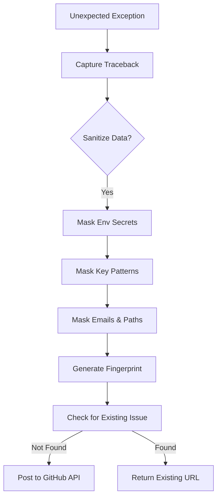

<details>
<summary>Relevant source files</summary>

The following files were used as context for generating this wiki page:

- [github_report.py](github_report.py)
- [scraper/scraper.py](scraper/scraper.py)
- [webui/app.py](webui/app.py)
- [scraper/enrich.py](scraper/enrich.py)
- [CLAUDE.md](CLAUDE.md)
- [tests/test_github_report.py](tests/test_github_report.py)
</details>

# Error Handling & GitHub Reporting

## Introduction
The scraper project implements a robust, automated error handling and reporting system designed to capture unexpected exceptions across its various modules (API, WebUI, Scraper Engine, and Enrichment). The primary goal is to provide "best-effort" reporting that creates GitHub issues tagged for developer intervention without exposing sensitive credentials or crashing the calling process.

This system centralizes reporting logic in `github_report.py`, which is distributed across different service working directories to accommodate environments managed by Supervisor. It features automatic data redaction, issue deduplication via error fingerprinting, and integration with external monitoring tools like Sentry.

Sources: [CLAUDE.md:33-40](CLAUDE.md#L33-L40), [github_report.py:1-15](github_report.py#L1-L15)

---

## Automated GitHub Reporting Logic
The core of the reporting system is the `report_error_to_github` function. It manages the lifecycle of an error report from initial capture to the creation of a GitHub issue.

### Data Flow and Redaction
Before any data is transmitted to GitHub, it passes through a redaction layer that masks known secret patterns. The redaction logic targets environment variables whose names contain KEY/TOKEN/SECRET/PASSWORD/PASS and common credential patterns (e.g., sk-..., ghp_..., AKIA...), plus email addresses and home directory paths. However, arbitrary or residual secrets that do not match these patterns may still leak.



The diagram shows the sequence of operations performed to safely report an error while avoiding duplicate issues.
Sources: [github_report.py:33-45](github_report.py#L33-L45), [github_report.py:70-85](github_report.py#L70-L85)

### Redaction Rules
The system applies several regex-based and environment-aware rules:
*  **Environment Variables**: Values of variables containing markers like `KEY`, `TOKEN`, `SECRET`, `PASSWORD`, or `PASS` are replaced with `[REDACTED]`.
*  **Known Patterns**: Matches for common keys (e.g., `sk-...`, `ghp_...`, `Bearer ...`) are masked.
*  **Personal Data**: Email addresses are replaced with `[EMAIL REDACTED]`.
*  **System Paths**: Home directories (e.g., `/home/username/`) are generalized to `/home/[user]`.

Sources: [github_report.py:33-45](github_report.py#L33-L45), [tests/test_github_report.py:9-30](tests/test_github_report.py#L9-L30)

### Error Fingerprinting and Deduplication
To prevent issue spam during repeated crashes, the system generates a stable 10-character fingerprint based on the exception type and the last line of the traceback.

| Component | Logic | Description |
|-----------|-------|-------------|
| **Fingerprint** | `hashlib.sha256(raw).hexdigest()[:10]` | Unique ID derived from ExceptionName@File:Line. |
| **Search** | `repo:{repo} is:issue is:open in:title [{fp}]` | Queries GitHub for open issues containing the fingerprint. |
| **Labeling** | `["bug", "auto-reported"]` | Applied to new issues for easy filtering. |

Sources: [github_report.py:48-54](github_report.py#L48-L54), [github_report.py:75-80](github_report.py#L75-L80)

---

## Service Integration
Error handling is integrated into the specific operational flows of the application's main components.

### WebUI and Scraper Engine (Flask)
Both the WebUI (`webui/app.py`) and the Scraper Engine (`scraper/scraper.py`) use Flask error handlers to catch unhandled exceptions during HTTP requests.

```python
@app.errorhandler(Exception)
def handle_unexpected_error(exc):
    if isinstance(exc, HTTPException):
        return exc
    logger.exception("Unhandled error handling %s %s", request.method, request.path)
    report_error_to_github(
        "blixten85/scraper",
        f"Oväntat fel: {request.method} {request.path}",
        exc,
        context={"method": request.method, "path": request.path},
    )
    return jsonify({"error": "Internal server error"}), 500
```

Sources: [scraper/scraper.py:41-54](scraper/scraper.py#L41-L54), [webui/app.py:44-57](webui/app.py#L44-L57)

### Scraper Loop and Enrichment
For background tasks, try-except blocks wrap the main execution loops to ensure transient failures do not kill the service permanently.

*  **Scraper Loop**: Errors in `run_scraper` are reported but the loop continues after the configured `scrape_interval`.
*  **Enrichment**: The `enrich.py` module reports "one-shot" failures via the same GitHub mechanism before exiting with a non-zero status.

Sources: [scraper/scraper.py:650-658](scraper/scraper.py#L650-L658), [scraper/enrich.py:228-232](scraper/enrich.py#L228-L232)

---

## External Monitoring (Sentry)
In addition to GitHub reporting, the WebUI component is integrated with **Sentry** for real-time error tracking and performance monitoring.

*  **Initialization**: Configured via `SENTRY_DSN` environment variable.
*  **Privacy**: `send_default_pii` is set to `False` and request body capture is disabled to protect user data.
*  **Capture**: Explicitly calls `sentry_sdk.capture_exception(exc)` within the global error handler.

Sources: [webui/app.py:23-31](webui/app.py#L23-L31), [webui/app.py:50](webui/app.py#L50)

---

## Configuration Requirements
The GitHub reporting feature is "best-effort" and remains dormant unless specifically configured.

| Environment Variable | Required | Function |
|----------------------|----------|----------|
| `GITHUB_ERROR_REPORT_TOKEN` | Yes | Personal Access Token with repo scope to create issues. |
| `SENTRY_DSN` | No | Enables Sentry integration if provided. |

Sources: [github_report.py:66-68](github_report.py#L66-L68), [webui/app.py:24](webui/app.py#L24)

## Conclusion
The project employs a tiered error handling strategy: local logging for immediate debugging, GitHub reporting for automated issue tracking with built-in privacy protections, and Sentry for deep diagnostic monitoring. This approach ensures that developers are alerted to production failures while maintaining the security and stability of the scraping platform.
