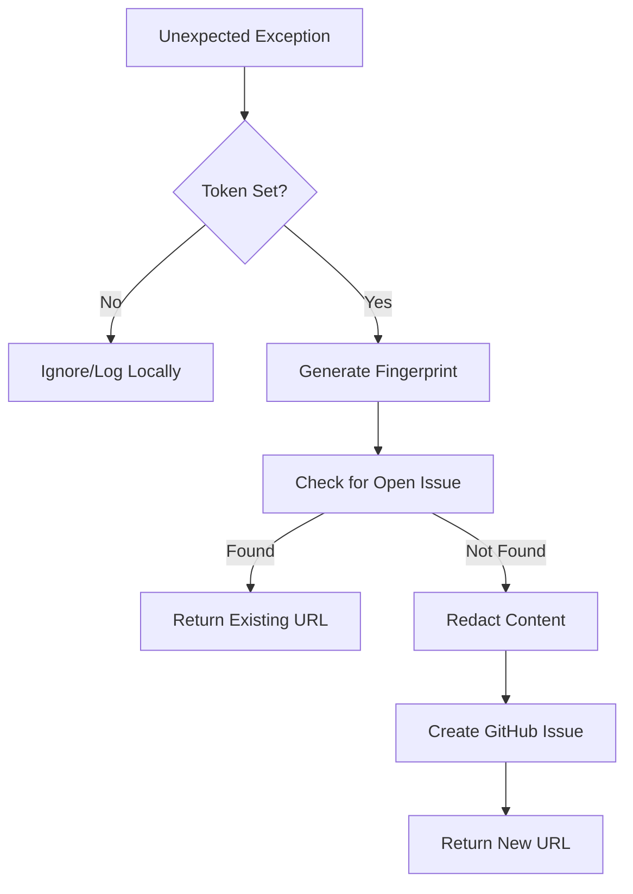
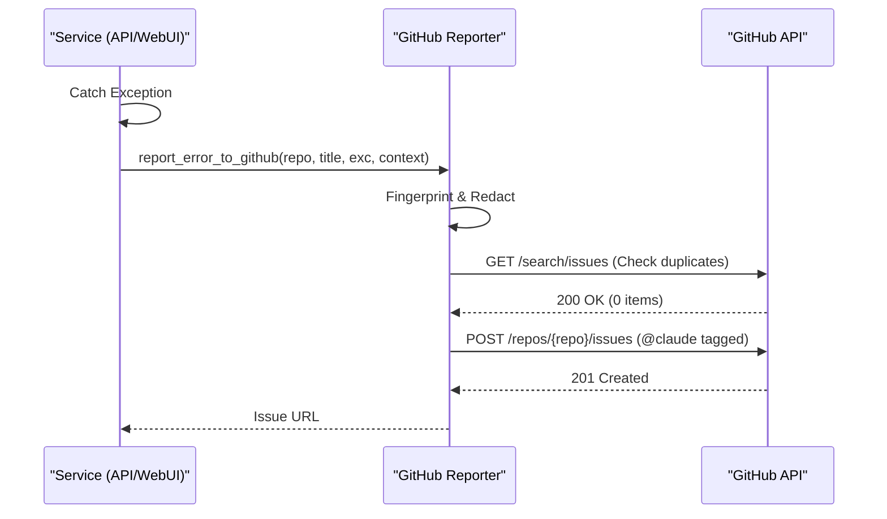

<details>
<summary>Relevant source files</summary>

The following files were used as context for generating this wiki page:

- [api/github\_report.py](api/github_report.py)
- [scraper/github\_report.py](scraper/github_report.py)
- [alerts/github\_report.py](alerts/github_report.py)
- [tests/test\_github\_report.py](tests/test_github_report.py)
- [scraper/scraper.py](scraper/scraper.py)
- [webui/app.py](webui/app.py)
- [scraper/enrich.py](scraper/enrich.py)
- [CLAUDE.md](CLAUDE.md)
</details>

# Error Handling & GitHub Reporting

The Error Handling and GitHub Reporting system is a specialized diagnostic module designed to capture unexpected exceptions across various services (API, Scraper, WebUI, and Alerts) and automatically report them as GitHub issues. Its primary purpose is to facilitate hands-off debugging by tagging reports for AI intervention (via `@claude`) while ensuring sensitive data like credentials and personal information are strictly redacted before submission.

The system is implemented as a "best-effort" utility, meaning it is designed to never crash the calling application even if reporting fails due to network issues or missing configuration. It is replicated across multiple service directories to ensure local availability for each process managed by Supervisor.
Sources: [CLAUDE.md:34-41](CLAUDE.md#L34-L41), [scraper/github\_report.py:53-56](scraper/github\_report.py#L53-L56)

## Automated Reporting Logic

The core logic resides in the `report_error_to_github` function. When an unhandled exception occurs, the system generates a unique "fingerprint" of the error to prevent duplicate reports (deduplication) and then submits a redacted report to the configured GitHub repository.

### Reporting Process Flow

The following diagram illustrates the flow from exception capture to GitHub issue creation:



The reporting logic prioritizes deduplication by searching for existing open issues containing the unique error fingerprint in the title.
Sources: [scraper/github\_report.py:53-112](scraper/github\_report.py#L53-L112), [tests/test\_github\_report.py:38-51](tests/test\_github\_report.py#L38-L51)

### Exception Fingerprinting
To identify recurring errors without leaking sensitive trace data, the system extracts the last line of the traceback (filename and line number) and the exception class name. This raw string is then hashed using SHA-256 and truncated to the first 10 characters.
Sources: [scraper/github\_report.py:44-50](scraper/github\_report.py#L44-L50)

## Data Redaction and Sanitization

A critical feature of the reporting system is the `_redact` function. It applies multiple layers of security to ensure that logs sent to a public or semi-public GitHub issue do not contain secrets.

| Category | Redaction Method | Details |
| :--- | :--- | :--- |
| **Environment Variables** | Keyword Matching | Any value from environment variables containing `KEY`, `TOKEN`, `SECRET`, `PASSWORD`, or `PASS` is replaced with `[REDACTED]`. |
| **Known Patterns** | Regex Matching | Matches common patterns such as `sk-...`, `ghp_...`, `AKIA...`, and `Bearer ...`. |
| **Personal Info** | Regex Matching | Emails are replaced with `[EMAIL REDACTED]`. |
| **System Paths** | Regex Matching | Home directories (e.g., `/home/username`) are generalized to `/home/[user]`. |

Sources: [scraper/github\_report.py:31-41](scraper/github\_report.py#L31-L41), [tests/test\_github\_report.py:10-34](tests/test\_github\_report.py#L10-L34)

```python
def _redact(text: str) -> str:
    for key, value in os.environ.items():
        if value and len(value) >= 8 and any(m in key.upper() for m in _SECRET_ENV_MARKERS):
            text = text.replace(value, "[REDACTED]")
    text = _KEY_PATTERN_RE.sub("[REDACTED]", text)
    text = _EMAIL_RE.sub("[EMAIL REDACTED]", text)
    text = _HOME_PATH_RE.sub("/home/[user]", text)
    return text
```

Sources: [scraper/github\_report.py:32-39](scraper/github\_report.py#L32-L39)

## Service Integration

The reporting mechanism is integrated into the global error handlers of the Flask and FastAPI components, as well as standalone scripts.

### WebUI and Scraper API Integration
In both `webui/app.py` and `scraper/scraper.py`, a global `@app.errorhandler(Exception)` is used to catch any unhandled errors during HTTP requests. This handler logs the exception locally and then calls `report_error_to_github`.



Sources: [scraper/scraper.py:37-51](scraper/scraper.py#L37-L51), [webui/app.py:41-53](webui/app.py#L41-L53)

### Standalone Module Usage
The enrichment script (`scraper/enrich.py`) also utilizes this system to report failures during batch product processing, ensuring that long-running background tasks are monitored for stability.
Sources: [scraper/enrich.py:202-205](scraper/enrich.py#L202-L205)

## Configuration Requirements

The system remains dormant unless specific environment variables are provided.

*  **`GITHUB_ERROR_REPORT_TOKEN`**: A GitHub Personal Access Token with permissions to create issues in the target repository.
*  **Repository Name**: Passed as an argument (e.g., `blixten85/scraper`) to the reporting function.
*  **Labels**: Issues are automatically created with the labels `bug` and `auto-reported`.

Sources: [scraper/github\_report.py:57-58](scraper/github\_report.py#L57-L58), [scraper/github\_report.py:103-104](scraper/github\_report.py#L103-L104)

## Conclusion

The Error Handling & GitHub Reporting system provides a robust, self-healing diagnostic layer for the Scraper platform. By combining automated fingerprinting, strict data redaction, and deduplication logic, it allows developers to monitor production failures through GitHub issues without manual intervention or security risks. The use of the `@claude` tag further enables automated AI-driven analysis of reported bugs.
Sources: [CLAUDE.md:34-41](CLAUDE.md#L34-L41), [scraper/github\_report.py:90-99](scraper/github\_report.py#L90-L99)
