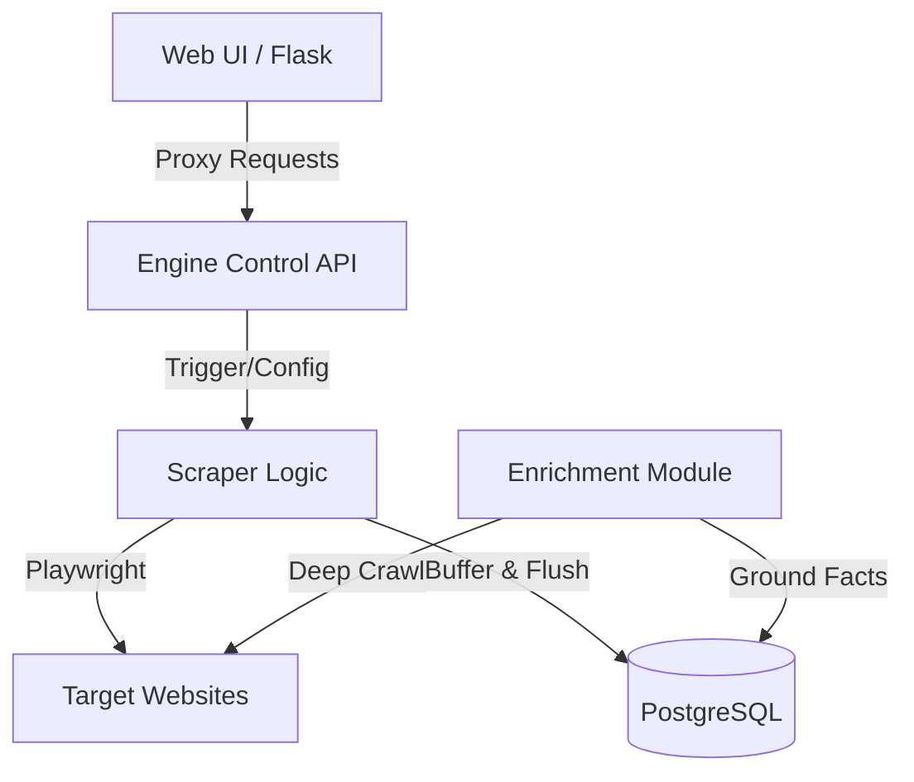
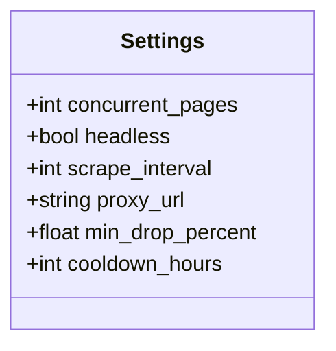

<details>
<summary>Relevant source files</summary>

The following files were used as context for generating this wiki page:

- [scraper/scraper.py](scraper/scraper.py)
- [scraper/enrich.py](scraper/enrich.py)
- [webui/app.py](webui/app.py)
- [webui/templates/config.html](webui/templates/config.html)
- [README.md](README.md)
- [CLAUDE.md](CLAUDE.md)
</details>

# Multi-Site Scraping Engine

The **Multi-Site Scraping Engine** is the core component of the Web Scraper Platform, responsible for orchestrated data extraction across diverse e-commerce websites. It utilizes a headless browser architecture powered by Playwright to navigate pages, handle dynamic content, and bypass bot protections. The engine is designed to be highly configurable, allowing users to define site-specific selectors through a Web UI while providing automation features like auto-discovery of subcategories and selector auto-detection.

Sources: [scraper/scraper.py](scraper/scraper.py), [README.md:10-21](README.md#L10-L21)

## Core Architecture

The engine operates as a standalone service with an internal Flask-based control API. It manages a pool of PostgreSQL connections to persist scraped data and uses an asynchronous loop to execute scraping tasks based on user-defined intervals.

### Component Relationship
The following diagram illustrates how the scraping engine interacts with other system components:



The Scraping Engine coordinates between the user configuration, the browser automation layer, and the database.
Sources: [scraper/scraper.py:843-855](scraper/scraper.py#L843-L855), [webui/app.py:100-115](webui/app.py#L100-L115), [scraper/enrich.py:15-28](scraper/enrich.py#L15-L28)

## Scraping Logic and Data Flow

The engine employs a multi-stage process for data extraction, focusing on efficiency and stealth. It supports two primary pagination modes: standard query-based (e.g., `?page=2`) and subcategory auto-discovery.

### Data Extraction Process
1.  **Configuration Loading**: Active configurations are fetched from the `scraper_config` table.
2.  **Browser Orchestration**: A Chromium instance is launched with specific arguments to minimize resource usage (e.g., `--no-sandbox`, `--disable-dev-shm-usage`).
3.  **Page Navigation**: Pages are loaded with configurable retries and exponential backoff.
4.  **Stealth & Interaction**: If enabled, `playwright-stealth` is applied, and common cookie consent dialogs are automatically accepted.
5.  **Element Extraction**: CSS selectors are used to identify product containers, titles, prices, and links.
6.  **Buffering**: Extracted data is stored in a `write_buffer` and periodically flushed to the database to reduce I/O overhead.

Sources: [scraper/scraper.py:381-420](scraper/scraper.py#L381-L420), [scraper/scraper.py:598-630](scraper/scraper.py#L598-L630)

### Execution Flow Diagram
This sequence diagram shows the lifecycle of a single scraping run for a specific site configuration:

```mermaid
sequenceDiagram
    participant Loop as Scraper Loop
    participant BW as Browser Context
    participant Web as Target Site
    participant Buf as Write Buffer
    participant DB as PostgreSQL

    Loop->>BW: Create Context (Proxy/UA)
    Loop->>BW: Open Page (with Retry)
    BW->>Web: Request URL
    Web-->>BW: HTML Content
    BW->>BW: Apply Stealth/Accept Cookies
    BW->>BW: Scroll & Extract Elements
    BW->>Buf: Append Product Data
    Note over Buf, DB: Periodic Flush (10 items or 5s)
    Buf->>DB: INSERT/UPDATE products
    Buf->>DB: INSERT price_history
    Loop->>BW: Close Context
```

The engine uses a buffered approach to database writes to maintain performance during high-concurrency scraping.
Sources: [scraper/scraper.py:598-650](scraper/scraper.py#L598-L650), [scraper/scraper.py:653-705](scraper/scraper.py#L653-L705)

## Key Modules and Functions

### Scraper Engine (`scraper/scraper.py`)
| Function | Description |
| :--- | :--- |
| `run_scraper()` | Main entry point that initializes the browser, manages concurrency semaphores, and starts workers. |
| `scrape_site()` | Handles pagination logic and coordinate the extraction of items from multiple pages. |
| `extract_product()` | Parses a single element using site-specific CSS selectors to create a data dictionary. |
| `flush_buffer()` | Executes bulk database operations to update product prices and record history. |
| `detect_selectors()` | A heuristic-based module that attempts to automatically identify CSS selectors for a new URL. |

Sources: [scraper/scraper.py:133-140](scraper/scraper.py#L133-L140), [scraper/scraper.py:288-320](scraper/scraper.py#L288-L320), [scraper/scraper.py:465-495](scraper/scraper.py#L465-L495), [scraper/scraper.py:716-750](scraper/scraper.py#L716-L750)

### Enrichment Module (`scraper/enrich.py`)
The enrichment module is a specialized component that performs "deep crawling." While the main engine only scrapes listing pages, the enrichment module visits individual product URLs to extract detailed descriptions and structured JSON-LD data. This prevents the system from relying solely on listing titles for product identification.

Sources: [scraper/enrich.py:15-30](scraper/enrich.py#L15-L30)

## Configuration and Settings

The engine's behavior is controlled through a mix of global settings and site-specific configurations stored in PostgreSQL.

### Scraper Configuration Schema
The `scraper_config` table defines how the engine interacts with specific domains:

| Field | Type | Description |
| :--- | :--- | :--- |
| `base_url` | TEXT | The starting point for the crawl. |
| `product_selector`| TEXT | CSS selector for the item container. |
| `pagination_type` | TEXT | Either 'query' or 'subcategory'. |
| `use_stealth` | INT | Flag (0/1) to enable bot protection bypass. |
| `proxy_url` | TEXT | SOCKS5/HTTP proxy for site-specific requests. |
| `url_scope` | TEXT | Pattern to restrict discovered subcategory links. |

Sources: [README.md:129-152](README.md#L129-L152), [scraper/scraper.py:186-210](scraper/scraper.py#L186-L210)

### Global Engine Settings
Engine-wide parameters are managed via the `settings` table:



Settings are accessed via `get_setting(key)` which retrieves values from the database with fallbacks to predefined defaults.
Sources: [scraper/scraper.py:45-75](scraper/scraper.py#L45-L75), [scraper/scraper.py:113-130](scraper/scraper.py#L113-L130)

## Bot Protection Bypass
The engine implements several strategies to evade bot detection:
*  **Stealth Mode**: Uses `playwright_stealth` to hide browser fingerprints.
*  **Behavioral Mimicry**: Includes random sleep intervals between page loads (3-7 seconds) and scrolling to trigger lazy-loaded content.
*  **Request Headers**: Sets realistic User-Agents and localized headers (e.g., `sv-SE`, `Europe/Stockholm`).
*  **Proxy Support**: Supports both global and per-site SOCKS5/HTTP proxies to rotate IP addresses.

Sources: [scraper/scraper.py:384-410](scraper/scraper.py#L384-L410), [scraper/scraper.py:725-745](scraper/scraper.py#L725-L745), [webui/templates/config.html:158-180](webui/templates/config.html#L158-L180)

The Multi-Site Scraping Engine provides a robust foundation for product monitoring by combining flexible configuration with automated extraction techniques and resilient browser management.
