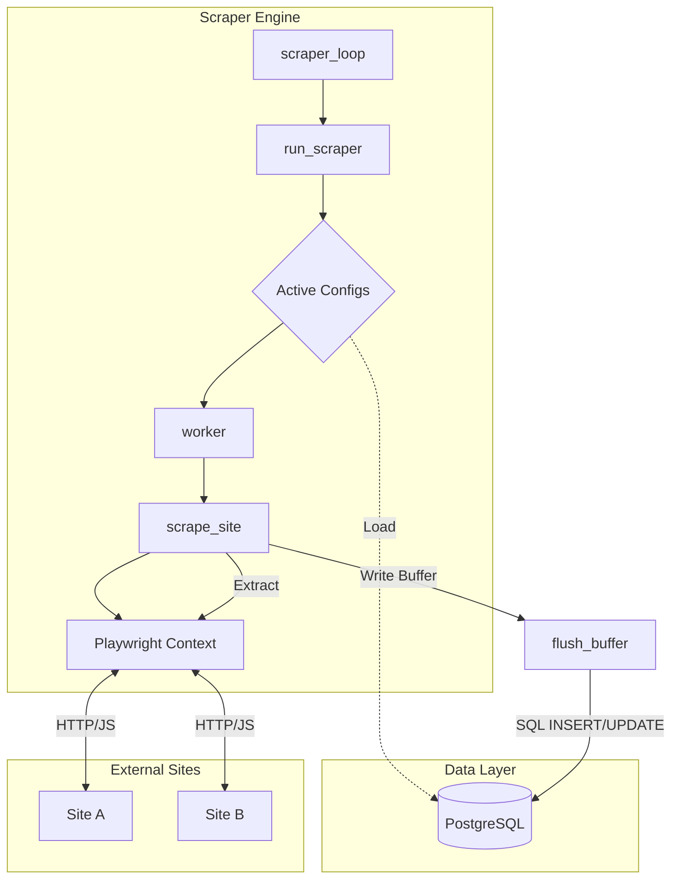
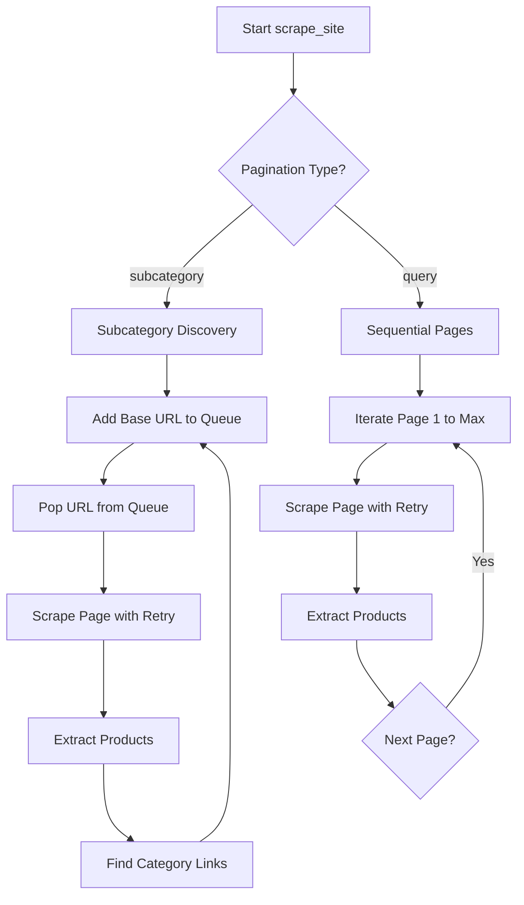
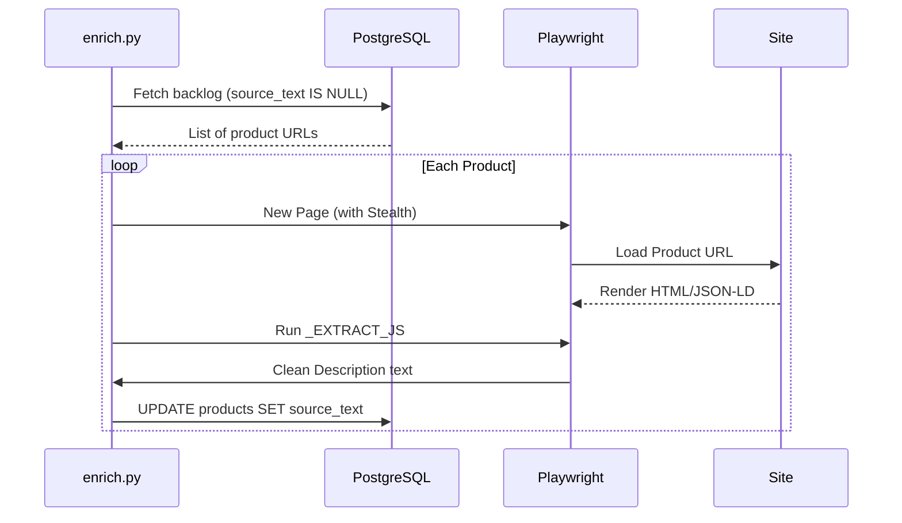

Relevant source files

The following files were used as context for generating this wiki page:

- [scraper/scraper.py](scraper/scraper.py)
- [scraper/enrich.py](scraper/enrich.py)
- [webui/app.py](webui/app.py)
- [webui/templates/config.html](webui/templates/config.html)
- [README.md](README.md)
- [CLAUDE.md](CLAUDE.md)

# Multi-Site Scraping Engine

The **Multi-Site Scraping Engine** is the core component of the Web Scraper Platform, responsible for orchestrating automated data extraction across diverse e-commerce websites. It leverages Playwright for headless browser automation, allowing it to navigate complex JavaScript-heavy sites, bypass bot protections, and extract structured product information such as titles, prices, and URLs.

The engine operates as a standalone service that communicates with a PostgreSQL database for persistent storage of configurations and scraped data. It exposes an internal Flask-based API (typically on port 5001) which the WebUI uses to trigger manual scrapes, test configurations, and auto-detect CSS selectors for new sites.

Sources: [README.md:9-17](README.md#L9-L17), [scraper/scraper.py:1022-1029](scraper/scraper.py#L1022-L1029), [CLAUDE.md:16-23](CLAUDE.md#L16-L23)

## Architecture and Data Flow

The engine is built on an asynchronous architecture using `asyncio` and `playwright`. It manages a pool of browser contexts to perform concurrent scraping tasks while maintaining rate limits and stealth requirements.

### Component Interaction
The following diagram illustrates the interaction between the Scraper Engine, the database, and the target websites:

The engine utilizes a periodic loop that fetches active configurations from the `scraper_config` table and initializes workers based on the `concurrent_pages` setting.

Sources: [scraper/scraper.py:649-670](scraper/scraper.py#L649-L670), [scraper/scraper.py:730-749](scraper/scraper.py#L730-L749), [scraper/scraper.py:441-482](scraper/scraper.py#L441-L482)

## Scraping Logic and Pagination

The engine supports two primary modes of operation for navigating websites: standard query-based pagination and subcategory auto-discovery.

### Pagination Modes
| Mode | Description | Logic |
| :--- | :--- | :--- |
| **Query** | Standard page-by-page scraping. | Appends `?page=N` to the base URL and iterates until `max_pages` or no new items found. |
| **Subcategory** | Crawls deeper into site structures. | Uses a `pagination_selector` to find category links and adds them to a queue for processing. |

### Execution Flow
The `scrape_site` function determines the strategy based on the configuration:

Sources: [scraper/scraper.py:539-550](scraper/scraper.py#L539-L550), [scraper/scraper.py:557-610](scraper/scraper.py#L557-L610), [scraper/scraper.py:612-646](scraper/scraper.py#L612-L646)

## Stealth and Bot Protection

To handle modern e-commerce security measures (e.g., Akamai, Cloudflare, PerimeterX), the engine implements several stealth features.

### Anti-Detection Measures
*  **Playwright Stealth**: Uses the `playwright-stealth` package to mask browser fingerprints.
*  **Custom Headers**: Sets realistic User-Agents, locales (`sv-SE`), and timezones.
*  **Jitter and Delays**: Implements random waits (e.g., 2-5 seconds) between page loads and interactions.
*  **Proxy Support**: Supports SOCKS5/HTTP proxies on both a global and per-site basis.
*  **Infinite Scroll Awareness**: Simulates user scrolling behavior to trigger lazy-loaded product containers.

Sources: [scraper/scraper.py:516-525](scraper/scraper.py#L516-L525), [scraper/scraper.py:690-705](scraper/scraper.py#L690-L705), [scraper/scraper.py:101-107](scraper/scraper.py#L101-L107)

## Data Extraction and Enrichment

Extraction is performed using CSS selectors defined in the site configuration. If a product's price or title is not found via the primary selector, the engine uses fallbacks or regex-based extraction.

### Selector Heuristics
The engine provides a `/detect` endpoint that uses a sophisticated JavaScript-based heuristic to guess selectors for new sites:
1.  **Container Search**: Looks for repetitive patterns in `article`, `li`, or `div` tags.
2.  **Price Detection**: Scans for patterns like `\d[\d\s]*\s*(kr|SEK|:-)`.
3.  **Link Identification**: Locates the closest anchor tag (`<a>`) relative to the container.

### Product Enrichment
While the main scraper focuses on listings, the `enrich.py` module performs one-shot visits to individual product pages to extract detailed descriptions.

Sources: [scraper/scraper.py:875-1010](scraper/scraper.py#L875-L1010), [scraper/enrich.py:27-46](scraper/enrich.py#L27-L46), [scraper/enrich.py:66-93](scraper/enrich.py#L66-L93)

## Configuration and Settings

Engine behavior is controlled via global settings stored in the database and specific per-site configurations.

### Global Settings
| Key | Default | Description |
| :--- | :--- | :--- |
| `concurrent_pages` | 2 | Parallel browser contexts. |
| `scrape_interval` | 3600 | Seconds between full runs. |
| `headless` | True | Whether to run browser without GUI. |
| `proxy_url` | "" | Global SOCKS5/HTTP proxy. |

### Scraper Configuration Schema
Configurations are stored in the `scraper_config` table and include:
*  `base_url`: The starting point for the scraper.
*  `product_selector`: CSS selector for the item container.
*  `title_selector` / `price_selector` / `link_selector`: Selectors for internal data.
*  `use_stealth`: Boolean flag to enable anti-bot measures.
*  `url_scope`: Restricts subcategory discovery to specific URL paths.

Sources: [scraper/scraper.py:56-100](scraper/scraper.py#L56-L100), [scraper/scraper.py:326-348](scraper/scraper.py#L326-L348), [README.md:154-177](README.md#L154-L177)

## Conclusion
The Multi-Site Scraping Engine provides a robust framework for tracking product data across various e-commerce platforms. By combining flexible pagination strategies, heuristic selector detection, and stealth-capable browser automation, it ensures reliable data collection even from sites with aggressive bot protection or complex client-side rendering.
