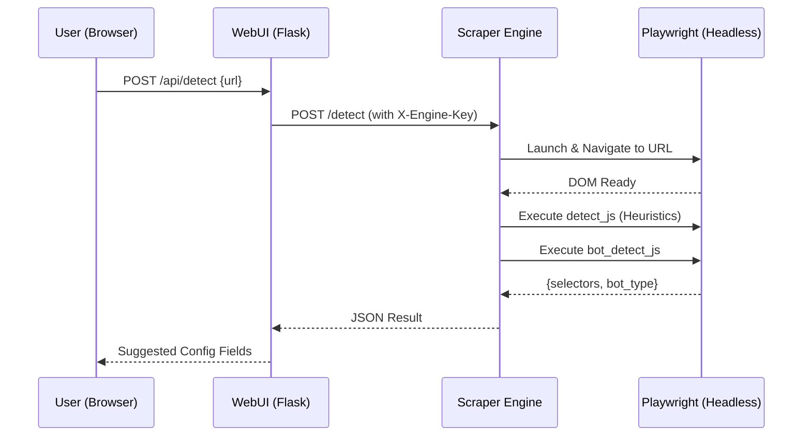

<details>
<summary>Relevant source files</summary>

The following files were used as context for generating this wiki page:

- [scraper/scraper.py](scraper/scraper.py)
- [webui/app.py](webui/app.py)
- [webui/templates/config.html](webui/templates/config.html)
- [scraper/enrich.py](scraper/enrich.py)
- [webui/static/script.js](webui/static/script.js)
- [README.md](README.md)
</details>

# Auto-Detect Selectors

The **Auto-Detect Selectors** feature is a core utility within the Web Scraper platform designed to simplify the configuration of new scraping targets. By analyzing a provided URL, the system employs Playwright-based heuristics and specialized JavaScript logic to identify common e-commerce patterns and automatically suggest CSS selectors for product containers, titles, prices, and links.

This system significantly reduces the manual effort required to set up a site configuration, allowing users to bootstrap a scraper by simply providing a "Start URL." It also identifies active bot protection services (such as Akamai or Cloudflare) and automatically configures "Stealth Mode" when necessary.
Sources: [scraper/scraper.py:843-851](scraper/scraper.py#L843-L851), [webui/templates/config.html:268-280](webui/templates/config.html#L268-L280), [README.md:16](README.md#L16)

## System Architecture and Data Flow

The auto-detection process is a multi-layered operation involving the WebUI, the Control Plane (Flask), and the Scraper Engine (Python/Playwright). 

1.  **User Interaction**: The user enters a URL in the configuration interface and triggers the "Detect" button.
2.  **Request Proxying**: The WebUI sends a request to the Control Plane (`webui/app.py`), which validates the path and proxies the request to the Scraper Engine's `/detect` endpoint using an internal engine key for authentication.
3.  **Heuristic Analysis**: The Scraper Engine (`scraper/scraper.py`) launches a headless browser, navigates to the target URL using `domcontentloaded` to avoid timeouts, and executes a complex JavaScript heuristic script to extract selectors.
4.  **Bot Detection**: Simultaneously, a bot detection script checks for signatures of common protection providers.

### Sequence Diagram: Selector Detection Flow

This diagram illustrates the communication between the UI, the back-end proxy, and the scraping engine during a detection request.



Sources: [webui/app.py:175-181](webui/app.py#L175-L181), [scraper/scraper.py:843-855](scraper/scraper.py#L843-L855), [webui/templates/config.html:286-310](webui/templates/config.html#L286-L310)

## Detection Logic and Heuristics

The engine uses two primary JavaScript blocks to analyze the target page: `detect_js` for CSS selectors and `bot_detect_js` for security profiling.

### Selector Identification (`detect_js`)
The heuristic logic identifies a "Product Container" by looking for repeating elements (at least 3 occurrences) that contain price-like patterns (e.g., "kr", "SEK", or ":-"). Once a container is identified, the system drills down to find:
*  **Title**: Prioritizes heading tags (H1-H4), then elements with classes containing "title" or "name", and finally the first text-heavy leaf node.
*  **Price**: Searches for elements matching a specific regular expression (`/\d[\d\s]*\s*(kr|SEK|:-|,\d{2})/i`) and prefers the shallowest leaf node containing the match.
*  **Link**: Identifies the primary anchor tag (`<a>`) associated with the product container.

### Bot Protection Detection (`bot_detect_js`)
The system explicitly checks for the following providers to determine if `use_stealth` should be enabled:
*  **Akamai**: Checks for `_abck` cookies or scripts.
*  **Cloudflare**: Looks for `cf-challenge` elements or `cf_clearance` cookies.
*  **PerimeterX**: Searches for `px-captcha` or related scripts.
*  **Distil**: Detects specific Distil-related body classes or scripts.

Sources: [scraper/scraper.py:861-949](scraper/scraper.py#L861-L949), [scraper/scraper.py:951-964](scraper/scraper.py#L951-L964)

## Component Overview

### API Endpoints
| Endpoint | Method | Source File | Description |
|----------|--------|-------------|-------------|
| `/api/detect` | POST | `webui/app.py` | WebUI entry point; proxies to the engine with a 110s timeout. |
| `/detect` | POST | `scraper/scraper.py` | Engine endpoint that executes Playwright and JavaScript heuristics. |
| `/api/test` | POST | `webui/app.py` | Proxies a synchronous test scrape to verify detected selectors. |

### Configuration Mapping
| Field | Detection Logic Source | Resulting Behavior |
|-------|------------------------|--------------------|
| `product_selector` | `candidates` (count >= 3) | Defines the repeating element in the listing. |
| `title_selector` | Heading tags or "title" class | Extracts the product name. |
| `price_selector` | `PRICE_RE` match | Extracts the current cost. |
| `link_selector` | Closest `a[href]` | Determines the product detail URL. |
| `use_stealth` | `bot_detect_js != 'none'` | Enables Playwright-stealth to bypass blocks. |

Sources: [webui/app.py:175-181](webui/app.py#L175-L181), [scraper/scraper.py:855-964](scraper/scraper.py#L855-L964), [webui/templates/config.html:298-306](webui/templates/config.html#L298-L306)

## Implementation Details

The detection engine incorporates several reliability features to handle modern web applications (SPAs and lazy-loaded sites):
*  **Dynamic Scrolling**: The engine automatically scrolls the page half-way three times to trigger lazy-loaded content before running the analysis.
*  **Wait for Load State**: It uses `wait_until="domcontentloaded"` and attempts a `networkidle` wait for up to 10 seconds to ensure scripts have executed.
*  **Selector Normalization**: It cleans class names by filtering out long numeric strings (likely dynamic IDs) to ensure suggested selectors are reusable.

```python
# scraper/scraper.py:978-984
# Example of the scrolling logic used during detection
for _ in range(3):
    await page.evaluate("window.scrollTo(0, document.body.scrollHeight / 2)")
    await asyncio.sleep(1)
await page.evaluate("window.scrollTo(0, 0)")
```

Sources: [scraper/scraper.py:976-986](scraper/scraper.py#L976-L986), [scraper/scraper.py:866-871](scraper/scraper.py#L866-L871)

## Conclusion
The Auto-Detect Selectors feature serves as the primary onboarding mechanism for the Web Scraper platform. By combining DOM structure analysis with price-pattern recognition and security profiling, it enables users to quickly generate functional scraping configurations even for complex, protected e-commerce sites. Its integration through the Control Plane ensures that heavy browser operations are isolated to the Scraper Engine while remaining accessible via the WebUI.
