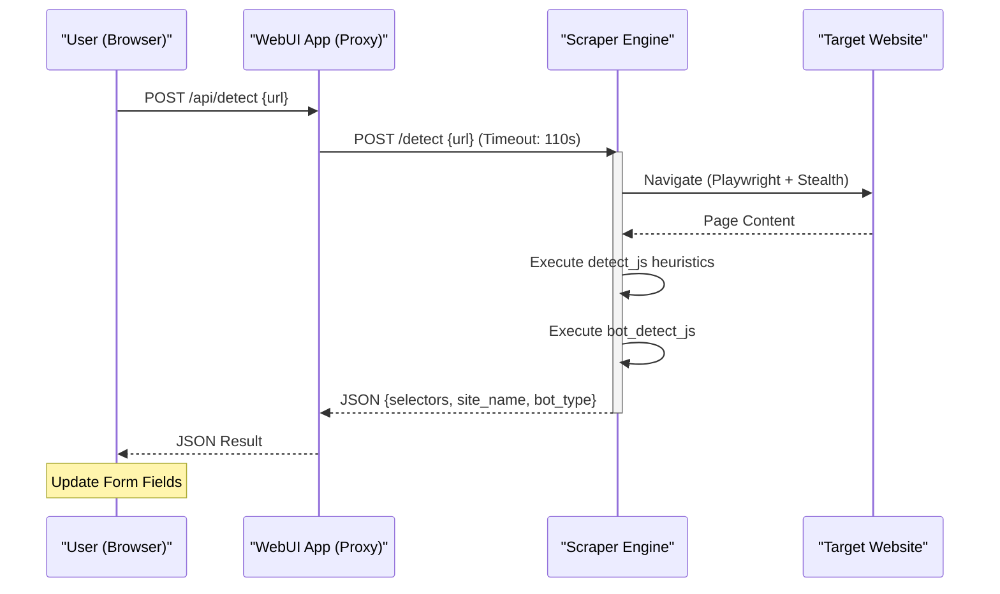

<details>
<summary>Relevant source files</summary>

The following files were used as context for generating this wiki page:

- [scraper/scraper.py](scraper/scraper.py)
- [webui/app.py](webui/app.py)
- [webui/templates/config.html](webui/templates/config.html)
- [webui/static/script.js](webui/static/script.js)
- [README.md](README.md)
- [CHANGELOG.md](CHANGELOG.md)
</details>

# Auto-Detect Selectors

The **Auto-Detect Selectors** feature is a specialized heuristic-based system designed to simplify the configuration of new e-commerce sites. It utilizes a headless browser to analyze a target URL and automatically identify the CSS selectors required for scraping product information, including product containers, titles, prices, and links. This feature significantly reduces the manual effort involved in setting up scrapers by providing a "Magic" detection button within the WebUI.

Sources: [README.md:15](README.md#L15), [scraper/scraper.py:848-850](scraper/scraper.py#L848-L850), [webui/templates/config.html:56-58](webui/templates/config.html#L56-L58)

## System Architecture

The auto-detection process is a multi-layered interaction between the WebUI, the Control Plane (WebUI App), and the Scraper Engine. The system uses Playwright to render pages, bypass bot protection via stealth mode, and execute complex JavaScript heuristics directly within the page context.

### Data Flow Overview

The following diagram illustrates the sequence of events when a user initiates an auto-detect request:



The WebUI App acts as a secure proxy, validating the request path and forwarding the request to the Scraper Engine with an extended timeout to account for browser rendering.

Sources: [webui/app.py:165-171](webui/app.py#L165-L171), [scraper/scraper.py:860-865](scraper/scraper.py#L860-L865)

## Heuristic Detection Logic

The core intelligence resides in a JavaScript block (`detect_js`) executed within the target page. It follows a tiered approach to find repeating patterns typical of product listings.

### Candidate Selection
The system first identifies repeating elements by generating CSS selectors for tags like `article`, `li`, `div`, and `section`. It counts occurrences and filters for patterns that appear at least three times.

### Selector Identification Hierarchy
Once potential product containers are found, the system applies specific logic to find internal data points:

| Data Point | Logic / Heuristic |
| :--- | :--- |
| **Product Container** | Elements appearing $\ge 3$ times containing text matching a price regex. |
| **Title** | Searches for `h1-h4` tags first, then classes containing "title", "name", or "heading". |
| **Price** | Identifies nodes matching `PRICE_RE` (e.g., `\d[\d\s]*\s*(kr|SEK|:-|,\d{2})`). |
| **Link** | Finds the nearest `<a>` tag with an `href` attribute. |
| **Site Name** | Extracts from `og:site_name` meta tag or the beginning of the page `<title>`. |

Sources: [scraper/scraper.py:865-965](scraper/scraper.py#L865-L965)

### Bot Protection Detection
Parallel to selector detection, the system runs `bot_detect_js` to check for known anti-bot providers. It inspects window objects and cookies for signatures of:
*  Akamai (`_abck`)
*  Cloudflare (`cf_clearance`)
*  PerimeterX (`px-captcha`)
*  Distil

If protection is detected, the engine automatically recommends enabling **Stealth Mode** for that configuration.

Sources: [scraper/scraper.py:967-980](scraper/scraper.py#L967-L980), [webui/templates/config.html:314-318](webui/templates/config.html#L314-L318)

## API Implementation

The functionality is exposed via the `/detect` endpoint on the Scraper Engine.

### Endpoint: POST /detect
This endpoint accepts a target URL and returns the detected configuration.

**Parameters:**
| Name | Type | Description |
| :--- | :--- | :--- |
| `url` | `string` | The full URL of the category/listing page to analyze. |

**Security Checks:**
The engine performs strict URL validation to prevent SSRF (Server-Side Request Forgery). It blocks requests to private IP ranges (e.g., `10.0.0.0/8`, `127.0.0.0/8`) and ensures only `http` or `https` schemes are used.

Sources: [scraper/scraper.py:850-860](scraper/scraper.py#L850-L860), [scraper/scraper.py:95-120](scraper/scraper.py#L95-L120)

## User Interface Integration

In the WebUI configuration page, the detection feature is triggered by the "Detect" button next to the "Start URL" input.

```javascript
// From webui/templates/config.html
function autoDetect() {
    const url = normalizeUrl(urlInput.value.trim());
    fetch('/api/detect', {
        method: 'POST',
        headers: {'Content-Type': 'application/json'},
        body: JSON.stringify({ url })
    })
    .then(res => {
        if (res.status === 'success') {
            // Update UI fields with res.product_selector, res.title_selector, etc.
        }
    });
}
```

Sources: [webui/templates/config.html:300-330](webui/templates/config.html#L300-L330), [webui/static/script.js:100-110](webui/static/script.js#L100-L110)

## Implementation Details

The detection logic includes several fallbacks and performance-tuning steps:
1.  **Lazy Loading Support**: The engine scrolls the page automatically (`window.scrollTo`) to trigger lazy-loaded product items before running heuristics.
2.  **Cookie Handling**: It attempts to click common "Accept" buttons (e.g., "Jag förstår", "Accept all") to clear overlays that might block element visibility.
3.  **Loose Matching**: If standard price regex fails, a fallback search for any 3+ digit number is used to identify product containers.

Sources: [scraper/scraper.py:986-995](scraper/scraper.py#L986-L995), [scraper/scraper.py:935-955](scraper/scraper.py#L935-L955), [scraper/scraper.py:448-458](scraper/scraper.py#L448-L458)

## Conclusion
The Auto-Detect Selectors system is a critical usability feature that bridges the gap between technical scraping requirements and user-friendly configuration. By combining Playwright's browser automation with sophisticated DOM-traversal heuristics and anti-bot detection, the platform allows users to onboard new e-commerce sites with minimal manual CSS inspection.

Sources: [CHANGELOG.md:144](CHANGELOG.md#L144), [README.md:15](README.md#L15)
