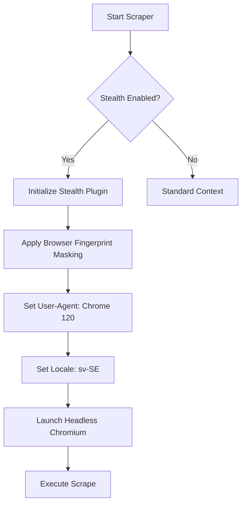
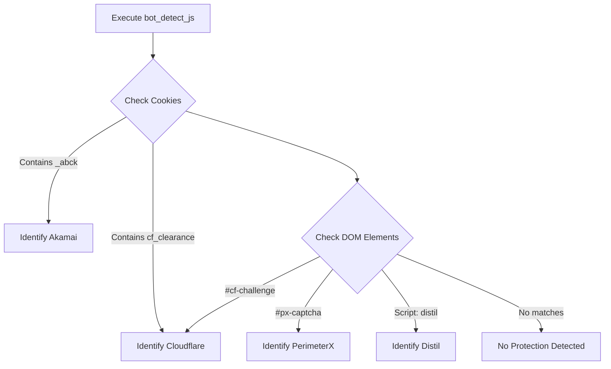

<details>
<summary>Relevant source files</summary>

The following files were used as context for generating this wiki page:

- [scraper/scraper.py](scraper/scraper.py)
- [scraper/enrich.py](scraper/enrich.py)
- [webui/templates/config.html](webui/templates/config.html)
- [README.md](README.md)
- [CHANGELOG.md](CHANGELOG.md)
</details>

# Stealth Mode & Bot Bypass

Stealth Mode is a critical feature of the Web Scraper Platform designed to evade detection by advanced anti-bot systems such as Akamai, Cloudflare, PerimeterX, and Distil. It leverages browser fingerprinting obfuscation, randomized interaction patterns, and network-level masking to ensure successful data extraction from highly protected e-commerce sites.

Sources: [README.md:14](README.md#L14), [scraper/scraper.py:1056-1070](scraper/scraper.py#L1056-L1070)

## Architecture of Stealth

The stealth system operates at three primary levels: the browser instance, the network layer, and the interaction layer. The core implementation relies on the `playwright-stealth` library and custom Playwright browser context configurations.

### Browser Context Obfuscation
When creating a new browser context, the system injects specific parameters to mimic a legitimate user. This includes setting a realistic User-Agent, locale, and timezone, as well as disabling features that are commonly used by anti-bot scripts to identify automated browsers (e.g., `AutomationControlled`).



The `scraper/enrich.py` and `scraper/scraper.py` modules both implement advanced context settings to maintain consistency across the periodic scraper and the enrichment job.

Sources: [scraper/scraper.py:418-420](scraper/scraper.py#L418-L420), [scraper/enrich.py:144-156](scraper/enrich.py#L144-L156), [scraper/scraper.py:102-108](scraper/scraper.py#L102-L108)

### Stealth Mechanism Components

| Component | Logic / Implementation | Purpose |
|-----------|------------------------|---------|
| **Playwright Stealth** | `Stealth().apply_stealth_async(page)` | Patches browser APIs like `navigator.webdriver`. |
| **User-Agent Spoofing** | Hardcoded Chrome 120 string | Prevents identification as a headless browser. |
| **Feature Disabling** | `--disable-blink-features=AutomationControlled` | Removes the `webdriver` flag from the DOM. |
| **HTTP Headers** | Custom `Accept-Language`, `DNT`, and `Accept` headers | Mimics real-world browser request headers. |

Sources: [scraper/scraper.py:102-108](scraper/scraper.py#L102-L108), [scraper/enrich.py:144-156](scraper/enrich.py#L144-L156)

## Bot Protection Detection

The platform includes a heuristic engine to identify which anti-bot provider a target site is using. This detection occurs during the "Auto-detect" phase in the WebUI or when configuring a new site.

### Detection Heuristics
The system executes a specialized JavaScript snippet (`bot_detect_js`) within the target page to look for specific artifacts:
*  **Akamai**: Searches for `_abck` cookies or scripts containing `akam`.
*  **Cloudflare**: Looks for `#cf-challenge-running` or `challenges.cloudflare.com` scripts.
*  **PerimeterX**: Detects scripts containing `perimeterx` or the `px-captcha` div.
*  **Distil**: Identifies `distil` classes or scripts.



Sources: [scraper/scraper.py:1056-1070](scraper/scraper.py#L1056-L1070), [webui/templates/config.html:268-285](webui/templates/config.html#L268-L285)

## Network Masking (Proxy Support)

Bypassing bot protection often requires cycling IP addresses or using residential proxies. The platform allows for both global and per-site proxy configurations.

*  **Global Proxy**: Configured via the `proxy_url` setting in the Advanced Settings menu.
*  **Per-Site Proxy**: Configured in the `scraper_config` table, allowing specific sites to use dedicated SOCKS5 or HTTP proxies.

### Proxy Data Flow
When a scrape starts, the system checks for a site-specific proxy. If none exists, it falls back to the global configuration before initializing the Playwright context.

Sources: [scraper/scraper.py:644-653](scraper/scraper.py#L644-L653), [webui/templates/config.html:105-108](webui/templates/config.html#L105-L108), [CHANGELOG.md:67](CHANGELOG.md#L67)

## Implementation Details

### Randomization and Jitter
To prevent rate-limiting and behavior-based detection, the scraper introduces "jitter" (random delays) between actions:
*  **Wait for timeout**: Random sleep of 2-5 seconds after page load.
*  **Worker Jitter**: 1-3 seconds sleep between page loads in the enrichment worker.
*  **Pagination Jitter**: 3-7 seconds delay between scraping consecutive pages.

Sources: [scraper/scraper.py:423](scraper/scraper.py#L423), [scraper/enrich.py:173](scraper/enrich.py#L173), [scraper/scraper.py:614](scraper/scraper.py#L614)

### Code Snippet: Stealth Application
The following logic in `scraper/scraper.py` demonstrates how stealth is applied to a specific page instance:

```python
async def scrape_page_with_retry(context, url, max_retries=3, use_stealth=False):
    for attempt in range(max_retries):
        page = None
        try:
            page = await context.new_page()
            if use_stealth:
                await Stealth().apply_stealth_async(page)
            await page.goto(url, timeout=60000, wait_until="domcontentloaded")
            # ... additional logic
```

Sources: [scraper/scraper.py:412-422](scraper/scraper.py#L412-L422)

## Summary
Stealth Mode & Bot Bypass in this platform is not a single toggle but a multi-layered defense strategy. By combining `playwright-stealth` for API patching, custom header injection for identity masking, and site-specific proxying, the system effectively bypasses standard e-commerce protection. The integrated bot detection heuristic ensures that users are alerted when a target site requires these advanced features to be enabled.

Sources: [scraper/scraper.py:1056-1080](scraper/scraper.py#L1056-L1080), [README.md:14](README.md#L14)
