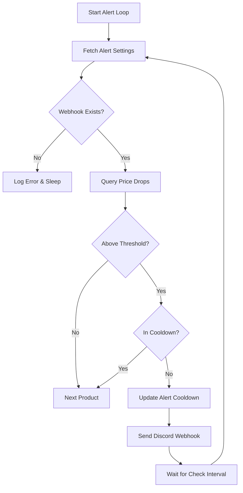
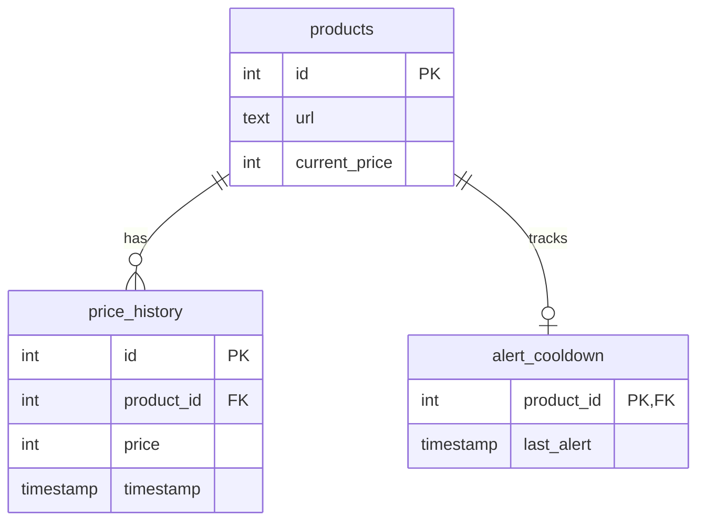

<details>
<summary>Relevant source files</summary>

The following files were used as context for generating this wiki page:

- [alerts/alerts.py](alerts/alerts.py)
- [scraper/scraper.py](scraper/scraper.py)
- [README.md](README.md)
- [webui/templates/config.html](webui/templates/config.html)
- [CLAUDE.md](CLAUDE.md)
</details>

# Price Monitoring & Discord Alerts

The Price Monitoring and Discord Alerts system is a specialized module designed to track fluctuations in product prices and notify users of significant price drops via Discord webhooks. It operates by analyzing historical price data stored in a PostgreSQL database and applying user-defined thresholds to filter out minor or frequent price changes.

The system is architected as an asynchronous service that runs alongside the main scraper, utilizing a cooldown mechanism to prevent notification fatigue. It integrates with the project's global configuration settings, allowing users to tune monitoring sensitivity directly from the WebUI.

Sources: [alerts/alerts.py:1-40](alerts/alerts.py#L1-L40), [README.md:12-25](README.md#L12-L25), [CLAUDE.md:30-35](CLAUDE.md#L30-L35)

## System Architecture

The alerting system functions as a consumer of the data generated by the scraper. While the scraper populates the `products` and `price_history` tables, the `alerts.py` service periodically polls these tables to identify downward price trends.

### Data Flow and Logic
The system follows a specific sequence to determine if an alert should be dispatched:
1.  **Price Drop Detection**: It uses a Common Table Expression (CTE) with the `LAG()` window function to compare the current price with the previous price for every product.
2.  **Threshold Validation**: It checks if the drop exceeds both the `min_drop_percent` and `min_drop_amount`.
3.  **Cooldown Check**: It verifies if an alert for the specific product was sent within the defined `cooldown_hours`.
4.  **Notification Dispatch**: If all criteria are met, it sends a formatted embed to the configured Discord webhook.

Sources: [alerts/alerts.py:120-155](alerts/alerts.py#L120-L155), [scraper/scraper.py:205-230](scraper/scraper.py#L205-L230)

### Logic Flow Diagram
The following flowchart illustrates the decision-making process for triggering a Discord alert:



Sources: [alerts/alerts.py:115-185](alerts/alerts.py#L115-L185)

## Configuration and Settings

Monitoring behavior is governed by parameters stored in the `settings` table. These settings can be modified via the WebUI and are applied dynamically during the next alert cycle.

### Key Monitoring Parameters

| Parameter | Type | Default | Description |
| :--- | :--- | :--- | :--- |
| `check_interval` | int | 1800s | Seconds between price-drop checks. |
| `min_drop_percent` | float | 5.0% | Minimum percentage drop required to trigger an alert. |
| `min_drop_amount` | int | 100 kr | Minimum absolute currency drop required. |
| `cooldown_hours` | int | 24h | Hours to wait before alerting on the same product again. |

Sources: [alerts/alerts.py:24-30](alerts/alerts.py#L24-L30), [scraper/scraper.py:65-85](scraper/scraper.py#L65-L85)

### Credentials Management
Discord alerts require a valid webhook URL. This is managed through the project's credential system:
*  **File-based**: Stored in `DOCKER/scraper/credentials/discord_webhook`.
*  **Environment-based**: Provided via the `DISCORD_WEBHOOK` or `DISCORD_WEBHOOK_FILE` environment variables.

Sources: [README.md:65-75](README.md#L65-L75), [alerts/alerts.py:97-100](alerts/alerts.py#L97-L100)

## Database Schema for Alerts

The alerting system relies on two primary tables for state management and historical analysis.

### alert_cooldown Table
This table tracks the last time a notification was sent for a specific product to enforce the cooldown period.

| Field | Type | Description |
| :--- | :--- | :--- |
| `product_id` | INTEGER | Foreign key referencing `products(id)`. |
| `last_alert` | TIMESTAMP | The timestamp of the most recent alert sent. |

Sources: [README.md:180-185](README.md#L180-L185), [scraper/scraper.py:238-243](scraper/scraper.py#L238-L243)

### ER Diagram
The relationship between products, price history, and alert cooldowns is shown below:



Sources: [README.md:140-190](README.md#L140-L190), [scraper/scraper.py:195-250](scraper/scraper.py#L195-L250)

## Implementation Details

### Alert Query Logic
The system identifies deals using a SQL query that joins products with their history and compares consecutive records.

```sql
WITH price_drops AS (
    SELECT
        p.id,
        p.title,
        p.url,
        ph.price AS new_price,
        LAG(ph.price) OVER (PARTITION BY p.id ORDER BY ph.timestamp) AS old_price
    FROM products p
    JOIN price_history ph ON p.id = ph.product_id
)
SELECT * FROM price_drops
WHERE old_price IS NOT NULL AND new_price < old_price
```

Sources: [alerts/alerts.py:125-135](alerts/alerts.py#L125-L135)

### Notification Formatting
Alerts are sent as Discord Embeds. The implementation includes formatting for Swedish currency (kr) and calculates the percentage drop for the display.

```python
def send_discord(webhook, title, old_price, new_price, url):
    drop = old_price - new_price
    percent = round((drop / old_price) * 100, 1)
    payload = {
        "embeds": [{
            "title": "💸 Price Drop!",
            "description": f"**{title}**",
            "color": 16711680,
            "fields": [
                {"name": "Old", "value": f"{old_price:,} kr".replace(",", " "), "inline": True},
                {"name": "New", "value": f"{new_price:,} kr".replace(",", " "), "inline": True},
                {"name": "Drop", "value": f"-{drop:,} kr ({percent}%)".replace(",", " "), "inline": True},
                {"name": "Link", "value": url}
            ]
        }]
    }
```

Sources: [alerts/alerts.py:103-120](alerts/alerts.py#L103-L120)

## Summary

The Price Monitoring & Discord Alerts module provides a robust mechanism for automated deal detection. By combining PostgreSQL window functions for price analysis with a persistent cooldown state, the system ensures that users receive timely, relevant, and non-repetitive notifications about price reductions across all monitored e-commerce sites. Configuration is flexible, allowing for fine-grained control over what constitutes a "significant" price drop.
