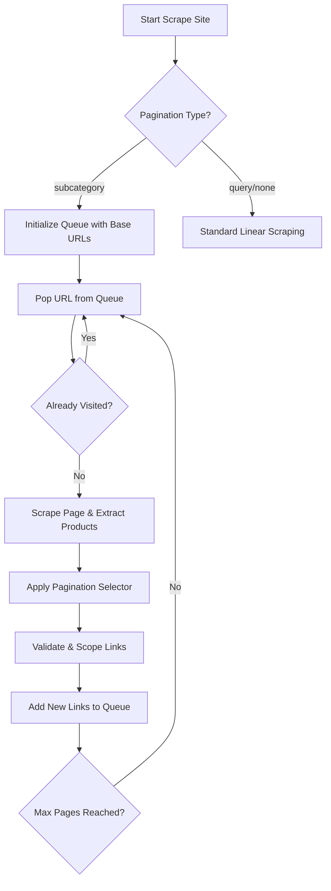

<details>
<summary>Relevant source files</summary>

The following files were used as context for generating this wiki page:

- [scraper/scraper.py](scraper/scraper.py)
- [CHANGELOG.md](CHANGELOG.md)
- [webui/templates/config.html](webui/templates/config.html)
- [fetcher/fetcher.py](fetcher/fetcher.py)
- [README.md](README.md)
</details>

# Subcategory Auto-Discovery

Subcategory Auto-Discovery is a feature introduced in version 1.18.0 that allows the scraper to automatically navigate and index deep product hierarchies by following category links on a website. Unlike standard linear scraping, this mode enables the engine to crawl through nested categories to find products that might not be visible from the top-level base URL.

The system uses CSS selectors to identify potential category links and manages a queue of discovered URLs while applying scope constraints to prevent the crawler from leaving the target domain or relevant sections. This feature is particularly useful for large e-commerce sites with complex taxonomies like Inet.se, Komplett.se, or Webhallen.

Sources: [CHANGELOG.md:18-20](CHANGELOG.md#L18-L20), [scraper/scraper.py:464-474](scraper/scraper.py#L464-L474)

## Architecture and Logic

The auto-discovery mechanism operates as a bread-first search (BFS) crawler. It starts with a set of base URLs and extracts further links matching a `pagination_selector`. These links are added to a processing queue, ensuring each unique URL is visited only once.

### Workflow Diagram

The following diagram illustrates the logical flow of the subcategory discovery process during a scraping run.



Sources: [scraper/scraper.py:464-486](scraper/scraper.py#L464-L486), [scraper/scraper.py:504-526](scraper/scraper.py#L504-L526)

### Component Details

*  **Queue Management**: Uses a `set` named `visited` to track processed URLs and a list `queue` to manage the BFS order.
*  **Link Extraction**: Uses Playwright's `eval_on_selector_all` to find all anchors matching the `pagination_selector` and extract their `href` attributes.
*  **URL Scoping**: A `url_scope` configuration ensures that discovered links contain specific substrings (e.g., "/category/"), preventing the scraper from wandering into irrelevant site sections like blogs or contact pages.
*  **Validation**: All discovered URLs undergo SSRF (Server-Side Request Forgery) protection checks via `_validate_scrape_url` to ensure they are public HTTP/HTTPS links and do not point to private networks.

Sources: [scraper/scraper.py:108-129](scraper/scraper.py#L108-L129), [scraper/scraper.py:476-483](scraper/scraper.py#L476-L483), [scraper/scraper.py:504-518](scraper/scraper.py#L504-L518)

## Configuration and Data Model

Subcategory discovery is configured per site within the `scraper_config` table. Users can enable this mode via the WebUI by toggling the "Auto-discover subcategories" switch.

### Database Schema

The `scraper_config` table includes specific fields to support this feature:

| Field | Type | Description |
| :--- | :--- | :--- |
| `pagination_type` | TEXT | Set to `'subcategory'` to enable auto-discovery. |
| `pagination_selector` | TEXT | CSS selector for links to follow (e.g., `a[href*='/kategori/']`). |
| `max_pages` | INTEGER | Maximum depth/number of category pages to crawl per base URL. |
| `url_scope` | TEXT | Substring filter to restrict discovered URLs. |

Sources: [README.md:179-198](README.md#L179-L198), [scraper/scraper.py:246-261](scraper/scraper.py#L246-L261)

### WebUI Configuration Snippet

In the configuration interface, enabling subcategory discovery reveals the selector input field:

```javascript
function togglePaginationSelector() {
    const show = document.getElementById('cfgSubcategory').checked;
    document.getElementById('paginationSelectorRow').style.display = show ? 'block' : 'none';
}
```

Sources: [webui/templates/config.html:268-271](webui/templates/config.html#L268-L271)

## Implementation in Scraper Engine

The core logic resides in `scraper/scraper.py` within the `scrape_site` function. It handles recursive discovery while maintaining the product extraction loop.

### Category Derivation

As the scraper traverses categories, it attempts to derive a readable category name from the URL path. This provides context for the product even if the product page itself doesn't explicitly state the category.

```python
def derive_category(page_url):
    path = urlparse(page_url).path
    for seg in reversed([s for s in path.split("/") if s]):
        if seg.lower() in _CATEGORY_SKIP:
            continue
        cleaned = re.sub(r"[-_]?\d+$", "", seg).replace("-", " ").replace("_", " ").strip()
        return cleaned[:100]
```

Sources: [scraper/scraper.py:382-401](scraper/scraper.py#L382-L401)

### Technical Constraints

1.  **Normalization**: URLs are normalized to ensure consistency (e.g., stripping trailing slashes) before being added to the `visited` set.
2.  **Concurrency**: The process respects the `concurrent_pages` setting, using an `asyncio.Semaphore` to limit simultaneous browser instances even when the discovery queue is large.
3.  **Shutdown Awareness**: The loop monitors a `shutdown_event` to ensure the scraper can stop gracefully during a service restart.

Sources: [scraper/scraper.py:471-474](scraper/scraper.py#L471-L474), [scraper/scraper.py:487-495](scraper/scraper.py#L487-L495), [scraper/scraper.py:614-617](scraper/scraper.py#L614-L617)

## Summary

Subcategory Auto-Discovery transforms the scraper from a static list processor into a dynamic crawler. By defining a `pagination_selector`, users allow the system to map out entire site sections automatically. This is governed by strict URL validation and scoping rules to ensure performance and security. The system integrates closely with the `derive_category` logic to enrich product metadata based on the path taken during discovery.

Sources: [scraper/scraper.py:464-526](scraper/scraper.py#L464-L526), [webui/templates/config.html:81-86](webui/templates/config.html#L81-L86)
