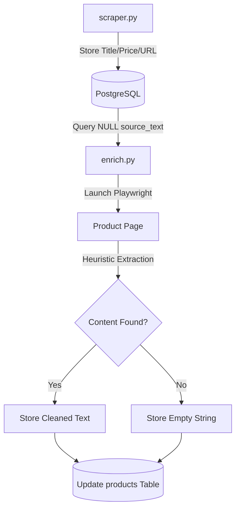
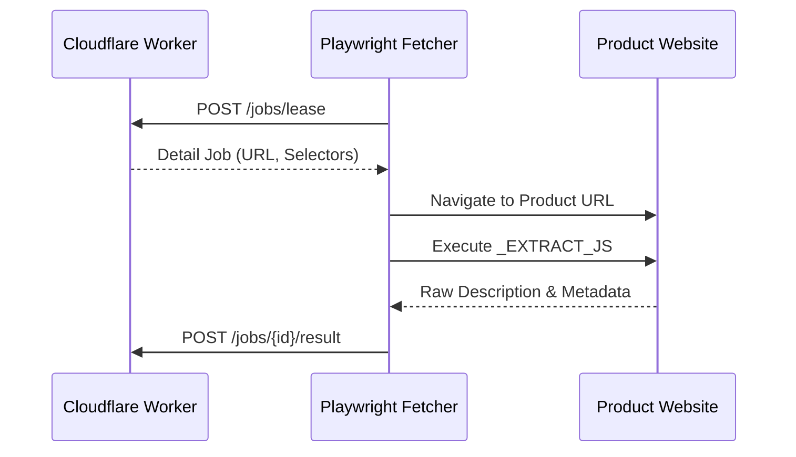

<details>
<summary>Relevant source files</summary>

The following files were used as context for generating this wiki page:

- [scraper/enrich.py](scraper/enrich.py)
- [scraper/scraper.py](scraper/scraper.py)
- [api/api.py](api/api.py)
- [fetcher/fetcher.py](fetcher/fetcher.py)
- [README.md](README.md)
</details>

# Product Description Enrichment

Product Description Enrichment is a specialized subsystem within the Web Scraper Platform designed to augment basic product listings with detailed descriptive text and metadata. While the primary periodic scraper focuses on category listing pages—capturing only titles, prices, and URLs—the enrichment process performs "deep" scraping by visiting individual product pages. This ensures that downstream services, such as automated describers, have access to factual source text rather than relying on potentially hallucinated data from product names.

Sources: [scraper/enrich.py:1-12](scraper/enrich.py#L1-L12), [scraper/scraper.py:270-280](scraper/scraper.py#L270-L280)

## Architecture and Data Flow

The enrichment system operates as a resumable, one-shot job that identifies products in the database lacking descriptive text. It utilizes a headless browser (Playwright) to navigate to the specific URL of each product, wait for client-side rendering, and execute heuristic extraction logic to find the best possible description.

### Enrichment Workflow
The following diagram illustrates the lifecycle of a product from initial discovery by the scraper to final enrichment.



The system distinguishes between products that have never been attempted (`source_text IS NULL`) and those where no description could be found (stored as an empty string `""`). This prevents the system from indefinitely retrying failed extractions.

Sources: [scraper/enrich.py:14-25](scraper/enrich.py#L14-L25), [scraper/enrich.py:73-95](scraper/enrich.py#L73-L95)

## Extraction Heuristics

The enrichment logic uses a prioritized hierarchy of JavaScript-based extraction methods to retrieve data. This ensures high reliability across diverse e-commerce platforms without requiring per-site custom code.

### Priority Levels
1.  **Custom Selector**: If a `detail_selector` is configured in the `scraper_config` table for a specific site, it takes the highest priority.
2.  **JSON-LD Structured Data**: The system searches for `application/ld+json` scripts with a `@type` of `Product`. It specifically looks for the `description` field.
3.  **Open Graph**: The `og:description` meta tag is used as a fallback.
4.  **Standard Meta**: The standard HTML `description` meta tag is the final fallback.

Sources: [scraper/enrich.py:53-70](scraper/enrich.py#L53-L70), [fetcher/fetcher.py:64-100](fetcher/fetcher.py#L64-L100)

### Wait Conditions
Many modern e-commerce sites are Single Page Applications (SPAs) that inject structured data client-side. The enrichment module includes a `RENDER_WAIT_MS` (default 12,000ms) and a JavaScript function `_JSONLD_READY_JS` to wait until the Product JSON-LD is actually present in the DOM before attempting extraction.

Sources: [scraper/enrich.py:38-51](scraper/enrich.py#L38-L51), [fetcher/fetcher.py:44-55](fetcher/fetcher.py#L44-L55)

## Data Models and Storage

Enrichment results are stored in the `products` table, which includes fields for raw source text and higher-level descriptions.

| Field | Type | Description |
| :--- | :--- | :--- |
| `source_text` | TEXT | The raw extracted description from the product page. |
| `source_text_updated_at` | TIMESTAMP | Timestamp of the last enrichment attempt. |
| `description` | TEXT | A refined or generated description (often updated via API). |
| `description_why` | TEXT | Reasoning or context for the generated description. |
| `description_updated_at` | TIMESTAMP | Timestamp of the last description update. |

Sources: [scraper/scraper.py:270-280](scraper/scraper.py#L270-L280), [README.md:180-195](README.md#L180-L195)

### Database Operations
The system uses indices to optimize the selection of products requiring enrichment:

```sql
CREATE INDEX IF NOT EXISTS idx_products_missing_source ON products(id) WHERE source_text IS NULL;
```

Sources: [scraper/scraper.py:285](scraper/scraper.py#L285)

## Integration with External Fetchers

In unified architectures, the enrichment logic is also implemented in a stateless "fetcher" component. This component leases jobs from a central engine and performs `detail` renders to extract `source_text`, title, price, and category data.



Sources: [fetcher/fetcher.py:1-25](fetcher/fetcher.py#L1-L25), [fetcher/fetcher.py:210-230](fetcher/fetcher.py#L210-L230)

## Configuration and CLI Usage

The enrichment process can be controlled via command-line arguments to handle backlogs or specific site refreshes.

| Argument | Description |
| :--- | :--- |
| `--limit` | Maximum number of products to process in one run. |
| `--concurrency` | Number of parallel page loads (default 3). |
| `--site` | Restrict enrichment to a specific site configuration name. |
| `--refresh` | Re-extract text even for products that already have `source_text`. |

Sources: [scraper/enrich.py:27-30](scraper/enrich.py#L27-L30), [scraper/enrich.py:157-162](scraper/enrich.py#L157-L162)

## API Endpoints

The system exposes REST API endpoints to retrieve products missing descriptions and to update enriched description fields.

*  **GET `/products?missing_description=true`**: Returns products that do not yet have a generated description.
*  **PUT `/products/{product_id}/description`**: Updates the `description` and `description_why` fields for a specific product.

Sources: [api/api.py:125-140](api/api.py#L125-L140), [api/api.py:155-165](api/api.py#L155-L165)

## Summary
Product Description Enrichment is critical for grounding the platform's data in facts. By visiting individual product pages and utilizing a robust hierarchy of extraction heuristics, the system transforms basic "title and price" entries into rich data objects suitable for complex analysis and consumption by other services.
