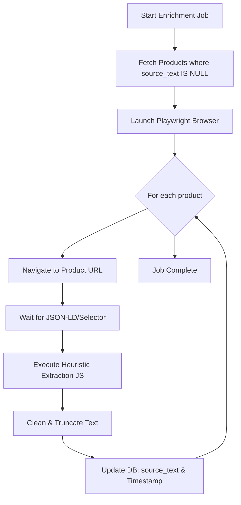
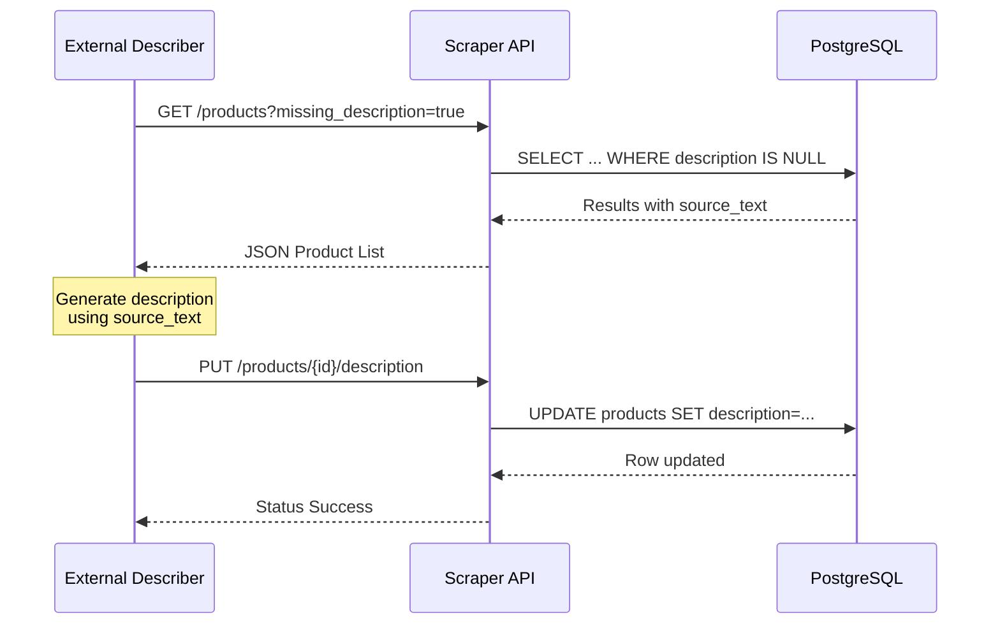

Relevant source files

The following files were used as context for generating this wiki page:

- [scraper/enrich.py](scraper/enrich.py)
- [scraper/scraper.py](scraper/scraper.py)
- [api/api.py](api/api.py)
- [fetcher/fetcher.py](fetcher/fetcher.py)
- [README.md](README.md)
- [CHANGELOG.md](CHANGELOG.md)

# Product Description Enrichment

Product Description Enrichment is a system within the Web Scraper Platform designed to bridge the gap between high-level category listing data and detailed product specifications. While the primary scraper collects basic metadata (title, price, URL) from category pages, the enrichment process visits individual product pages to extract "source text"—the raw description found on the merchant's site. This grounded data prevents "hallucinations" by downstream consumer services, such as product describers, by providing factual context instead of relying solely on often-opaque product names.

Sources: [scraper/enrich.py:5-13](scraper/enrich.py#L5-L13), [fetcher/fetcher.py:1-15](fetcher/fetcher.py#L1-L15)

## Architecture and Data Flow

The enrichment system operates as a resumable, one-shot job or a stateless fetcher service. It identifies products in the database where `source_text` is `NULL`, visits the corresponding product URL using a headless browser (Playwright), and applies a hierarchy of extraction heuristics.

### Enrichment Workflow
The following diagram illustrates the logical flow of the enrichment process:

The system uses a semaphore to control concurrency and includes "jitter" (random delays) between page loads to remain polite to target sites.

Sources: [scraper/enrich.py:125-181](scraper/enrich.py#L125-L181), [scraper/enrich.py:192-198](scraper/enrich.py#L192-L198)

## Extraction Heuristics

Extraction is performed client-side using injected JavaScript. It follows a strictly prioritized heuristic model to ensure the most reliable data is captured across varying e-commerce site architectures.

### Extraction Hierarchy
1.  **Custom Selector:** Uses a site-specific `detail_selector` from the `scraper_config` table if provided (highest priority; site-specific).
2.  **JSON-LD Linked Data:** Searches for `application/ld+json` scripts containing a `Product` type with a `description` field (most reliable for e-commerce).
3.  **Open Graph:** Extracts the `og:description` meta property.
4.  **Standard Meta Description:** Falls back to the standard HTML `description` meta tag.

Sources: [scraper/enrich.py:87-116](scraper/enrich.py#L87-L116), [fetcher/fetcher.py:116-148](fetcher/fetcher.py#L116-L148)

### Data Sanitization
Extracted text is processed to:
*  Normalize whitespace (replacing multiple spaces/newlines with a single space).
*  Truncate the string to a maximum length of 1200 characters (`MAX_SOURCE_LEN`).
*  Store an empty string (rather than `NULL`) if no description is found, marking the row as "attempted" to prevent infinite retries.

Sources: [scraper/enrich.py:53-56](scraper/enrich.py#L53-L56), [scraper/enrich.py:101-105](scraper/enrich.py#L101-L105)

## Database Schema Integration

The enrichment system extends the `products` table with specific columns to track the source data and the downstream descriptions generated from that data.

### Relevant Table Fields
| Field | Type | Description |
| :--- | :--- | :--- |
| `source_text` | TEXT | Raw text extracted from the product page. |
| `source_text_updated_at` | TIMESTAMP | Last time the extraction was performed. |
| `category` | TEXT | Derived category name from URL path or breadcrumbs. |
| `description` | TEXT | Enriched/generated description (often by external AI services). |
| `description_why` | TEXT | Reasoning/context for the generated description. |
| `description_updated_at` | TIMESTAMP | Timestamp of the last description update. |

Sources: [scraper/scraper.py:273-281](scraper/scraper.py#L273-L281), [README.md:210-221](README.md#L210-L221)

### Performance Optimization
To support efficient querying of the backlog, the system utilizes partial indexes:
*  `idx_products_missing_source`: Indexes products where `source_text IS NULL`.
*  `idx_products_missing_description`: Indexes products where `description IS NULL`.

Sources: [scraper/scraper.py:282-283](scraper/scraper.py#L282-L283)

## API and Integration

The platform provides REST API endpoints to facilitate the consumption of source text and the submission of enriched descriptions.

### API Endpoint Summary
| Method | Endpoint | Description |
| :--- | :--- | :--- |
| `GET` | `/products?missing_description=true` | Retrieves products that have source text but lack a final description. |
| `PUT` | `/products/{id}/description` | Updates a product's description and "why" fields. |
| `GET` | `/products` | Returns `source_text` and `category` alongside basic product data. |

Sources: [api/api.py:115-120](api/api.py#L115-L120), [api/api.py:145-167](api/api.py#L145-L167)

### Description Update Sequence
The following sequence diagram shows how an external service interacts with the API to perform enrichment:

Sources: [api/api.py:120-136](api/api.py#L120-L136), [api/api.py:151-167](api/api.py#L151-L167)

## Category Derivation
A specialized utility, `derive_category`, extracts a readable category from the product's listing URL path. It filters out common technical segments (e.g., "sv", "shop", "p") and strips numeric IDs to provide the enrichment process with clean context about the product's placement in the merchant's taxonomy.

Sources: [scraper/scraper.py:236-253](scraper/scraper.py#L236-L253), [fetcher/fetcher.py:48-73](fetcher/fetcher.py#L48-L73)

The Product Description Enrichment module ensures that the scraped database contains more than just prices and titles, providing a rich, factual foundation for advanced product data processing and display.
