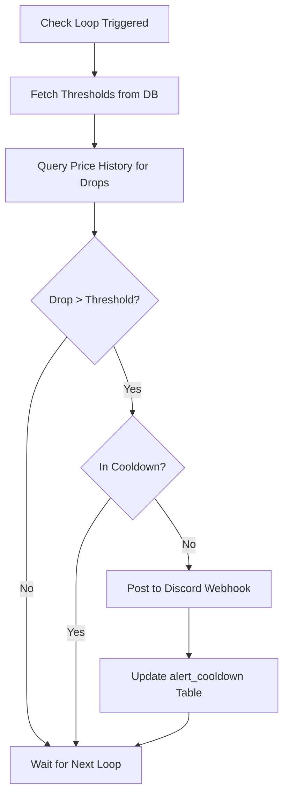
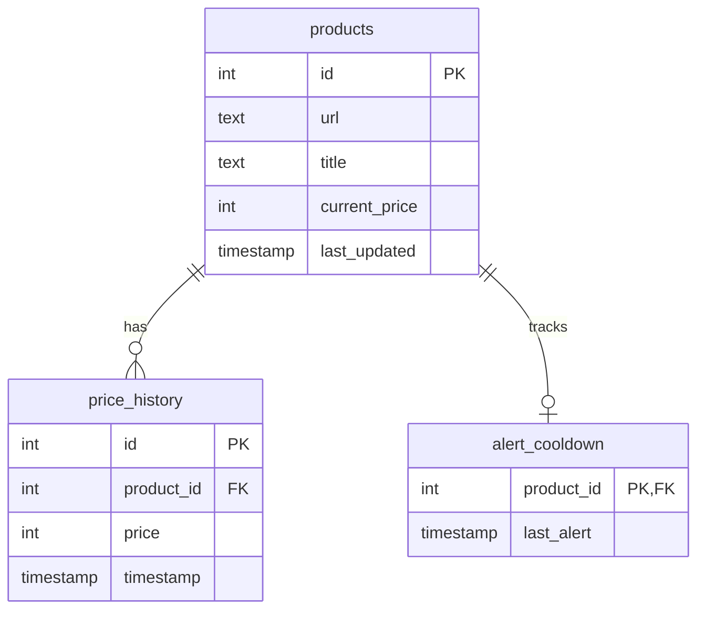

<details>
<summary>Relevant source files</summary>

The following files were used as context for generating this wiki page:

- [alerts/alerts.py](alerts/alerts.py)
- [README.md](README.md)
- [scraper/scraper.py](scraper/scraper.py)
- [webui/templates/config.html](webui/templates/config.html)
- [webui/static/script.js](webui/static/script.js)
</details>

# Price Monitoring & Discord Alerts

The Price Monitoring and Discord Alerts system is a core component of the Web Scraper Platform designed to track product price changes and notify users of significant drops. It operates by analyzing price history stored in a PostgreSQL database and comparing current prices against historical data to identify trends and trigger notifications.

The system is architected as an asynchronous service that periodically checks for "deals" based on user-defined thresholds. When a price drop meets specific criteria—such as minimum percentage or absolute currency value decreases—the system dispatches an embed notification to a configured Discord webhook.

Sources: [README.md:16](README.md#L16), [alerts/alerts.py:12-20](alerts/alerts.py#L12-L20)

## Architecture and Data Flow

The monitoring system relies on a continuous loop that interacts with the PostgreSQL database and external Discord APIs. The process is decoupled from the actual scraping logic, allowing price analysis to occur independently of data collection.

### Core Components

*  **Alert Loop:** A persistent asynchronous loop that executes at defined intervals (default 1800s) to check for price changes.
*  **Database (PostgreSQL):** Stores `products`, `price_history`, and `alert_cooldown` tables.
*  **Discord Webhook:** The external endpoint used to deliver notifications.

### Detection Logic Diagram
The following diagram illustrates the flow from price detection in the database to the delivery of a Discord alert.



Sources: [alerts/alerts.py:124-180](alerts/alerts.py#L124-L180), [scraper/scraper.py:61-90](scraper/scraper.py#L61-L90)

## Configuration and Thresholds

The system is highly configurable through the WebUI, with settings stored in the `settings` table. These parameters control the sensitivity of the alert system and prevent notification fatigue.

| Setting | Type | Default | Description |
| :--- | :--- | :--- | :--- |
| `check_interval` | Integer | 1800s | Seconds between price-drop checks. |
| `min_drop_percent` | Float | 5.0% | Minimum percentage drop to trigger an alert. |
| `min_drop_amount` | Integer | 100 kr | Minimum absolute drop in currency to trigger an alert. |
| `cooldown_hours` | Integer | 24h | Hours to wait before alerting on the same product again. |

Sources: [scraper/scraper.py:61-90](scraper/scraper.py#L61-L90), [alerts/alerts.py:27-32](alerts/alerts.py#L27-L32)

## Data Models for Monitoring

The system utilizes three primary tables to manage price tracking and alert states.

### Relational Schema Diagram
The relationship between products, their price history, and the alert status is managed through foreign keys as shown below.



Sources: [README.md:155-185](README.md#L155-L185), [scraper/scraper.py:195-235](scraper/scraper.py#L195-L235)

## Alert Dispatch Logic

Alerts are sent using the `send_discord` function, which constructs a rich embed. To prevent duplicate notifications, the system utilizes a Common Table Expression (CTE) and the `alert_cooldown` table to ensure a product is only flagged if the cooldown period has elapsed.

```python
# Sources: alerts/alerts.py:101-118
def send_discord(webhook, title, old_price, new_price, url):
    drop = old_price - new_price
    percent = round((drop / old_price) * 100, 1)
    payload = {
        "embeds": [{
            "title": "💸 Price Drop!",
            "description": f"**{title}**",
            "color": 16711680,
            "fields": [
                {"name": "Old", "value": f"{old_price:,} kr".replace(",", " "), "inline": True},
                {"name": "New", "value": f"{new_price:,} kr".replace(",", " "), "inline": True},
                {"name": "Drop", "value": f"-{drop:,} kr ({percent}%)".replace(",", " "), "inline": True},
                {"name": "Link", "value": url}
            ]
        }]
    }
    try:
        return requests.post(webhook, json=payload, timeout=10).status_code == 204
    except requests.exceptions.RequestException:
        return False
```

The system verifies the drop using a SQL query that partition price history:

```sql
-- Sources: alerts/alerts.py:139-148
SELECT * FROM (
    SELECT
        p.id, p.title, p.url,
        ph.price AS new_price,
        LAG(ph.price) OVER (PARTITION BY p.id ORDER BY ph.timestamp) AS old_price
    FROM products p
    JOIN price_history ph ON p.id = ph.product_id
) price_drops
WHERE old_price IS NOT NULL AND new_price < old_price
```

## Security and Credentials

Discord webhooks are sensitive and are managed via the `credentials` directory. Users must manually create the `discord_webhook` file or set the `DISCORD_WEBHOOK` environment variable. The system reads these secrets at runtime to authenticate requests to Discord.

Sources: [README.md:65-75](README.md#L65-L75), [alerts/alerts.py:97-99](alerts/alerts.py#L97-L99)
