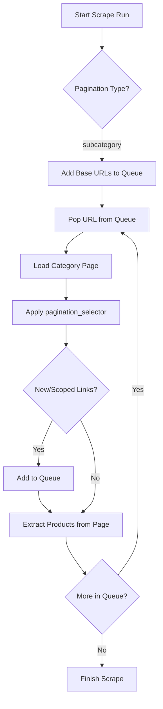
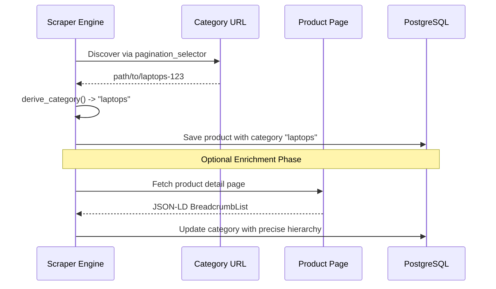

<details>
<summary>Relevant source files</summary>

The following files were used as context for generating this wiki page:

- [scraper/scraper.py](scraper/scraper.py)
- [CHANGELOG.md](CHANGELOG.md)
- [README.md](README.md)
- [webui/templates/config.html](webui/templates/config.html)
- [fetcher/fetcher.py](fetcher/fetcher.py)
- [scraper/enrich.py](scraper/enrich.py)

</details>

# Subcategory Auto-Discovery

Subcategory Auto-Discovery is a core feature of the Web Scraper Platform designed to automate the traversal of e-commerce directory structures. Unlike standard query-based pagination, which simply increments a page number, this system identifies and follows category links found on a page to discover deeper levels of products. This allows the scraper to move beyond flat listing pages and map out complex site hierarchies effectively.

The feature was introduced in version 1.18.0 as part of an effort to improve scraping coverage for sites that organize products into nested sub-navigation menus. It works in tandem with the [Scraper Config](#database-schema) to provide a flexible way to target specific branches of a website using CSS selectors for subcategory links.

Sources: [CHANGELOG.md:27](CHANGELOG.md#L27), [README.md:162-177](README.md#L162-L177), [webui/templates/config.html:75-79](webui/templates/config.html#L75-L79)

## Architectural Overview

The Subcategory Auto-Discovery logic resides primarily within the `scrape_site` function in the scraper engine. When a configuration's `pagination_type` is set to `subcategory`, the engine switches from a linear page loop to a queue-based crawling algorithm.

### Logic Flow

1.  **Queue Initialization**: The scraper starts with a set of base URLs provided in the site configuration.
2.  **Breadth-First Traversal**: The scraper maintains a `visited` set to avoid loops and a `queue` for pending URLs.
3.  **Discovery**: On each category page, the engine applies the `pagination_selector` to find links to further sub-segments.
4.  **Product Extraction**: For every discovered page, the standard product container and field selectors are applied to extract data.



This flow ensures that the scraper remains within the intended `url_scope` while discovering all relevant branch nodes in the site's navigation.

Sources: [scraper/scraper.py:469-522](scraper/scraper.py#L469-L522), [webui/templates/config.html:362-378](webui/templates/config.html#L362-L378)

## Configuration and Implementation

Subcategory discovery is configured via the WebUI and persisted in the `scraper_config` table. Key fields include the `pagination_type`, the `pagination_selector` (the CSS selector for links to follow), and the `url_scope`.

### Key Configuration Fields

| Field | Purpose | Implementation Detail |
| :--- | :--- | :--- |
| `pagination_type` | Determines crawling mode | Set to `'subcategory'` for discovery mode. |
| `pagination_selector` | Targets category links | CSS selector like `a[href*='/kategori/']`. |
| `url_scope` | Restricts traversal | String check to ensure followed links stay on relevant paths. |
| `max_pages` | Limit per category | Caps how deep the scraper goes within a single subcategory. |

Sources: [scraper/scraper.py:488-490](scraper/scraper.py#L488-L490), [webui/templates/config.html:86-90](webui/templates/config.html#L86-L90), [README.md:165-177](README.md#L165-L177)

### Code Snippet: Traversal Logic
The following logic in `scraper/scraper.py` demonstrates how new links are discovered and added to the processing queue:

```python
# scraper/scraper.py:495-512
if page_num == 1 and config.get('pagination_selector'):
    try:
        links = await page.eval_on_selector_all(
            config['pagination_selector'],
            "els => [...new Set(els.map(e => e.href))]"
        )
        for link in links:
            link = link.rstrip('/')
            # Validate URL for SSRF protection
            _validate_scrape_url(link)
            if url_scope and url_scope not in link:
                continue
            if link not in visited and link not in queued:
                queued.add(link)
                queue.append(link)
    except PlaywrightError as e:
        logger.debug(f"Pagination selector failed: {e}")
```

Sources: [scraper/scraper.py:495-512](scraper/scraper.py#L495-L512)

## Data Enrichment and Categorization

As the scraper navigates through subcategories, it attempts to derive context for the products it finds. The `derive_category` function parses the URL of the listing page to extract a readable category name, which is then stored with the product.

### Category Extraction Heuristics

The system uses the following steps to clean and identify categories:
1.  **Path Parsing**: Splits the URL path into segments.
2.  **Filtering**: Skips common generic segments like "shop", "products", or "kategori".
3.  **Cleaning**: Removes trailing numeric IDs and replaces dashes/underscores with spaces.
4.  **Resumable Enrichment**: The `enrich.py` module further refines this by visiting individual product pages to extract JSON-LD Breadcrumb data.



Sources: [scraper/scraper.py:433-452](scraper/scraper.py#L433-L452), [scraper/enrich.py:101-125](scraper/enrich.py#L101-L125), [fetcher/fetcher.py:76-96](fetcher/fetcher.py#L76-L96)

## Security and Validation

To prevent Server-Side Request Forgery (SSRF), all discovered subcategory links are passed through `_validate_scrape_url` before being added to the queue.

*  **Public URL Enforcement**: Only `http` and `https` schemes are allowed.
*  **Private Network Blocking**: Links resolving to private IP ranges (e.g., 127.0.0.1, 192.168.x.x, 10.x.x.x) are immediately rejected.
*  **Hostname Validation**: The system ensures the link contains a valid hostname and performs a DNS resolution check to prevent hostname-based SSRF.

Sources: [scraper/scraper.py:133-156](scraper/scraper.py#L133-L156), [scraper/scraper.py:503-504](scraper/scraper.py#L503-L504)

## Summary

Subcategory Auto-Discovery transforms the platform from a flat scraper into a sophisticated crawler capable of navigating hierarchical site structures. By combining user-defined CSS selectors with automated URL traversal and category derivation, the system ensures high data coverage while maintaining strict security boundaries through SSRF protection. Its integration into the standard scraping loop allows it to benefit from other platform features like Stealth mode and Proxy support.

Sources: [README.md:15-25](README.md#L15-L25), [scraper/scraper.py:469-522](scraper/scraper.py#L469-L522)
