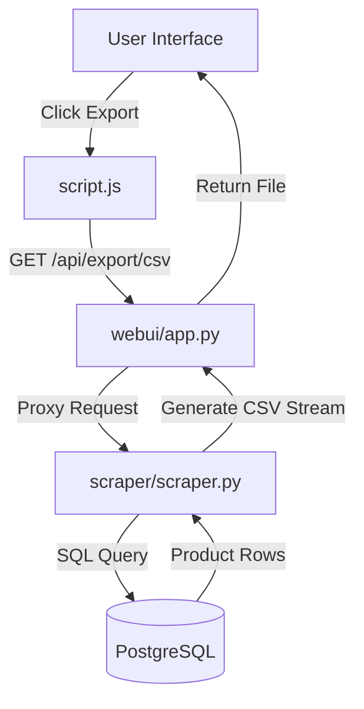

<details>
<summary>Relevant source files</summary>

The following files were used as context for generating this wiki page:

- [webui/app.py](webui/app.py)
- [scraper/scraper.py](scraper/scraper.py)
- [webui/static/script.js](webui/static/script.js)
- [webui/templates/index.html](webui/templates/index.html)
- [README.md](README.md)
- [fetcher/fetcher.py](fetcher/fetcher.py)
</details>

# Data Export Capabilities

The Web Scraper platform provides robust mechanisms for exporting scraped product data into structured formats, primarily CSV. This feature allows users and external services to consume processed e-commerce data for further analysis, reporting, or integration with other tools like the `product-describer`. The export system is architected as a multi-layer process involving the Web UI, a control plane proxy, and the Scraper Engine's backend data retrieval logic.

Data export can be triggered globally for all products or filtered by specific site configurations. The implementation ensures data integrity by using secure SQL queries and formatting helpers that prevent common spreadsheet injection vulnerabilities.

## Architecture and Data Flow

The export process follows a request-response flow starting from the frontend and moving through the Flask-based WebUI to the Scraper Engine.



*The diagram shows the sequence of requests from the user's browser through the WebUI proxy to the Scraper Engine and Database.*

Sources: [webui/app.py:195-207](webui/app.py#L195-L207), [scraper/scraper.py:925-958](scraper/scraper.py#L925-L958), [webui/static/script.js:156-158](webui/static/script.js#L156-L158)

## Backend Export Implementation

The Scraper Engine (running on port 5001) serves as the primary data processor for exports. It utilizes `psycopg2` with `RealDictCursor` to fetch data and the standard Python `csv` module to generate the file content in memory using `StringIO`.

### SQL Retrieval Logic
The system uses two primary queries for export depending on whether the user wants a site-specific or a global dataset.

| Query Type | Logic | Source |
| :--- | :--- | :--- |
| **Site Specific** | Joins `products` and `scraper_config` tables, filtering by `site_name`. | [scraper/scraper.py:909-914](scraper/scraper.py#L909-L914) |
| **Global Export** | Selects all products with a `current_price > 0`. | [scraper/scraper.py:916-921](scraper/scraper.py#L916-L921) |

### Security and Formatting
To ensure compatibility with spreadsheet software and prevent formula injection (CSV Injection), the engine employs a `_csv_safe` helper function. This function prepends a single quote to values starting with potentially dangerous characters such as `=`, `+`, `-`, or `@`.

```python
def _csv_safe(value):
    s = str(value) if value is not None else ''
    if s and s[0] in ('=', '+', '-', '@', '\t', '\r'):
        return "'" + s
    return s
```

Sources: [scraper/scraper.py:902-906](scraper/scraper.py#L902-L906)

## API Endpoints for Export

The platform exposes several endpoints for programmatic and UI-based data retrieval. Access through the WebUI proxy requires standard authentication as configured in the control plane.

| Endpoint (WebUI Proxy) | Endpoint (Engine) | Method | Description |
| :--- | :--- | :--- | :--- |
| `/api/export/csv` | `/export` | GET | Exports all products to a CSV file. |
| N/A | `/export/<site_name>` | GET | Exports products filtered by a specific site name. |

Sources: [webui/app.py:195-207](webui/app.py#L195-L207), [scraper/scraper.py:925-958](scraper/scraper.py#L925-L958)

## Frontend Integration

The user triggers exports via the Dashboard. The frontend implementation simplifies the download process by redirecting the window location to the export endpoint, allowing the browser to handle the file stream and download headers.

### UI Components
*  **Export Button**: Located on the main dashboard (`webui/templates/index.html`), identified by `id="exportBtn"`.
*  **JavaScript Helper**: The `exportData` function in `script.js` initiates the download.

```javascript
function exportData(format = 'csv') {
    window.location.href = `/api/export/${format}`;
}
```

Sources: [webui/templates/index.html:84-86](webui/templates/index.html#L84-L86), [webui/static/script.js:156-158](webui/static/script.js#L156-L158)

## Data Schema for Export

The exported CSV files contain three primary columns derived from the `products` table.

| CSV Column | Database Field | Data Type | Description |
| :--- | :--- | :--- | :--- |
| **Product** | `title` | TEXT | The name/title of the product. |
| **Price (SEK)** | `current_price` | INTEGER | The most recently scraped price in SEK. |
| **Link** | `url` | TEXT | The direct URL to the product page. |

The filename is automatically generated using the current date in `YYYYMMDD` format (e.g., `products_20231027.csv`).

Sources: [scraper/scraper.py:935-958](scraper/scraper.py#L935-L958), [README.md:144-156](README.md#L144-L156)

## Conclusion
Data Export Capabilities in the Scraper platform provide a secure and streamlined path for extracting e-commerce intelligence. By leveraging a proxy architecture and safe CSV formatting, the system ensures that high-quality, scraped data is available for external use without compromising server security or data integrity.

Sources: [scraper/scraper.py](scraper/scraper.py), [webui/app.py](webui/app.py), [webui/static/script.js](webui/static/script.js)
