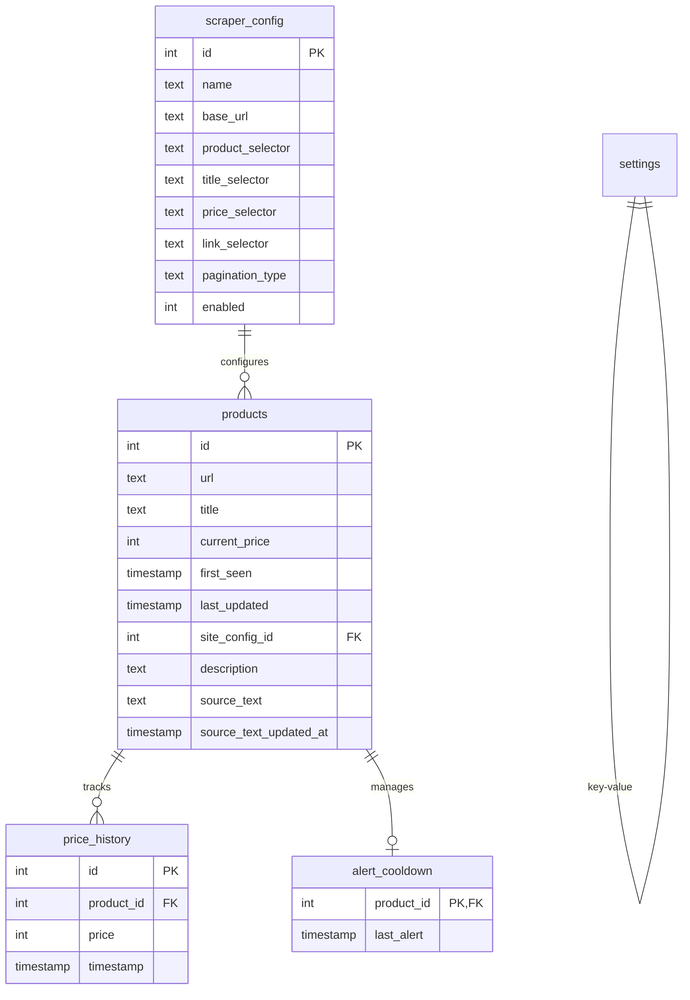
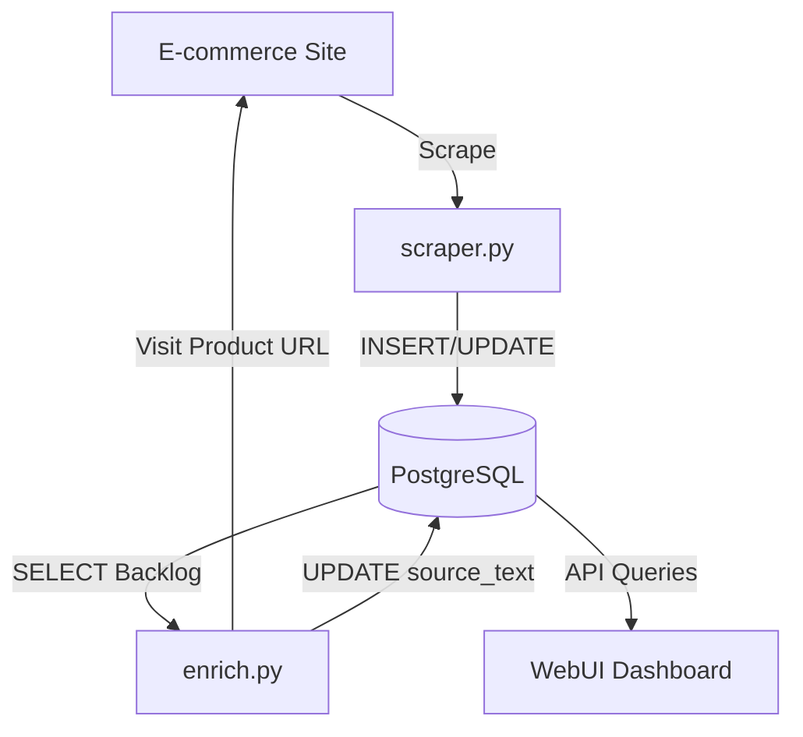

<details>
<summary>Relevant source files</summary>

The following files were used as context for generating this wiki page:

- [README.md](README.md)
- [scraper/scraper.py](scraper/scraper.py)
- [scraper/enrich.py](scraper/enrich.py)
- [fetcher/fetcher.py](fetcher/fetcher.py)
- [webui/templates/config.html](webui/templates/config.html)

</details>

# Database Schema & Structure

## Introduction

The Web Scraper Platform utilizes a PostgreSQL database to manage multi-site scraping configurations, product data, price history, and system-wide settings. It is designed for production-grade reliability, featuring connection pooling and structured relationships to support features like price monitoring and automated product enrichment.

The database serves as the central state management system for the entire platform, coordinating between the scraping engine (`scraper.py`), the product enrichment module (`enrich.py`), and the user interface (`webui`). It ensures data persistence for scraped items while maintaining historical price records to enable deal detection and alerts.

Sources: [README.md:1-20](README.md#L1-L20), [scraper/scraper.py:12-25](scraper/scraper.py#L12-L25)

## Entity Relationship Diagram

The following diagram illustrates the relationships between the core tables in the system, including the foreign key constraints between products, their history, and site configurations.



Sources: [README.md:183-228](README.md#L183-L228), [scraper/scraper.py:206-285](scraper/scraper.py#L206-L285)

## Data Models

### Products Table
The `products` table stores the primary record for every discovered item. It tracks the current state of the product, including its URL, most recent price, and metadata for enrichment.

| Field | Type | Description |
| :--- | :--- | :--- |
| `id` | SERIAL | Primary key. |
| `url` | TEXT | Unique product URL. |
| `title` | TEXT | Product name or title. |
| `current_price` | INTEGER | The most recently scraped price in SEK. |
| `site_config_id` | INTEGER | FK to `scraper_config`. |
| `description` | TEXT | High-level product description. |
| `source_text` | TEXT | Raw extracted text from the product page for enrichment. |
| `category` | TEXT | Derived category from URL path or JSON-LD. |
| `last_updated` | TIMESTAMP | Last time the price or title was updated. |

Sources: [scraper/scraper.py:208-216](scraper/scraper.py#L208-L216), [scraper/scraper.py:263-268](scraper/scraper.py#L263-L268), [scraper/enrich.py:133-143](scraper/enrich.py#L133-L143)

### Scraper Configuration Table
This table defines how the scraping engine interacts with different e-commerce sites. It stores CSS selectors and operational parameters.

| Field | Type | Default | Description |
| :--- | :--- | :--- | :--- |
| `name` | TEXT | N/A | Unique identifier for the site (e.g., "Inet.se"). |
| `base_url` | TEXT | N/A | The starting URL(s) for the scraper. |
| `product_selector` | TEXT | N/A | CSS selector for the product container. |
| `title_selector` | TEXT | N/A | CSS selector for the product name. |
| `price_selector` | TEXT | N/A | CSS selector for the price element. |
| `pagination_type` | TEXT | 'query' | Type of pagination ('query' or 'subcategory'). |
| `use_stealth` | INTEGER | 0 | Boolean flag to enable bot protection bypass. |
| `proxy_url` | TEXT | '' | Site-specific proxy configuration. |

Sources: [scraper/scraper.py:228-247](scraper/scraper.py#L228-L247), [webui/templates/config.html:150-180](webui/templates/config.html#L150-L180)

### Settings Table
The `settings` table uses a key-value structure to store global configuration options that can be modified via the WebUI without restarting the service.

| Key | Type | Default | Description |
| :--- | :--- | :--- | :--- |
| `concurrent_pages` | int | 2 | Number of simultaneous browser pages. |
| `scrape_interval` | int | 3600 | Seconds between full scraping runs. |
| `headless` | bool | True | Whether to run the browser without a GUI. |
| `min_drop_percent` | float | 5.0 | Minimum price drop to trigger an alert. |

Sources: [scraper/scraper.py:53-90](scraper/scraper.py#L53-L90), [scraper/scraper.py:255-259](scraper/scraper.py#L255-L259)

## Database Initialization and Migration

The application handles schema creation and updates automatically during the `init_db()` phase. This includes creating tables, adding missing columns to existing tables (e.g., `use_stealth`, `source_text`), and seeding the database with default templates if no configurations exist.

```python
# Example of column migration logic in scraper.py
cur.execute("ALTER TABLE scraper_config ADD COLUMN IF NOT EXISTS use_stealth INTEGER DEFAULT 0")
cur.execute("ALTER TABLE products ADD COLUMN IF NOT EXISTS description TEXT")
cur.execute("CREATE INDEX IF NOT EXISTS idx_products_url ON products(url)")
```

Sources: [scraper/scraper.py:206-285](scraper/scraper.py#L206-L285)

## Indexing Strategy

To maintain performance with high data volumes, the schema includes several indexes targeting common query patterns used by the API and the scraper.

*  **URL Uniqueness**: `idx_products_url` ensures unique product entries and fast lookups during ingestion.
*  **Update Tracking**: `idx_products_last_updated` facilitates fetching recently updated items for the Dashboard.
*  **Price History**: `idx_price_history_product_time` optimizes the retrieval of price trends for specific products.
*  **Enrichment Backlog**: Partial indexes like `idx_products_missing_source` allow `enrich.py` to quickly find products that haven't been visited yet.

Sources: [scraper/scraper.py:269-275](scraper/scraper.py#L269-L275), [scraper/enrich.py:100-115](scraper/enrich.py#L100-L115)

## Data Flow Architecture

The following diagram shows how data flows from external sites into the database and is subsequently consumed by the UI and Enrichment modules.



Sources: [scraper/scraper.py:650-700](scraper/scraper.py#L650-L700), [scraper/enrich.py:155-180](scraper/enrich.py#L155-L180), [fetcher/fetcher.py:180-210](fetcher/fetcher.py#L180-L210)

## Conclusion

The database structure of the Web Scraper Platform is designed to support scalable, multi-site e-commerce monitoring. By separating site-specific configurations from product data and price history, the system maintains a clean hierarchy that enables advanced features like stealth scraping, automated selector detection, and factual product enrichment. The use of a centralized settings table and automated migrations ensures that the platform remains configurable and easy to maintain in production environments.

Sources: [README.md:1-15](README.md#L1-L15), [scraper/scraper.py:20-50](scraper/scraper.py#L20-L50)
