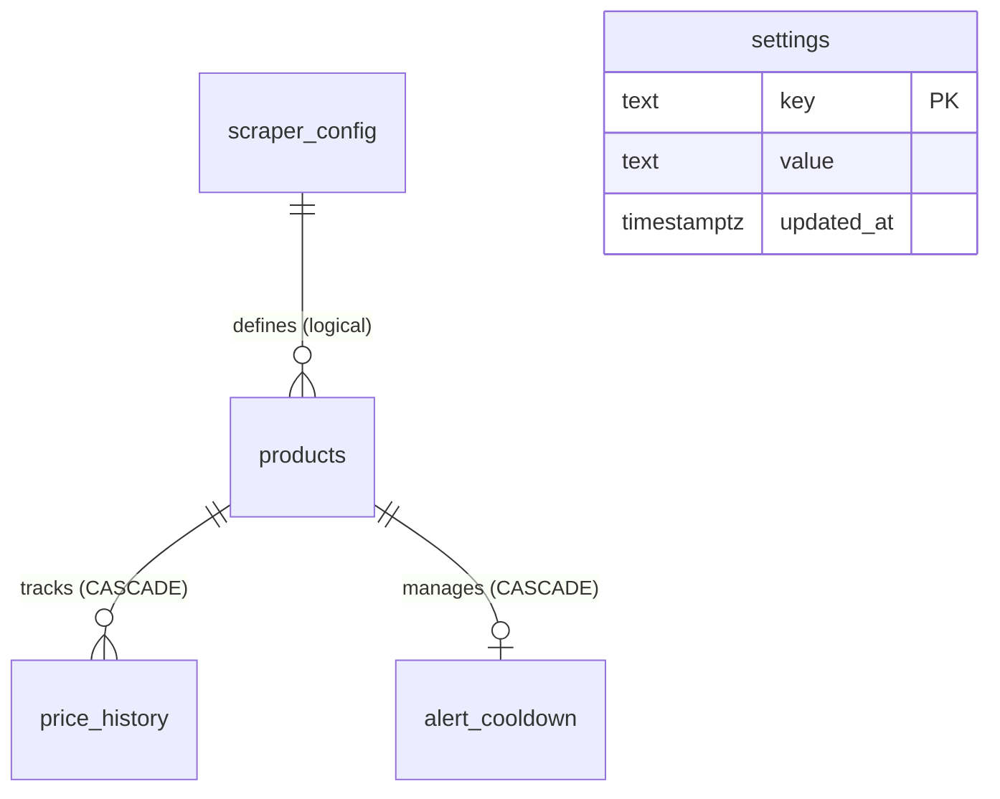
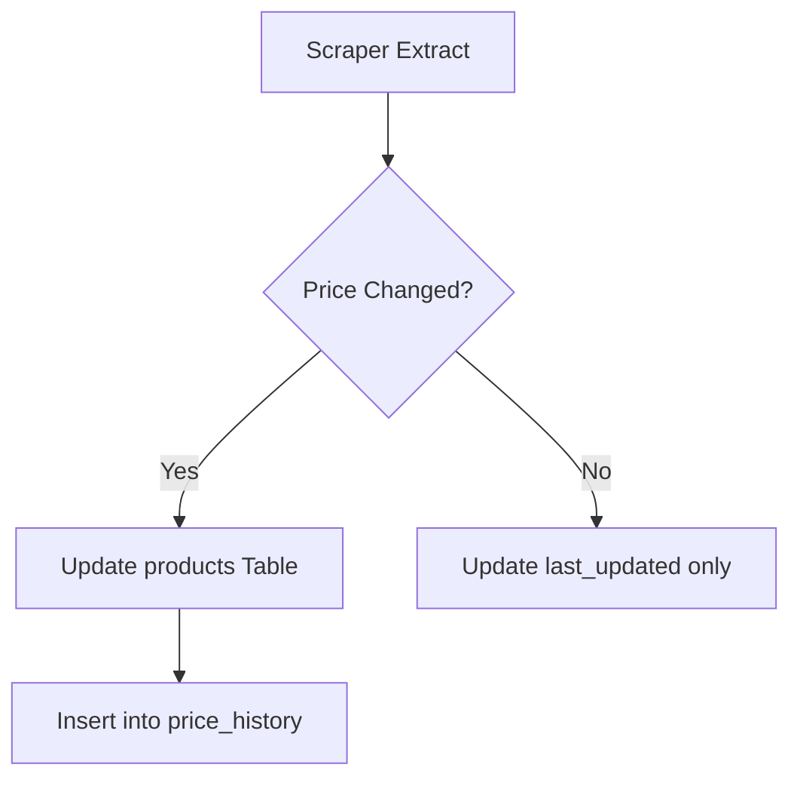
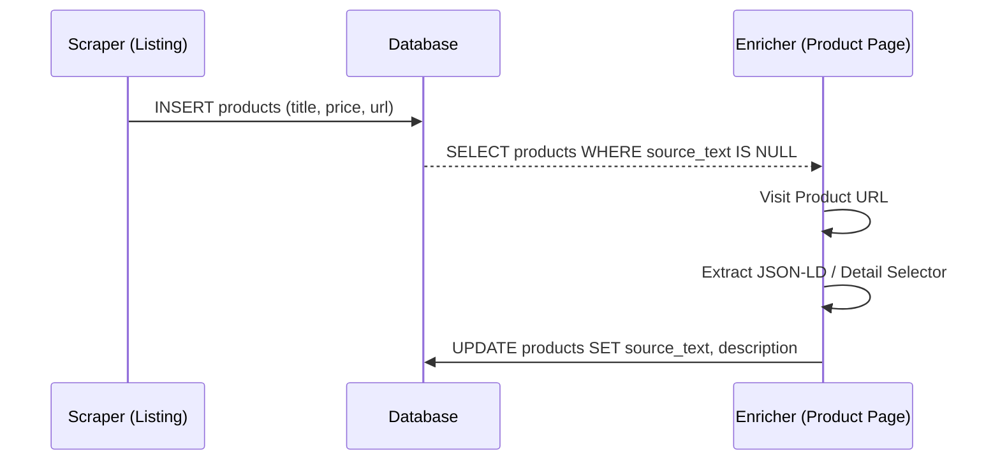

<details>
<summary>Relevant source files</summary>

The following files were used as context for generating this wiki page:

- [README.md](README.md)
- [scraper/scraper.py](scraper/scraper.py)
- [scraper/enrich.py](scraper/enrich.py)
- [fetcher/fetcher.py](https://github.com/blixten85/fetcher/blob/4b9cbc617a59e1012e1aafd1acf0eb054595ff5a/fetcher/fetcher.py)
- [webui/templates/config.html](webui/templates/config.html)
</details>

# Database Schema & Structure

The Web Scraper Platform utilizes a PostgreSQL database as its primary persistence layer to manage scraped product data, historical price points, scraping configurations, and system-wide settings. The database architecture is designed to support multi-site scraping with high-frequency updates and provides connection pooling via `ThreadedConnectionPool` for efficient resource management.

The schema is primarily initialized and maintained through the `init_db()` function in the main scraper module, which ensures all required tables, columns, and indices exist upon service startup. This structure facilitates features such as price drop monitoring, automated enrichment of product descriptions, and site-specific scraping parameters.

Sources: [README.md:12-25](README.md#L12-L25), [scraper/scraper.py:202-212](scraper/scraper.py#L202-L212), [scraper/scraper.py:246-324](scraper/scraper.py#L246-L324)

## Entity Relationship Overview

The database consists of five core tables that manage the lifecycle of a product from discovery to price monitoring and description enrichment.



The relationships between products and price_history/alert_cooldown enforce referential integrity via `ON DELETE CASCADE` constraints. The link between products and scraper_config is logical only (no foreign key constraint) to allow for configuration deletion without cascading to products.

Sources: [README.md:214-266](README.md#L214-L266), [scraper/scraper.py:269-317](scraper/scraper.py#L269-L317)

## Core Data Models

### Products Table
The `products` table is the central repository for all scraped items. It stores basic metadata, current pricing, and enriched description data.

| Field | Type | Description |
|-------|------|-------------|
| `id` | SERIAL | Primary Key |
| `url` | TEXT | Unique product URL |
| `title` | TEXT | Product name/title |
| `current_price` | INTEGER | Last observed price |
| `site_config_id` | INTEGER | Logical reference to `scraper_config(id)` (no FK constraint) |
| `description` | TEXT | Enriched product description |
| `source_text` | TEXT | Raw extracted text from product page |
| `category` | TEXT | Derived category from URL or JSON-LD |
| `first_seen` | TIMESTAMP | Initial discovery time |
| `last_updated` | TIMESTAMP | Last time the price or title changed |

Sources: [README.md:215-226](README.md#L215-L226), [scraper/scraper.py:269-278](scraper/scraper.py#L269-L278), [scraper/scraper.py:333-340](scraper/scraper.py#L333-L340)

### Price History Table
This table tracks every price change for every product, enabling the "deals" and historical tracking features.



Records are inserted into `price_history` only when a price variation is detected during a scrape run compared to the `current_price` stored in the `products` table.

Sources: [scraper/scraper.py:262-269](scraper/scraper.py#L262-L269), [scraper/scraper.py:596-620](scraper/scraper.py#L596-L620)

### Scraper Configuration Table
The `scraper_config` table defines how the system interacts with different e-commerce sites, including CSS selectors and stealth parameters.

| Field | Type | Description |
|-------|------|-------------|
| `name` | TEXT | Unique name for the site (e.g., "Inet.se") |
| `base_url` | TEXT | The starting URL(s) for crawling |
| `product_selector` | TEXT | CSS selector for the product container |
| `pagination_type` | TEXT | Method for paging ('query' or 'subcategory') |
| `use_stealth` | INTEGER | Toggle for Playwright-Stealth (0 or 1) |
| `proxy_url` | TEXT | Optional site-specific proxy |

Sources: [README.md:234-256](README.md#L234-L256), [scraper/scraper.py:271-291](scraper/scraper.py#L271-L291), [webui/templates/config.html:100-140](webui/templates/config.html#L100-L140)

## System Settings & Orchestration

The `settings` table stores global configuration parameters that control the scraper's behavior across all sites.

```python
SETTINGS_META = {
    'concurrent_pages': {'default': 2, 'description': 'Pages scraped simultaneously.'},
    'scrape_interval': {'default': 3600, 'description': 'Seconds between runs.'},
    'proxy_url': {'default': '', 'description': 'Global SOCKS5/HTTP proxy.'},
    'min_drop_percent': {'default': 5.0, 'description': 'Min % drop for alerts.'}
}
```

Sources: [scraper/scraper.py:53-83](scraper/scraper.py#L53-L83), [scraper/scraper.py:299-303](scraper/scraper.py#L299-L303)

## Data Flow: Enrichment & Discovery

The system performs a two-stage data capture. Initial discovery captures listing data, while an enrichment process populates detailed product information.



The `enrich.py` module specifically targets rows where `source_text IS NULL` to ground the product data in facts rather than relying solely on listing titles.

Sources: [scraper/enrich.py:18-34](scraper/enrich.py#L18-L34), [scraper/enrich.py:84-110](scraper/enrich.py#L84-L110), [fetcher/fetcher.py:70-110](fetcher/fetcher.py#L70-L110)

## Performance Optimization

The schema includes several indices and structural features to maintain performance as the dataset grows:
*  **Unique Constraints:** `products(url)` and `scraper_config(name)` prevent duplicate entries.
*  **Partial Indices:** `idx_products_missing_source` specifically targets products needing enrichment (`WHERE source_text IS NULL`).
*  **Composite Indices:** `idx_price_history_product_time` optimizes historical price lookups by grouping product IDs with descending timestamps.
*  **Cascading Deletes:** Foreign keys on `price_history` and `alert_cooldown` use `ON DELETE CASCADE` to ensure data integrity when a product is removed.

Sources: [scraper/scraper.py:264](scraper/scraper.py#L264), [scraper/scraper.py:311-318](scraper/scraper.py#L311-L318), [scraper/scraper.py:841-850](scraper/scraper.py#L841-L850)

The database structure serves as the backbone of the platform, enabling reliable multi-site scraping while providing the necessary historical data for price monitoring and product analysis.
