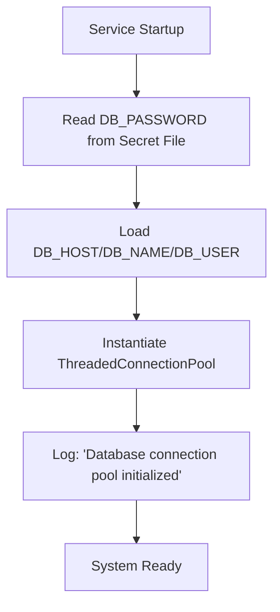
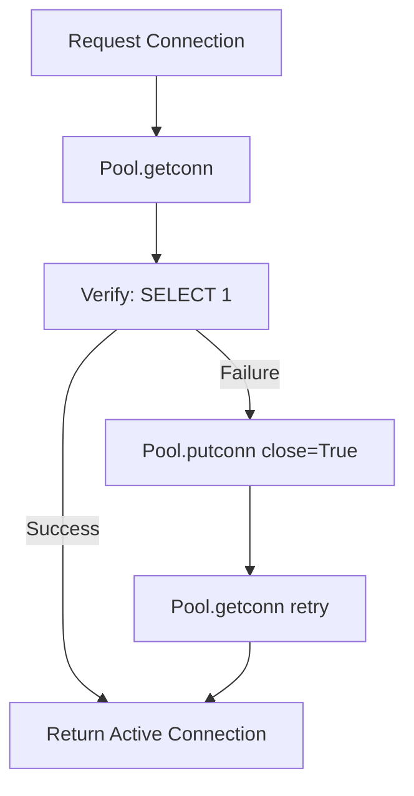
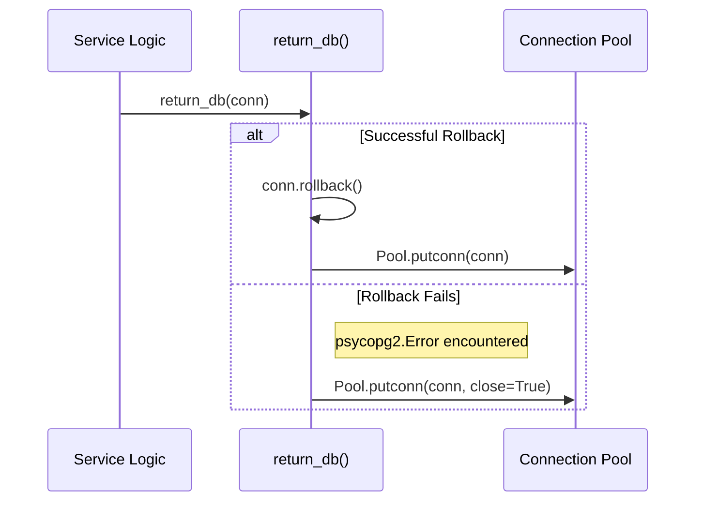

<details>
<summary>Relevant source files</summary>

The following files were used as context for generating this wiki page:

- [api/api.py](api/api.py)
- [scraper/scraper.py](scraper/scraper.py)
- [scraper/enrich.py](scraper/enrich.py)
- [README.md](README.md)
- [CLAUDE.md](CLAUDE.md)
- [webui/templates/config.html](webui/templates/config.html)
</details>

# PostgreSQL Connection Pooling

The Web Scraper Platform utilizes a production-grade PostgreSQL connection pooling mechanism based on the `psycopg2.pool.ThreadedConnectionPool` class. This system is designed to manage database connections efficiently across multiple concurrent processes, including the REST API, the main scraper engine, and the background enrichment module. By maintaining a pool of ready-to-use connections, the project reduces the overhead of establishing a new connection for every database query, which is critical for the platform's high-concurrency scraping and real-time API response requirements.

The connection pooling logic is implemented consistently across the `api/api.py` and `scraper/scraper.py` modules, ensuring that both the web-facing services and the heavy-duty background tasks share the same robust connection management strategy.

Sources: [README.md:15](README.md#L15), [CLAUDE.md:10](CLAUDE.md#L10), [api/api.py:5-10](api/api.py#L5-L10)

## Architecture and Configuration

The connection pool is globally initialized within each service. It uses environment variables and secure credentials files to configure the connection parameters.

### Pool Parameters
The pool is configured with specific limits to balance performance and resource usage:

| Parameter | Value / Source | Description |
|-----------|----------------|-------------|
| `minconn` | 1 | The minimum number of connections the pool will maintain. |
| `maxconn` | 10 | The maximum number of concurrent connections allowed in the pool. |
| `host` | `DB_HOST` (default: 'postgres') | The hostname of the PostgreSQL server. |
| `database` | `DB_NAME` (default: 'scraper') | The name of the database. |
| `user` | `DB_USER` (default: 'scraper') | The database user credential. |
| `connect_timeout`| 10 seconds | Maximum time to wait for a connection to be established. |

Sources: [api/api.py:34-36](api/api.py#L34-L36), [api/api.py:53-57](api/api.py#L53-L57), [scraper/scraper.py:165-174](scraper/scraper.py#L165-L174)

### Initialization Flow
The initialization process involves reading secrets (either from environment variables or dedicated credential files) before instantiating the `ThreadedConnectionPool`.



The diagram shows the sequence of steps taken during the initialization of the database pool in both the API and Scraper modules.
Sources: [api/api.py:46-60](api/api.py#L46-L60), [scraper/scraper.py:165-175](scraper/scraper.py#L165-L175)

## Connection Lifecycle Management

The platform uses a "borrow and return" pattern to manage connections. This ensures that connections are not leaked and are always returned to the pool for reuse, even when errors occur.

### Acquisition and Verification
When a database connection is requested via `get_db()`, the system performs a health check. In the API module, the system executes a `SELECT 1` query to verify that the connection is still alive. If the connection is found to be stale (e.g., timed out by the server), it is discarded and a fresh connection is pulled from the pool.



The flow diagram illustrates the resilient connection acquisition logic used in the API to prevent using dead or stale database connections.
Sources: [api/api.py:62-72](api/api.py#L62-L72), [scraper/scraper.py:217-219](scraper/scraper.py#L217-L219)

### Release and Cleanup
Connections must be returned to the pool using the `return_db(conn)` function. This function ensures that any pending transactions are rolled back before the connection is made available to other threads. If a rollback fails due to a database error, the connection is closed and discarded from the pool entirely to maintain pool health.



The sequence diagram details the safety measures taken when returning a connection to the pool, including transaction rollback and error handling.
Sources: [api/api.py:74-80](api/api.py#L74-L80), [scraper/scraper.py:221-223](scraper/scraper.py#L221-L223)

## Dynamic Re-initialization
The system supports dynamic re-initialization of the connection pool. This is particularly relevant when database credentials are changed via the WebUI. The `scraper/scraper.py` module includes a `reinit_db_pool()` function that safely closes all existing connections in the old pool before creating a new one with updated credentials.

### Configuration Update Workflow
1. User updates credentials in `webui/templates/config.html`.
2. API/Scraper receives a `PUT` request to `/credentials/password` or `/credentials/username`.
3. The application writes the new credentials to the filesystem.
4. `reinit_db_pool()` is called to cycle the connection pool.

Sources: [scraper/scraper.py:178-188](scraper/scraper.py#L178-L188), [scraper/scraper.py:1022-1055](scraper/scraper.py#L1022-L1055), [webui/templates/config.html:125-145](webui/templates/config.html#L125-L145)

## Usage in Background Tasks

Modules like `scraper/enrich.py` do not manage their own pools but rather import and utilize the initialized pool and helper functions from the main scraper module. This centralized management prevents connection exhaustion by ensuring all background enrichment tasks respect the global `maxconn` limits.

```python
# scraper/enrich.py:44-54
from scraper.scraper import (
    get_db,
    init_db_pool,
    return_db,
    # ... other imports
)

def fetch_backlog(limit, site, refresh):
    conn = get_db()
    try:
        cur = conn.cursor()
        # ... query logic
    finally:
        return_db(conn)
```

Sources: [scraper/enrich.py:44-54](scraper/enrich.py#L44-L54), [scraper/enrich.py:100-120](scraper/enrich.py#L100-L120)

## Conclusion
PostgreSQL Connection Pooling in this project provides a robust foundation for both the synchronous REST API and the asynchronous scraper. By leveraging `ThreadedConnectionPool` with custom health checks and strict lifecycle management, the platform maintains high availability and performance while preventing common database connection issues such as leaks and stale handles. This architecture is vital for the platform's ability to handle multi-site scraping and price monitoring at scale.

Sources: [api/api.py:118-125](api/api.py#L118-L125), [scraper/scraper.py:750-760](scraper/scraper.py#L750-L760)
