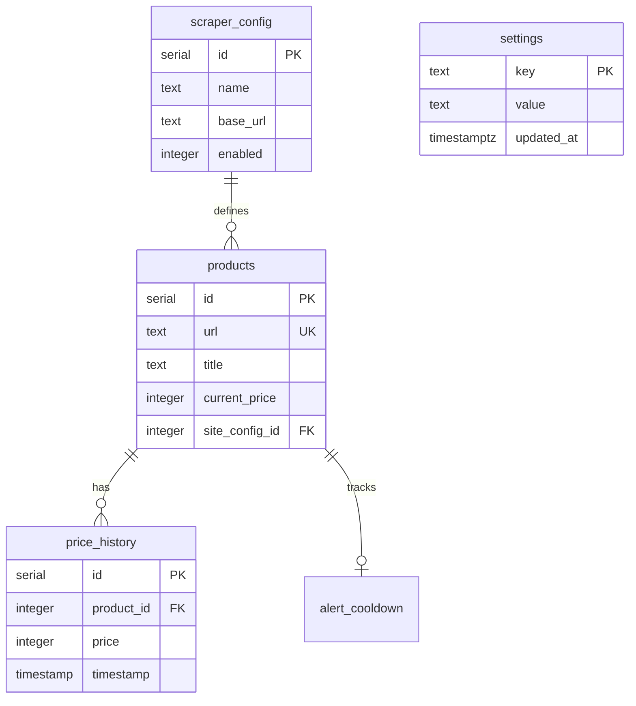
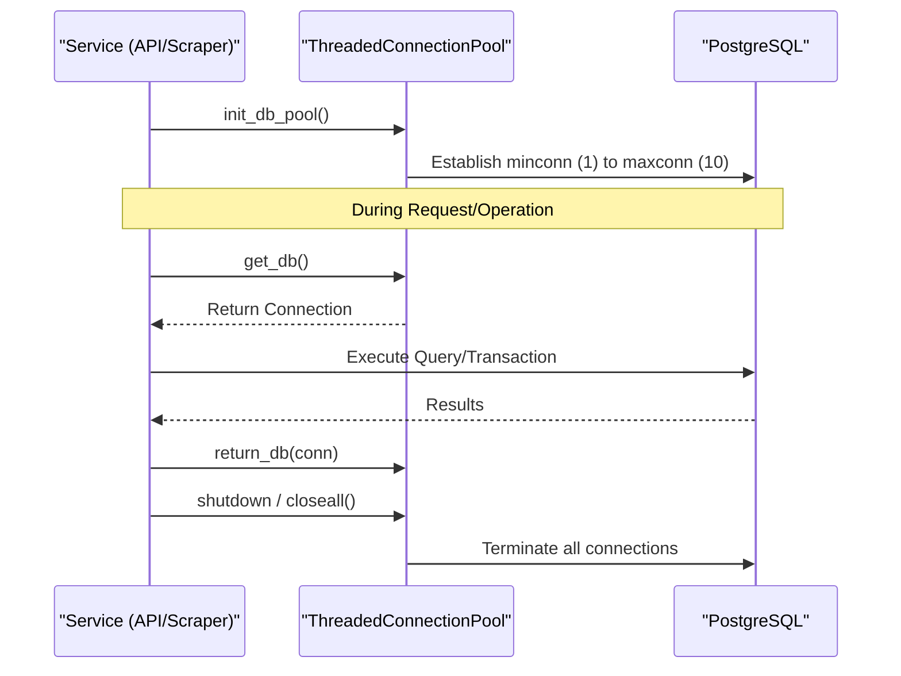

<details>
<summary>Relevant source files</summary>

The following files were used as context for generating this wiki page:

- [api/api.py](api/api.py)
- [scraper/scraper.py](scraper/scraper.py)
- [scraper/enrich.py](scraper/enrich.py)
- [README.md](README.md)
- [CLAUDE.md](CLAUDE.md)
</details>

# PostgreSQL & Connection Pooling

The Web Scraper platform utilizes PostgreSQL as its primary production-grade database to store product data, price history, scraper configurations, and system settings. To handle concurrent access from multiple services—including the REST API, the scraper engine, and the enrichment module—the project implements a robust connection pooling mechanism using `psycopg2.pool.ThreadedConnectionPool`.

This architecture ensures efficient resource management by maintaining a pool of reusable database connections, reducing the overhead of establishing new connections for every transaction. This is particularly critical for the scraper and API components, which may handle high volumes of concurrent read and write operations.

Sources: [README.md:16](README.md#L16), [CLAUDE.md:8](CLAUDE.md#L8), [api/api.py:53-61](api/api.py#L53-L61), [scraper/scraper.py:165-175](scraper/scraper.py#L165-L175)

## Database Schema & Models

The system maintains five primary tables to manage the scraping lifecycle and data persistence. The schema is initialized automatically upon the first run of the scraper service.

### Entity Relationship Diagram
The following diagram illustrates the relationships between the core database tables, including foreign key constraints for price history and alert tracking.



Sources: [README.md:148-198](README.md#L148-L198), [scraper/scraper.py:192-237](scraper/scraper.py#L192-L237)

### Core Tables Summary

| Table | Description | Key Fields |
|-------|-------------|------------|
| `products` | Stores current product state and metadata. | `url` (Unique), `current_price`, `last_updated` |
| `price_history` | Records every price change for historical analysis. | `product_id`, `price`, `timestamp` |
| `scraper_config` | Stores site-specific CSS selectors and crawl settings. | `product_selector`, `title_selector`, `use_stealth` |
| `settings` | Global system configurations (e.g., scrape interval). | `key` (Primary), `value` |
| `alert_cooldown`| Tracks last notification time to prevent spam. | `product_id`, `last_alert` |

Sources: [scraper/scraper.py:192-237](scraper/scraper.py#L192-L237), [README.md:148-198](README.md#L148-L198)

## Connection Pooling Implementation

The project uses `psycopg2.pool.ThreadedConnectionPool` to manage database sessions across threaded environments like the FastAPI/Uvicorn API and the Waitress-backed Scraper WebUI.

### Pool Lifecycle
The pool is initialized during the service startup sequence and closed during shutdown. In the API, this is managed via FastAPI event handlers.



Sources: [api/api.py:53-61](api/api.py#L53-L61), [api/api.py:100-108](api/api.py#L100-L108), [scraper/scraper.py:165-175](scraper/scraper.py#L165-L175)

### Connection Management Logic
To ensure reliability, the system implements checks for "stale" connections. When a connection is retrieved, the `get_db` function performs a "health check" (e.g., `SELECT 1`) to verify the connection is still alive before providing it to the caller.

```python
def get_db():
    conn = db_pool.getconn()
    try:
        conn.cursor().execute("SELECT 1")
    except psycopg2.Error:
        try:
            db_pool.putconn(conn, close=True) # Discard stale
        except psycopg2.Error:
            pass
        conn = db_pool.getconn() # Get fresh
    return conn
```

Sources: [api/api.py:63-75](api/api.py#L63-L75), [scraper/scraper.py:184-190](scraper/scraper.py#L184-L190)

## Configuration & Security

Database credentials and connection parameters are managed through environment variables and secret files.

| Parameter | Env Variable | Default | Description |
|-----------|--------------|---------|-------------|
| Host | `DB_HOST` | `postgres` | Hostname of the database container |
| Name | `DB_NAME` | `scraper` | Name of the database |
| User | `DB_USER` | `scraper` | Database user |
| Password | `DB_PASSWORD` | N/A | Read from `.env` or `db_password` file |
| Min Conns | `minconn` | 1 | Minimum connections in the pool |
| Max Conns | `maxconn` | 10 | Maximum connections in the pool |

Sources: [api/api.py:34-36](api/api.py#L34-L36), [api/api.py:56-60](api/api.py#L56-L60), [scraper/scraper.py:168-174](scraper/scraper.py#L168-L174)

### Credential Handling
The system prioritizes reading secrets from files (e.g., `/run/secrets/` or defined by `_FILE` suffixes) before falling back to environment variables. On first startup, the scraper service automatically generates database credentials if they are missing.
Sources: [api/api.py:43-51](api/api.py#L43-L51), [scraper/scraper.py:151-163](scraper/scraper.py#L151-L163)

## Usage in Services

### REST API (FastAPI)
The API uses the connection pool to serve product data and update descriptions. Each request fetches a connection from the pool and returns it in a `finally` block to prevent leaks.
Sources: [api/api.py:126-155](api/api.py#L126-L155)

### Scraper Engine
The scraper uses the pool to fetch active site configurations (`load_configs`) and flush scraped results to the database in batches (`flush_buffer`).
Sources: [scraper/scraper.py:302-308](scraper/scraper.py#L302-L308), [scraper/scraper.py:557-610](scraper/scraper.py#L557-L610)

### Enrichment Module
The enrichment script uses the pool to identify a "backlog" of products missing source text and updates them individually after successful extraction.
Sources: [scraper/enrich.py:112-146](scraper/enrich.py#L112-L146)

## Summary
PostgreSQL provides the persistent backbone of the Web Scraper platform. By implementing `ThreadedConnectionPool`, the system achieves high availability and performance across its distributed services while maintaining data integrity through relational constraints and historical price tracking.
Sources: [README.md:16](README.md#L16), [scraper/scraper.py:192-237](scraper/scraper.py#L192-L237)
