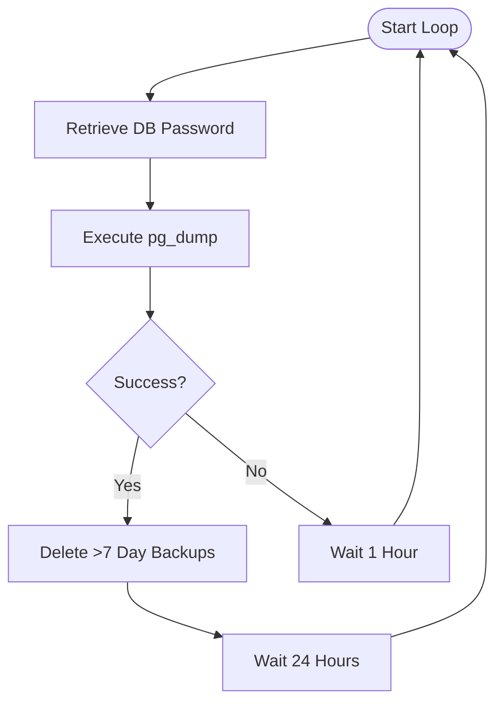
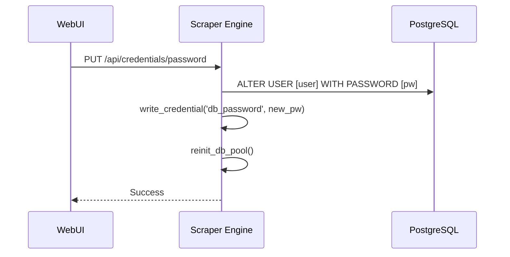

<details>
<summary>Relevant source files</summary>

The following files were used as context for generating this wiki page:

- [README.md](README.md)
- [CHANGELOG.md](CHANGELOG.md)
- [scraper/scraper.py](scraper/scraper.py)
- [webui/templates/config.html](webui/templates/config.html)
- [CLAUDE.md](CLAUDE.md)

</details>

# Automated Database Backups

Automated Database Backups provide a robust mechanism for ensuring data persistence and recovery for the Web Scraper Platform. The system utilizes a dedicated Docker service to perform daily dumps of the PostgreSQL database, preserving product data, price history, and scraper configurations.

The backup process is designed to be production-ready, utilizing the standard `pg_dump` utility to create compressed archive files. These backups are stored in a dedicated volume with an automated retention policy to manage disk space by removing files older than seven days.

Sources: [README.md:95-121](README.md#L95-L121), [CHANGELOG.md:162-164](CHANGELOG.md#L162-L164)

## Backup Architecture and Workflow

The backup system is implemented as a sidecar container named `scraper_pgdump`. This container runs a shell loop that executes the backup sequence every 24 hours. It relies on Docker secrets for secure credential management and shares a volume with the host for persistent storage of dump files.



The diagram above illustrates the logical flow of the backup service, including error handling and the retention cleanup process.

Sources: [README.md:98-112](README.md#L98-L112)

### Components and Dependencies

The backup service is tightly integrated with the core platform services but operates independently to ensure availability even if the main scraper engine is busy.

| Component | Description |
|-----------|-------------|
| `pgdump` service | The Docker container responsible for executing the backup script. |
| `postgres` service | The source database; the backup service depends on this service being healthy. |
| `/backup` volume | Persistent storage mapping `${DOCKER}/scraper/backup` to the container. |
| `scraper_password` | A Docker secret used to authenticate the `pg_dump` command. |

Sources: [README.md:95-121](README.md#L95-L121), [CLAUDE.md:28-29](CLAUDE.md#L28-L29)

## Configuration and Implementation

The backup implementation uses a specific command string within the `docker-compose.yml` to orchestrate the `pg_dump` utility. It targets the `scraper` database using the `scraper` user.

### Backup Command Logic
The core backup logic is contained within a shell script executed as the container entrypoint:
1. **Authentication**: `PGPASSWORD` is sourced from `/run/secrets/scraper_password`.
2. **Execution**: `pg_dump` creates a custom-format (`-Fc`) archive named with the current timestamp.
3. **Retention**: The `find` command locates and deletes `.dump` files with a modification time (`-mtime`) greater than 7 days.
4. **Scheduling**: A `sleep 86400` ensures a daily cadence, while a `sleep 3600` is used for retries after failures.

Sources: [README.md:101-109](README.md#L101-L109)

```yaml
    command: |
      while true; do
        PGPASSWORD=$(cat /run/secrets/scraper_password)
        pg_dump -h postgres -U scraper scraper -Fc \
          -f "/backup/scraper_$(date +%Y%m%d_%H%M).dump" \
          && find /backup -name '*.dump' -mtime +7 -delete \
          && echo "[$(date '+%T')] pg_dump ok" \
          || echo "[$(date '+%T')] pg_dump failed" && sleep 3600 && continue
        sleep 86400
      done
```

Sources: [README.md:101-109](README.md#L101-L109)

## Data Security and Credentials

The backup system follows the project's security convention of never storing credentials in the image or version control. Database credentials (username and password) can be updated via the WebUI under **Configuration → Advanced settings → Database credentials**, which renames the PostgreSQL user and updates the password immediately.

**Note:** The backup sidecar service currently hardcodes the `-U scraper` username in its `pg_dump` command. If you change the database username via the WebUI, the backup service must be reconfigured to use the new username or restarted with updated command arguments to maintain functional backups.



The sequence diagram shows how credential updates are propagated, which subsequently affects the backup service's ability to authenticate.

Sources: [scraper/scraper.py:657-678](scraper/scraper.py#L657-L678), [webui/templates/config.html:129-145](webui/templates/config.html#L129-L145), [CLAUDE.md:32-33](CLAUDE.md#L32-L33)

## Summary

Automated Database Backups ensure that the Web Scraper Platform maintains high data durability. By leveraging Docker's orchestration capabilities and standard PostgreSQL tools, the system provides consistent, daily snapshots of the database with an automated 7-day retention cycle, protecting against data loss while maintaining secure credential handling.

Sources: [README.md:95-121](README.md#L95-L121), [CHANGELOG.md:162-164](CHANGELOG.md#L162-L164)
