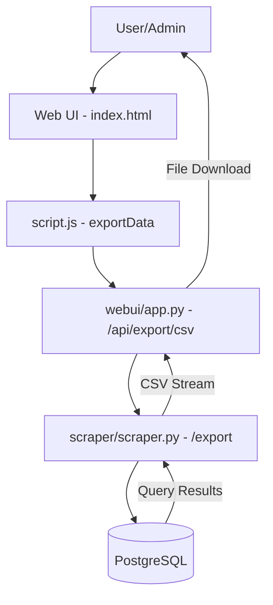
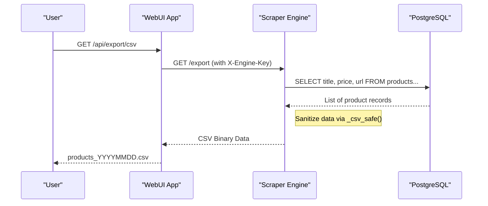

<details>
<summary>Relevant source files</summary>

The following files were used as context for generating this wiki page:

- [webui/app.py](webui/app.py)
- [scraper/scraper.py](scraper/scraper.py)
- [webui/static/script.js](webui/static/script.js)
- [webui/templates/index.html](webui/templates/index.html)
- [README.md](README.md)
- [CHANGELOG.md](CHANGELOG.md)
</details>

# Data Export Capabilities

The Data Export Capabilities of the Web Scraper platform provide users and external services with mechanisms to extract scraped product information for external analysis or consumption. The system primarily supports CSV (Comma-Separated Values) format, allowing for both bulk exports of all products in the database and filtered exports based on specific site configurations.

These capabilities are integrated across the stack, originating from the PostgreSQL database, processed by the Scraper Engine's Flask-based internal API, and exposed through the Web UI and REST API layers. The architecture ensures that data remains portable and accessible for downstream tasks such as price monitoring or product description generation.

Sources: [README.md:1-15](README.md#L1-L15), [scraper/scraper.py:27-35](scraper/scraper.py#L27-L35), [webui/app.py:17-25](webui/app.py#L17-L25)

## Architecture and Data Flow

The export system follows a multi-tier request-response pattern. A user initiates an export from the Web UI, which proxies the request through the Control Plane (WebUI App) to the Scraper Engine. The Scraper Engine then queries the PostgreSQL database and streams the result as a CSV file.



The diagram shows the sequential flow of a data export request from the user interface through the backend services to the database.

### Key Components

*  **Export Logic (Engine):** The `scraper/scraper.py` file contains the core logic for SQL execution and CSV serialization using the Python `csv` and `io.StringIO` modules.
*  **Request Proxy (WebUI):** The `webui/app.py` acts as a security and routing layer, validating paths and forwarding requests to the internal engine using `X-Engine-Key` authentication.
*  **Frontend Trigger:** The `webui/static/script.js` handles the client-side redirection to the export endpoint.

Sources: [scraper/scraper.py:940-985](scraper/scraper.py#L940-L985), [webui/app.py:202-215](webui/app.py#L202-L215), [webui/static/script.js:189-191](webui/static/script.js#L189-L191)

## Export Endpoints and Parameters

The system exposes specific internal and external endpoints to facilitate data retrieval. While the Web UI provides a convenient "Export CSV" button, the endpoints can also be accessed programmatically.

### Scraper Engine API (Internal)
The engine provides the raw data extraction service. It requires an `X-Engine-Key` for authorization.

| Endpoint | Method | Description |
| :--- | :--- | :--- |
| `/export` | GET | Exports all products currently in the database with a price > 0. |
| `/export/<site_name>` | GET | Exports products filtered by a specific site configuration name. |

Sources: [scraper/scraper.py:953](scraper/scraper.py#L953), [scraper/scraper.py:972](scraper/scraper.py#L972)

### Web UI Control Plane (External)
The WebUI proxies these requests and handles the file download headers for the user.

| Endpoint | Method | Description |
| :--- | :--- | :--- |
| `/api/export/csv` | GET | Proxies the request to the engine's `/export` endpoint and returns a CSV file. |

Sources: [webui/app.py:202-215](webui/app.py#L202-L215)

## Data Security and Sanitization

To prevent common injection vulnerabilities in spreadsheet software (CSV Injection), the scraper implements safety measures during the export process.

### CSV Injection Prevention
The `_csv_safe` function in the scraper engine checks the first character of any string value. If it contains potentially dangerous characters often used in spreadsheet formulas (e.g., `=`, `+`, `-`, `@`), it prepends a single quote `'` to treat the cell as literal text.

```python
def _csv_safe(value):
    s = str(value) if value is not None else ''
    if s and s[0] in ('=', '+', '-', '@', '\t', '\r'):
        return "'" + s
    return s
```

Sources: [scraper/scraper.py:932-936](scraper/scraper.py#L932-L936)

### Database Schema for Export
The exports are derived from two primary SQL queries that target the `products` and `scraper_config` tables.

| Field | Description | Source Table |
| :--- | :--- | :--- |
| `Product` | The title of the scraped product. | `products.title` |
| `Price (SEK)` | The current price in Swedish Krona. | `products.current_price` |
| `Link` | The direct URL to the product page. | `products.url` |

Sources: [scraper/scraper.py:939-950](scraper/scraper.py#L939-L950), [README.md:129-138](README.md#L129-L138)

## Implementation Details

The export process uses `psycopg2.extras.RealDictCursor` to fetch results as dictionaries, making it straightforward to map database columns to CSV headers.

### Sequence of Operations
1.  **Database Connection:** The engine retrieves a connection from the `ThreadedConnectionPool`.
2.  **Query Execution:** For bulk exports, it selects products where `current_price > 0`, ordered by price ascending.
3.  **CSV Generation:** It writes a header row (`Product`, `Price (SEK)`, `Link`) followed by the sanitized data rows.
4.  **Streaming Response:** The result is wrapped in a Flask `Response` object with `mimetype='text/csv'`.



Sources: [scraper/scraper.py:972-990](scraper/scraper.py#L972-L990), [webui/app.py:202-215](webui/app.py#L202-L215)

## Conclusion
The Data Export Capabilities allow for seamless transitions between the automated scraping environment and manual data analysis. By providing sanitized CSV outputs through a proxied architecture, the system maintains security while ensuring that the collected product and pricing data is highly portable.

Sources: [README.md:73-75](README.md#L73-L75), [CHANGELOG.md:180-182](CHANGELOG.md#L180-L182)
