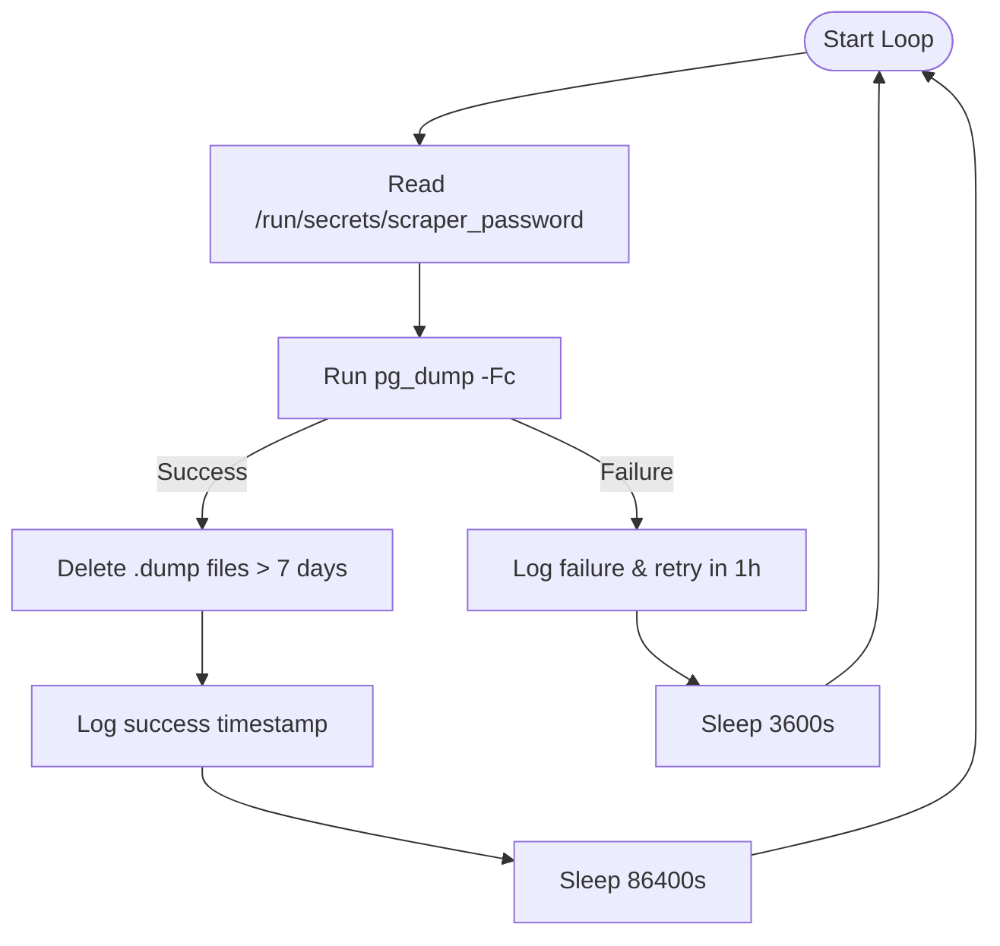
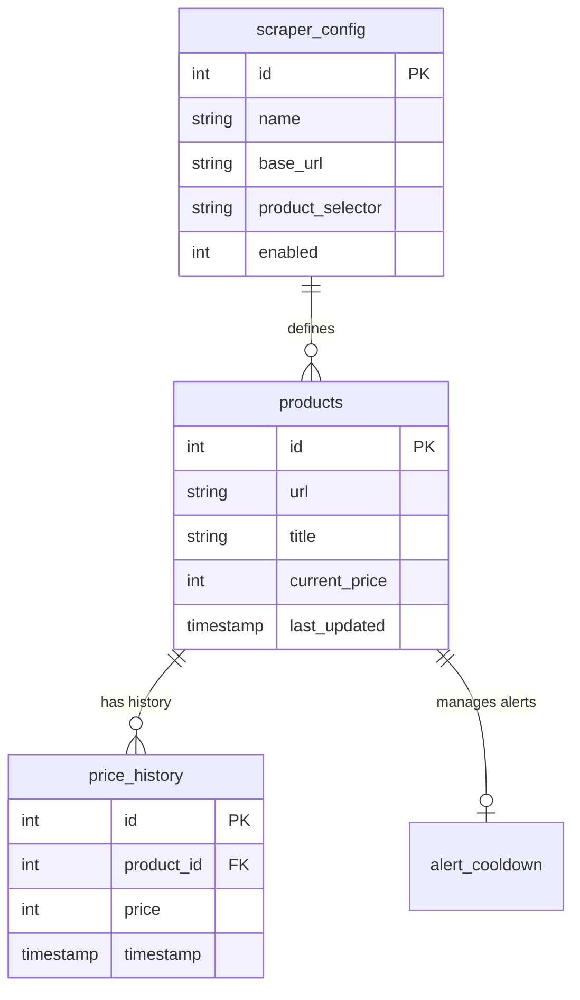

<details>
<summary>Relevant source files</summary>

The following files were used as context for generating this wiki page:

- [README.md](README.md)
- [CHANGELOG.md](CHANGELOG.md)
- [scraper/scraper.py](scraper/scraper.py)
- [CLAUDE.md](CLAUDE.md)
- [webui/templates/config.html](webui/templates/config.html)
</details>

# Automated Database Backups

Automated Database Backups provide a production-ready mechanism for ensuring data persistence and recovery for the Web Scraper Platform's PostgreSQL database. This system is designed to run as a sidecar service within the Docker environment, performing daily dumps of the scraping data, price history, and system configurations.

The backup system utilizes the standard `pg_dump` utility to create compressed archive files, which are stored in a dedicated volume with an automated retention policy. This ensures that the platform can recover from data loss while managing storage consumption by purging older backup files.

Sources: [README.md:9-25](README.md#L9-L25), [README.md:148-152](README.md#L148-L152)

## Architecture and Components

The backup system is implemented as a dedicated service named `pgdump` within the `docker-compose.yml` orchestration. It operates independently of the main scraper engine and WebUI, interacting with the `postgres` service via the internal Docker network.

### Key Components

| Component | Description |
|-----------|-------------|
| `pgdump` Service | A Docker container based on the `postgres:latest` image that executes the backup loop. |
| `pg_dump` Utility | The primary tool used to extract the PostgreSQL database into a script file or archive file. |
| `scraper_password` | A Docker secret used to securely provide the database password to the backup process. |
| `/backup` Volume | A persistent volume mapped to `${DOCKER}/scraper/backup` for storing `.dump` files. |

Sources: [README.md:154-180](README.md#L154-L180), [CLAUDE.md:14-23](CLAUDE.md#L14-L23)

### Workflow Logic

The backup process follows a continuous loop with a 24-hour sleep cycle. It retrieves the database password from a secure secret file, executes the dump, and then performs a cleanup of files older than seven days.



The diagram above illustrates the internal control loop of the `pgdump` container, showing the retry logic and the 7-day retention policy.
Sources: [README.md:158-167](README.md#L158-L167)

## Configuration and Implementation

The backup system is configured via a command-line entrypoint within the Docker container. This script-based approach handles authentication, file naming, and maintenance.

### Database Connection and Credentials
The backup utility connects to the `postgres` host using the `scraper` user. It relies on the environment variable `PGPASSWORD`, which is populated by reading the auto-generated secret file.

```yaml
  pgdump:
    image: postgres:latest
    container_name: scraper_pgdump
    command: |
      while true; do
        PGPASSWORD=$(cat /run/secrets/scraper_password)
        pg_dump -h postgres -U scraper scraper -Fc \
          -f "/backup/scraper_$(date +%Y%m%d_%H%M).dump"
```

Sources: [README.md:154-164](README.md#L154-L164)

### Retention Policy
To prevent the storage volume from filling up, the system executes a `find` command after every successful backup. This command identifies and removes any `.dump` files with a modification time (`-mtime`) greater than 7 days.

```bash
find /backup -name '*.dump' -mtime +7 -delete
```

Sources: [README.md:166](README.md#L166)

## Data Protected by Backups

The automated backups capture the entire `scraper` database schema, ensuring all aspects of the platform can be restored.

| Table Name | Description |
|------------|-------------|
| `products` | Core product data including URLs, titles, and current prices. |
| `price_history` | Historical price points used for trend analysis and alerts. |
| `scraper_config` | Site-specific selectors, intervals, and proxy settings. |
| `settings` | System-wide advanced configurations (e.g., concurrent pages, scrape intervals). |
| `alert_cooldown` | Tracking data to prevent Discord notification spam. |

Sources: [README.md:188-235](README.md#L188-L235), [scraper/scraper.py:230-280](scraper/scraper.py#L230-L280)

### Schema Relationship Diagram



The ER diagram displays the primary entities protected by the backup system, emphasizing the relationship between product data and configuration.
Sources: [README.md:188-228](README.md#L188-L228), [scraper/scraper.py:230-280](scraper/scraper.py#L230-L280)

## Manual Recovery and Maintenance

While the creation of backups is automated, recovery is a manual process. The backups are stored in custom format (`-Fc`), which allows for flexible restoration using the `pg_restore` utility.

### Storage Location
Backups are stored on the host machine at the path defined by the `DOCKER` environment variable, specifically in `${DOCKER}/scraper/backup`.

### Backup File Naming Convention
Files are named with a timestamp to allow for point-in-time recovery: `scraper_YYYYMMDD_HHMM.dump`.

Sources: [README.md:148-152](README.md#L148-L152), [README.md:164-165](README.md#L164-L165), [CHANGELOG.md:195-200](CHANGELOG.md#L195-L200)

## Summary

The Automated Database Backup system is a critical reliability feature of the Web Scraper Platform, providing daily snapshots of the PostgreSQL database. By leveraging Docker secrets for security and a simple shell-based loop for automation, it ensures that years of price history and complex scraper configurations are preserved with a rolling 7-day window of recovery points.
