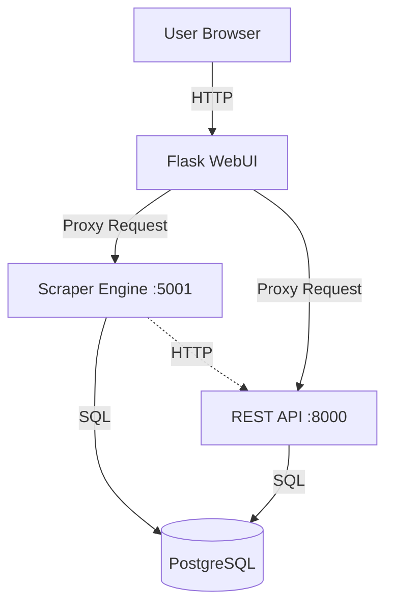
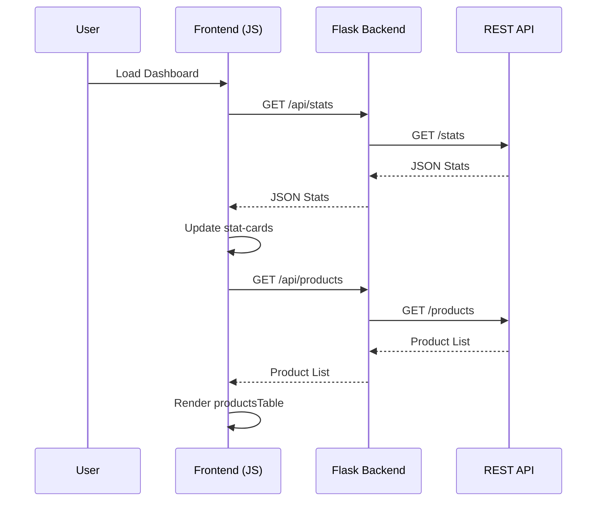

Relevant source files

The following files were used as context for generating this wiki page:

- [webui/app.py](webui/app.py)
- [webui/static/script.js](webui/static/script.js)
- [webui/static/style.css](webui/static/style.css)
- [webui/templates/index.html](webui/templates/index.html)
- [webui/templates/config.html](webui/templates/config.html)
- [scraper/scraper.py](scraper/scraper.py)
- [README.md](README.md)

# WebUI Overview & Architecture

The WebUI serves as the central control plane for the Web Scraper Platform, providing a visual interface for monitoring scraped products, managing scraper configurations, and adjusting system-wide settings. It is built using a Flask backend that acts as a secure proxy to the underlying Scraper Engine and REST API.

Sources: [webui/app.py:1-10](webui/app.py#L1-L10), [README.md:12-25](README.md#L12-L25)

## System Architecture

The WebUI operates as a gateway between the end-user and the backend services. It implements a decoupled architecture where the frontend (HTML/JS/CSS) communicates with a Flask application, which then forwards requests to the Scraper Engine (port 5001) or the REST API (port 8000).

### Service Interaction Flow

The following diagram illustrates how the WebUI orchestrates requests between the user and backend services.

The WebUI manages authentication and provides a unified interface for operations that involve multiple backend components. 
Sources: [webui/app.py:32-33](webui/app.py#L32-L33), [webui/app.py:84-100](webui/app.py#L84-L100), [README.md:55-65](README.md#L55-L65)

## Backend Architecture (Flask)

The Flask backend handles security, session management, and API orchestration.

### Security and Middleware
The application implements several security layers:
*  **Basic Authentication**: Controlled via `WEBUI_USERNAME` and `WEBUI_PASSWORD` environment variables.
*  **CSRF/CSP**: Generates a unique `csp_nonce` for every request to protect against Cross-Site Scripting (XSS).
*  **Security Headers**: Sets `X-Frame-Options: DENY`, `X-Content-Type-Options: nosniff`, and a strict Content Security Policy.
*  **Path Validation**: Uses regular expressions (`PATH_RE`) to validate that proxied request paths contain only valid URL path characters. This validates only the path string syntax and does not restrict destination hosts or provide SSRF protection against requests to private network ranges.

Sources: [webui/app.py:32](webui/app.py#L32), [webui/app.py:92-94](webui/app.py#L92-L94), [webui/app.py:106-120](webui/app.py#L106-L120), [webui/app.py:134-149](webui/app.py#L134-L149)

### Internal Proxy Methods
The backend defines two primary internal functions for communicating with backend services:

| Function | Destination | Header | Description |
| :--- | :--- | :--- | :--- |
| `engine_request` | `SCRAPER_ENGINE` | `X-Engine-Key` | Manages scraper configurations, manual triggers, and exports. |
| `api_request` | `SCRAPER_API` | `X-API-Key` | Retrieves product statistics, history, and deal data. |

Sources: [webui/app.py:84-93](webui/app.py#L84-L93), [webui/app.py:111-118](webui/app.py#L111-L118)

## Frontend Architecture

The frontend is a single-page-style interface using Bootstrap 5 for styling and vanilla JavaScript for interactivity.

### Components and Logic
The frontend logic is distributed across `script.js` and inline scripts in templates:
*  **Theme Management**: Supports light and dark modes, persisting the choice in `localStorage`.
*  **Data Polling**: Periodically fetches statistics (Total Products, Updated 24h) via `/api/stats`.
*  **Dynamic Rendering**: Uses event delegation and fetch calls to manage configuration lists and product tables.

Sources: [webui/static/script.js:155-175](webui/static/script.js#L155-L175), [webui/templates/index.html:15-22](webui/templates/index.html#L15-L22), [webui/static/style.css:1-25](webui/static/style.css#L1-L25)

### Data Loading Sequence
The following sequence diagram shows how the Dashboard populates data on load.

Sources: [webui/static/script.js:156-175](webui/static/script.js#L156-L175), [webui/templates/index.html:145-178](webui/templates/index.html#L145-L178), [webui/app.py:202-218](webui/app.py#L202-L218)

## Feature Modules

### Scraper Configuration
Located at `/config`, this module allows users to create and manage site-specific scraper settings. It includes "Quick templates" for popular sites like Inet.se and Komplett.se.

| Parameter | Selector Type | Description |
| :--- | :--- | :--- |
| `Product` | CSS Selector | The container element for a single product. |
| `Title` | CSS Selector | The element containing the product name. |
| `Price` | CSS Selector | The element containing the price string. |
| `Link` | CSS Selector | The anchor element leading to the product page. |

Sources: [webui/templates/config.html:150-185](webui/templates/config.html#L150-L185), [scraper/scraper.py:180-205](scraper/scraper.py#L180-L205)

### Auto-Detection System
The WebUI provides a "Detect" feature that leverages Playwright heuristics in the Scraper Engine to guess CSS selectors for a target URL.
1.  Frontend sends a POST to `/api/detect`.
2.  Backend proxies to Engine's `/detect`.
3.  Engine opens a headless browser, analyzes DOM for price patterns (e.g., `/\d[\d\s]*\s*(kr|SEK)/`), and identifies repetitive containers.
4.  Returns identified selectors and bot protection type (Akamai, Cloudflare, etc.).

Sources: [webui/app.py:236-243](webui/app.py#L236-L243), [scraper/scraper.py:648-735](scraper/scraper.py#L648-L735), [webui/templates/config.html:220-256](webui/templates/config.html#L220-L256)

### Advanced Settings
This section allows modification of system parameters stored in the `settings` database table. Changes are saved immediately via PUT requests to `/api/settings/<key>`.

| Key | Type | Default | Description |
| :--- | :--- | :--- | :--- |
| `concurrent_pages` | int | 2 | Parallel browser instances. |
| `scrape_interval` | int | 3600 | Seconds between full runs. |
| `headless` | bool | true | Whether to hide the browser UI. |
| `min_drop_percent` | float | 5.0 | Threshold for price alerts. |

Sources: [scraper/scraper.py:46-75](scraper/scraper.py#L46-L75), [webui/templates/config.html:360-395](webui/templates/config.html#L360-L395)

## Conclusion
The WebUI Architecture provides a secure and centralized management layer for the scraping ecosystem. By separating the user interface from the heavy lifting of the Scraper Engine and the data access of the REST API, the system achieves a robust and scalable structure suitable for production deployment.
