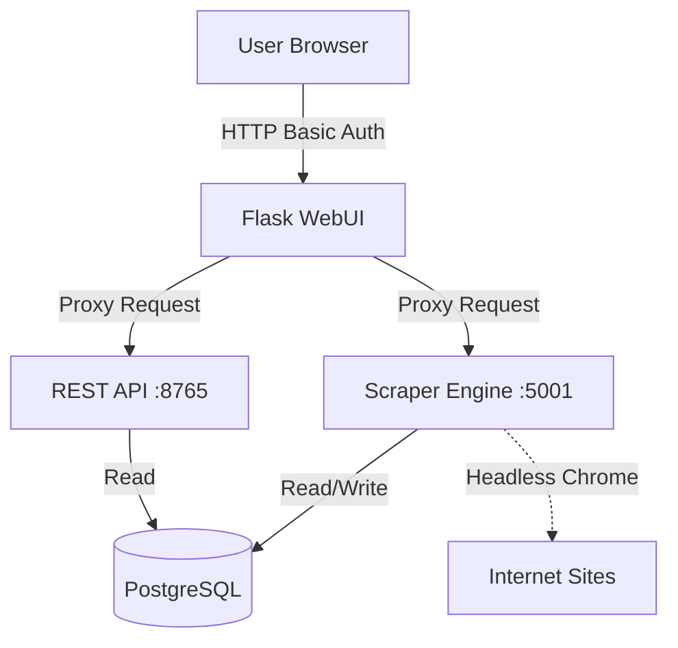
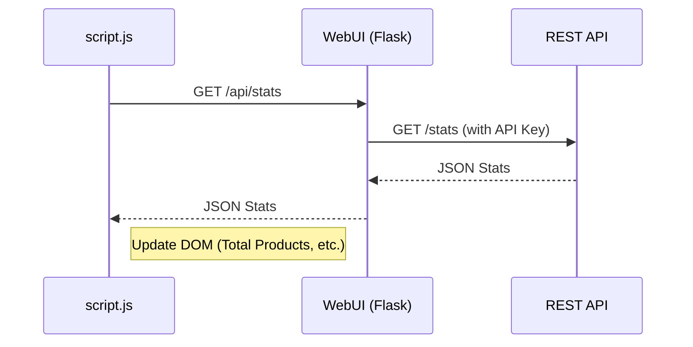
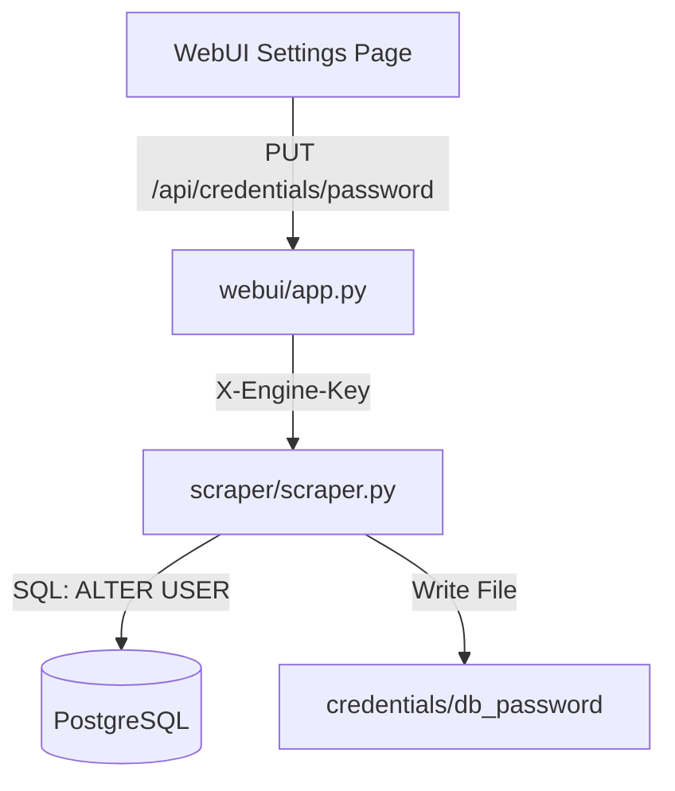

Relevant source files

The following files were used as context for generating this wiki page:

- [webui/app.py](webui/app.py)
- [webui/static/script.js](webui/static/script.js)
- [webui/templates/index.html](webui/templates/index.html)
- [webui/templates/config.html](webui/templates/config.html)
- [scraper/scraper.py](scraper/scraper.py)
- [README.md](README.md)

# WebUI Overview & Architecture

The WebUI serves as the central control plane for the Web Scraper Platform, providing a graphical interface for monitoring scraping activities, managing site configurations, and adjusting system-wide settings. It is built using the Flask web framework and acts as a secure proxy layer between end-users and the underlying Scraper Engine and REST API.

Architecture-wise, the WebUI is decoupled from the data-processing services, communicating with the `SCRAPER_API` (port 8765) and `SCRAPER_ENGINE` (port 5001) via internal HTTP requests. This design ensures that the user-facing interface remains responsive while heavy scraping or data analysis tasks are handled by dedicated background processes.

Sources: [webui/app.py:12-28](webui/app.py#L12-L28), [README.md:52-56](README.md#L52-L56), [CLAUDE.md:27-32](CLAUDE.md#L27-L32)

## System Architecture & Data Flow

The WebUI functions as a middleware component. It authenticates user requests using Basic Authentication and then forwards authorized actions to either the API (for data retrieval) or the Engine (for operational tasks like starting a scrape).

### Component Relationship
The following diagram illustrates how the WebUI interacts with other system components:

The WebUI ensures security by validating paths via regex and injecting Content Security Policy (CSP) nonces into templates.

Sources: [webui/app.py:46-52](webui/app.py#L46-L52), [webui/app.py:88-102](webui/app.py#L88-L102), [webui/app.py:114-123](webui/app.py#L114-L123)

## Request Proxying & Security

The WebUI does not connect directly to the PostgreSQL database. Instead, it utilizes two helper functions to communicate with internal services: `api_request` and `engine_request`.

### API & Engine Communication
All proxied requests include necessary authentication headers, such as `X-API-Key` or `X-Engine-Key`, which are retrieved from secure credential files.

| Function | Destination | Auth Header | Purpose |
| :--- | :--- | :--- | :--- |
| `api_request` | `SCRAPER_API` | `X-API-Key` | Fetching product data, stats, and history. |
| `engine_request` | `SCRAPER_ENGINE` | `X-Engine-Key` | Managing configs, triggering scrapes, and auto-detection. |

Sources: [webui/app.py:73-81](webui/app.py#L73-L81), [webui/app.py:108-115](webui/app.py#L108-L115)

### Security Headers
The WebUI implements several security measures to protect the control plane:
* **CSP Nonce:** A 16-character hex nonce is generated per request to allow specific inline scripts.
* **Headers:** Sets `X-Frame-Options: DENY`, `X-Content-Type-Options: nosniff`, and a strict `Content-Security-Policy`.
* **Path Validation:** The `_validate_path` function uses the regex `^/[A-Za-z0-9._~!$&'()*+,;=:@/%-]*$` to prevent SSRF and directory traversal.

Sources: [webui/app.py:34](webui/app.py#L34), [webui/app.py:84-86](webui/app.py#L84-L86), [webui/app.py:117-130](webui/app.py#L117-L130)

## Frontend Components

The frontend is a single-page style application using Bootstrap 5.3 for styling and a custom `script.js` for asynchronous interactions.

### Dashboard & Monitoring
The Dashboard (`index.html`) provides real-time statistics and product listings. It uses a polling mechanism to keep data fresh.

Sources: [webui/static/script.js:154-165](webui/static/script.js#L154-L165), [webui/templates/index.html:105-115](webui/templates/index.html#L105-L115)

### Configuration Management
The Configuration page (`config.html`) allows users to:
1.  **Add/Edit Sites:** Define CSS selectors for products, titles, prices, and links.
2.  **Auto-Detect:** Submit a URL to the engine to automatically discover selectors using Playwright heuristics.
3.  **Advanced Settings:** Toggle stealth mode, configure SOCKS5 proxies, and modify database credentials.

Sources: [webui/templates/config.html:150-185](webui/templates/config.html#L150-L185), [webui/templates/config.html:236-258](webui/templates/config.html#L236-L258)

## API Endpoints (WebUI Internal)

The WebUI exposes several endpoints to its own frontend that map to backend services:

| Endpoint | Method | Backend Service | Description |
| :--- | :--- | :--- | :--- |
| `/api/configs` | GET/POST | Engine | List or create scraper configurations. |
| `/api/scrape` | POST | Engine | Manually trigger a scraping run. |
| `/api/detect` | POST | Engine | Auto-detect CSS selectors from a URL. |
| `/api/stats` | GET | API | Get global stats (total products, etc.). |
| `/api/products` | GET | API | Retrieve paginated product list with search. |
| `/api/settings` | GET/PUT | Engine | Manage system-wide operational settings. |

Sources: [webui/app.py:145-215](webui/app.py#L145-L215), [webui/app.py:228-245](webui/app.py#L228-L245)

## Database Credentials Management

A specialized set of endpoints allows users to update PostgreSQL credentials directly from the WebUI. This process involves the WebUI sending a request to the Engine, which then executes the `ALTER USER` SQL commands and updates local credential files.

Sources: [webui/app.py:248-261](webui/app.py#L248-L261), [scraper/scraper.py:843-861](scraper/scraper.py#L843-L861)

## Conclusion

The WebUI Architecture provides a secure, abstracted interface for managing the scraping lifecycle. By acting as a proxy with strict path validation and centralized authentication, it protects the Scraper Engine and REST API from direct exposure while providing a unified management experience for administrators.
