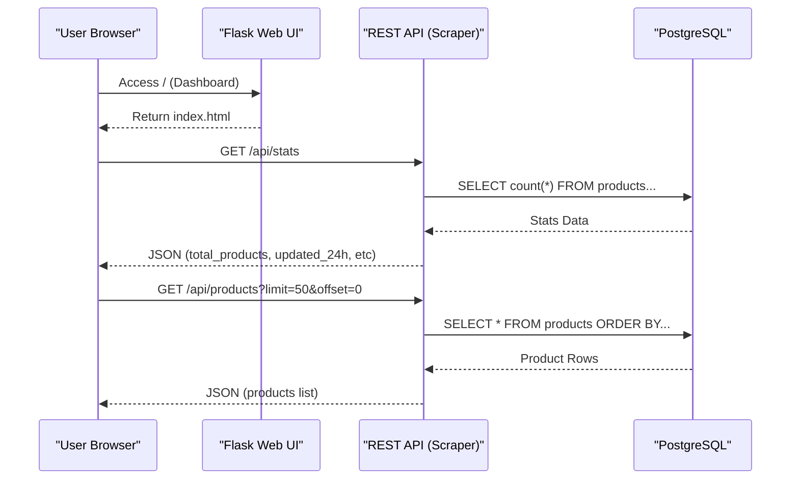
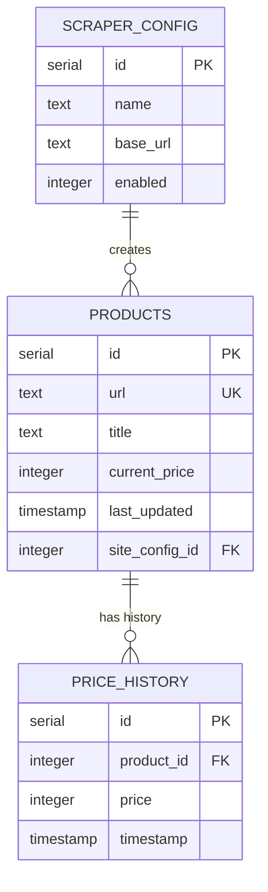

Relevant source files

The following files were used as context for generating this wiki page:

- [webui/templates/index.html](webui/templates/index.html)
- [webui/static/script.js](webui/static/script.js)
- [webui/static/style.css](webui/static/style.css)
- [scraper/scraper.py](scraper/scraper.py)
- [README.md](README.md)
- [webui/templates/config.html](webui/templates/config.html)

# Product & Deals Dashboard

The **Product & Deals Dashboard** serves as the primary monitoring and control interface for the Web Scraper Platform. It provides a real-time overview of scraping metrics, product listings, and price monitoring activities. The dashboard facilitates the visualization of data collected by the scraper engine and stored in the PostgreSQL backend, allowing users to track inventory changes and price fluctuations across multiple configured e-commerce sites.

Functionally, the dashboard integrates a high-level statistics overview, a searchable product table with pagination, and quick-access triggers for manual scraping operations and data exports. It is implemented as a responsive web interface using Bootstrap for styling and asynchronous JavaScript for data fetching from the REST API.

Sources: [README.md:10-18](README.md#L10-L18), [webui/templates/index.html:1-50](webui/templates/index.html#L1-L50), [scraper/scraper.py:821-825](scraper/scraper.py#L821-L825)

## System Architecture & Data Flow

The dashboard operates as a consumer of the scraper's internal REST API. It follows a client-server model where the frontend (Flask-rendered templates) periodically polls or requests data from the backend (FastAPI/Waitress-powered scraper engine).

### UI Interaction Flow

The following sequence diagram illustrates how the dashboard fetches and displays data upon user interaction or periodic updates.

The dashboard uses asynchronous `fetch` calls to update the DOM without requiring a full page reload, ensuring a smooth user experience.

Sources: [webui/static/script.js:154-162](webui/static/script.js#L154-L162), [webui/templates/index.html:120-130](webui/templates/index.html#L120-L130), [scraper/scraper.py:821-830](scraper/scraper.py#L821-L830)

## Dashboard Components

### 1. Real-time Statistics Cards
The dashboard displays three primary KPIs (Key Performance Indicators) at the top of the page to provide an immediate snapshot of the system state:
*  **Total Products:** The total count of unique product URLs stored in the database.
*  **Updated last 24h:** The number of products that have had their price or metadata refreshed within the last 24 hours.
*  **Active Configurations:** The count of scraper configurations currently enabled for monitoring.

These stats are updated via a polling mechanism that triggers every 30,000 milliseconds (30 seconds).

Sources: [webui/templates/index.html:53-83](webui/templates/index.html#L53-L83), [webui/static/script.js:164-173](webui/static/script.js#L164-L173)

### 2. Product Monitoring Table
The central feature is the `productsTable`, which lists the latest items scraped. 
*  **Search:** A search input field allows users to filter products by title. This is debounced in `script.js` to optimize performance.
*  **Pagination:** The dashboard implements client-side pagination control that requests specific offsets from the server (e.g., `PAGE_SIZE = 50`).
*  **Data Points:** Each row displays the product title (linked to the original site) and the `current_price`, formatted for the Swedish locale (e.g., "1 299 kr").

| Column | Data Source | Format |
| :--- | :--- | :--- |
| **Product** | `products.title` | EscapeHTML + Link to `url` |
| **Price** | `products.current_price` | `formatPrice()` (space separator + 'kr') |

Sources: [webui/templates/index.html:98-115](webui/templates/index.html#L98-L115), [webui/static/script.js:12-22](webui/static/script.js#L12-L22), [scraper/scraper.py:220-230](scraper/scraper.py#L220-L230)

### 3. Action Controls
The dashboard provides several manual triggers:
*  **Start Scraping Now:** Sends a `POST` request to `/api/scrape` to bypass the `scrape_interval` and begin a run immediately.
*  **Export CSV:** Generates a CSV file containing all product titles, prices, and links for external analysis.

Sources: [webui/templates/index.html:86-95](webui/templates/index.html#L86-L95), [scraper/scraper.py:1141-1155](scraper/scraper.py#L1141-L1155)

## Data Model (Dashboard View)

The dashboard presents a unified view of the `products` and `price_history` tables. The underlying schema ensures that the dashboard can show not only current prices but also trends (though history visualization is primarily handled via the API).

Sources: [README.md:148-180](README.md#L148-L180), [scraper/scraper.py:220-260](scraper/scraper.py#L220-L260)

## API Endpoints for Dashboard

The following REST API endpoints are utilized by the dashboard for its dynamic content:

| Endpoint | Method | Description | Parameters |
| :--- | :--- | :--- | :--- |
| `/api/stats` | GET | Returns summary counts for the dashboard cards. | None |
| `/api/products` | GET | Returns a paginated list of products. | `limit`, `offset`, `search` |
| `/api/scrape` | POST | Manually triggers the scraping engine. | None |
| `/api/export/csv` | GET | Streams the product database as a CSV file. | None |

Sources: [scraper/scraper.py:821-830](scraper/scraper.py#L821-L830), [webui/templates/index.html:132-155](webui/templates/index.html#L132-L155), [README.md:65-75](README.md#L65-L75)

## Visual Styles & UX Features

The dashboard implements several modern UX patterns to improve usability:
*  **Theme Toggle:** Supports both Light and Dark modes, persisting the user preference in `localStorage` and checking for system preferences on load.
*  **Scraping Indicator:** A visual "Monitoring" dot with a CSS pulse animation (`@keyframes pulse`) indicates the dashboard is active.
*  **Responsive Layout:** Uses Bootstrap's grid system to stack stats cards vertically on mobile devices while maintaining a three-column layout on desktops.
*  **Security:** Implements Content Security Policy (CSP) nonces for inline scripts to prevent cross-site scripting.

Sources: [webui/static/style.css:4-50](webui/static/style.css#L4-L50), [webui/templates/index.html:9-20](webui/templates/index.html#L9-L20), [webui/static/style.css:320-335](webui/static/style.css#L320-L335)

## Conclusion
The **Product & Deals Dashboard** is a critical component of the Web Scraper Platform, providing the interface layer between the complex backend scraping engine and the end-user. By leveraging a real-time REST API and a responsive frontend, it enables efficient monitoring of e-commerce data, price tracking, and system health status.
