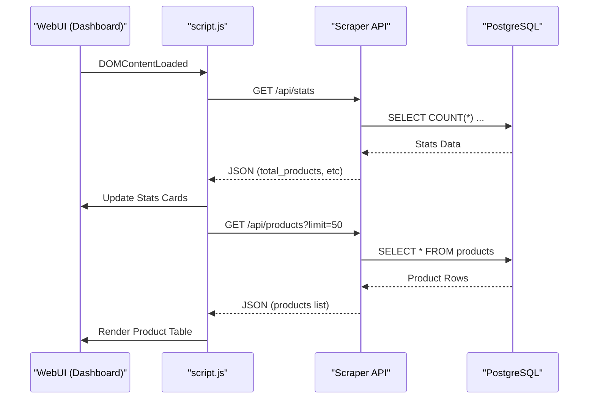
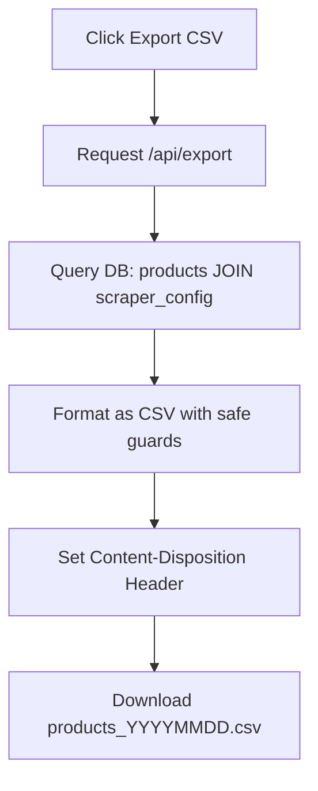

Relevant source files

The following files were used as context for generating this wiki page:

- [webui/templates/index.html](webui/templates/index.html)
- [webui/static/script.js](webui/static/script.js)
- [scraper/scraper.py](scraper/scraper.py)
- [webui/static/style.css](webui/static/style.css)
- [README.md](README.md)
- [scraper/enrich.py](scraper/enrich.py)

# Product & Deals Dashboard

## Introduction
The **Product & Deals Dashboard** serves as the central monitoring and management interface for the Web Scraper Platform. It provides a real-time overview of scraped product data, system statistics, and manual control over scraping operations. The dashboard is designed to surface high-level metrics such as total products tracked and recent updates while allowing users to browse, search, and export the collected data.

The dashboard integrates directly with the backend REST API to fetch product lists and statistics, providing a responsive experience with features like theme toggling (dark/light mode) and periodic polling for status updates. It acts as the primary user-facing component of the WebUI, bridging the gap between the automated scraping engine and the end-user.
Sources: [README.md:9-19](README.md#L9-L19), [webui/templates/index.html:1-30](webui/templates/index.html#L1-L30), [webui/static/script.js:189-218](webui/static/script.js#L189-L218)

## Dashboard Architecture and Data Flow
The dashboard utilizes a client-side rendering approach where the HTML structure is provided by Jinja2 templates, and data is populated asynchronously via JavaScript `fetch` calls to the scraper's internal API.

### Component Interaction
The UI interacts with the Scraper Engine through a set of dedicated API endpoints. When the dashboard loads, it initializes multiple concurrent requests to populate the stats cards and the product table.

Sources: [webui/static/script.js:77-120](webui/static/script.js#L77-L120), [webui/templates/index.html:125-175](webui/templates/index.html#L125-L175), [scraper/scraper.py:844-860](scraper/scraper.py#L844-L860)

## Key Features and Metrics
The dashboard displays three primary metric cards that give immediate insight into the health and scale of the scraping operations.

| Metric | Description | Source Data |
|--------|-------------|-------------|
| **Total Products** | The total number of unique items across all configured sites. | `products` table count |
| **Updated 24h** | Number of products that have seen a price change or update in the last 24 hours. | `last_updated` field in `products` |
| **Active Configs** | The count of scraping configurations currently enabled. | `scraper_config` table (enabled=1) |

Sources: [webui/templates/index.html:51-78](webui/templates/index.html#L51-L78), [scraper/scraper.py:845-855](scraper/scraper.py#L845-L855)

### Data Presentation and Formatting
Data within the dashboard is localized for usability. Prices are formatted with thousand separators and the "kr" suffix, while dates are converted to Swedish locale formats.
*  **Currency Formatting:** Prices are processed through `formatPrice()` which adds spaces as thousand separators.
*  **Date Formatting:** Dates are handled by `formatDate()` using the `sv-SE` locale.
*  **Security:** All text content is sanitized via `escapeHtml()` before being injected into the DOM to prevent XSS.

Sources: [webui/static/script.js:8-23](webui/static/script.js#L8-L23), [webui/static/style.css:140-165](webui/static/style.css#L140-L165)

## Core API Endpoints for Dashboard
The dashboard relies on specific endpoints defined in the Scraper Engine's Flask application to function.

### Statistics and Monitoring
*  **`GET /api/stats`**: Returns an object containing `total_products`, `updated_24h`, and `active_configs`.
*  **`POST /api/scrape`**: Triggers a manual scraping run. The dashboard updates a "Scraping Indicator" (a pulsing dot) based on the `active` status returned by the system.

### Product Browsing
*  **`GET /api/products`**: Supports pagination and searching.
  *  `limit`: Number of products to return (default 50).
  *  `offset`: Starting point for pagination.
  *  `search`: Query string to filter product titles.

Sources: [scraper/scraper.py:844-860](scraper/scraper.py#L844-L860), [webui/templates/index.html:145-175](webui/templates/index.html#L145-L175), [webui/static/script.js:192-218](webui/static/script.js#L192-L218)

## Data Management and Export
The dashboard provides tools for external data consumption through the Export feature.

### CSV Export Logic
Users can export the current database state to CSV files. The system supports both a global export and site-specific exports.
*  **Global Export:** accessible via `/api/export`, it aggregates all products with a current price greater than zero.
*  **Site Export:** accessible via `/api/export/<site_name>`, it filters products based on the associated `scraper_config`.

Sources: [scraper/scraper.py:1003-1045](scraper/scraper.py#L1003-L1045), [webui/static/script.js:184-187](webui/static/script.js#L184-L187), [webui/templates/index.html:86-88](webui/templates/index.html#L86-L88)

### CSV Security Measures
To prevent CSV Injection (Formula Injection), the export logic applies a `_csv_safe` function that prefixes values starting with dangerous characters (`=`, `+`, `-`, `@`) with a single quote.
Sources: [scraper/scraper.py:1003-1007](scraper/scraper.py#L1003-L1007)

## UI Styling and User Experience
The dashboard implements a responsive design using Bootstrap 5 and custom CSS.

### Theme Management
A theme toggle allows users to switch between light and dark modes. This preference is persisted in `localStorage`.
*  **Dark Mode Colors:** Uses a background of `#0f1117` and card backgrounds of `#1a1f2e`.
*  **Light Mode Colors:** Uses standard white backgrounds with `#e2e8f0` borders.

### Real-time Status
The "Scraping Indicator" uses a CSS animation to pulse when monitoring is active, providing visual feedback on background processes.
Sources: [webui/static/style.css:1-25](webui/static/style.css#L1-L25), [webui/static/style.css:250-265](webui/static/style.css#L250-L265), [webui/templates/index.html:130-140](webui/templates/index.html#L130-L140)

## Conclusion
The Product & Deals Dashboard is the operational hub of the Scraper Platform, providing necessary visibility into the automated data collection pipeline. By combining real-time metrics, searchable product tables, and secure data export capabilities, it enables users to monitor price trends and scraping performance effectively. Its architecture ensures that the complex backend scraping logic is presented through a simple, localized, and performant user interface.
