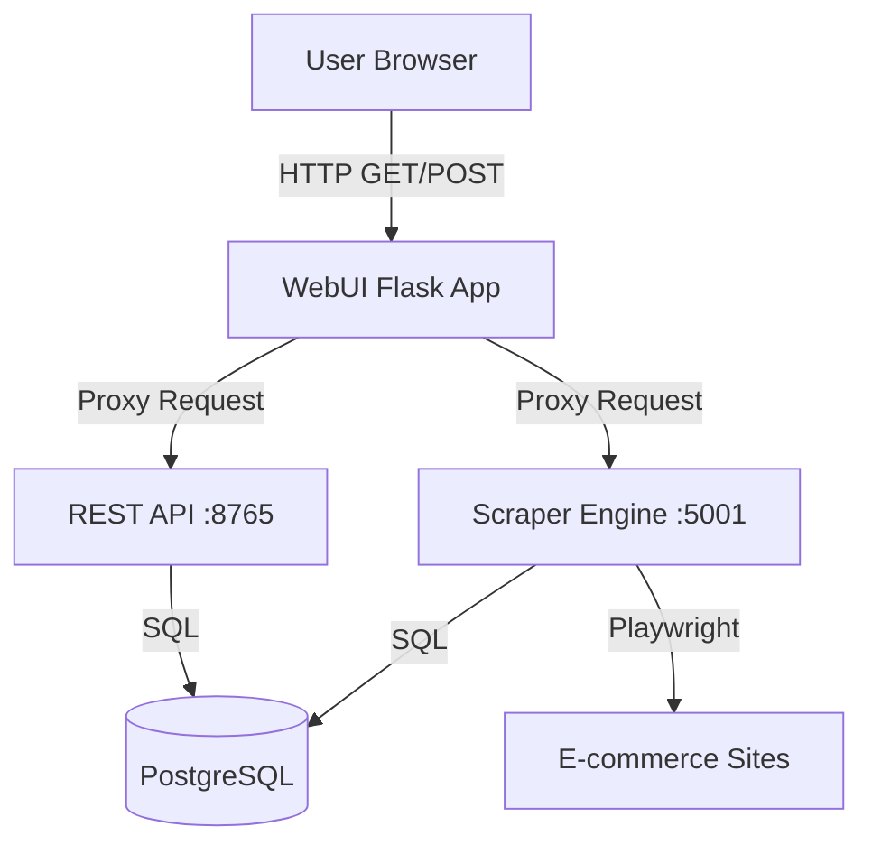
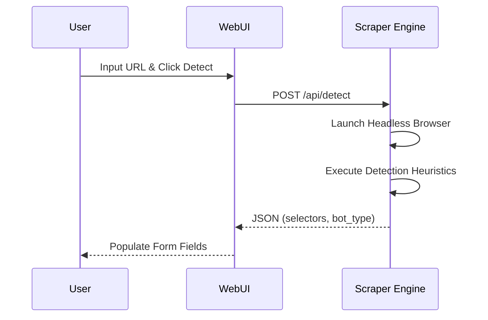
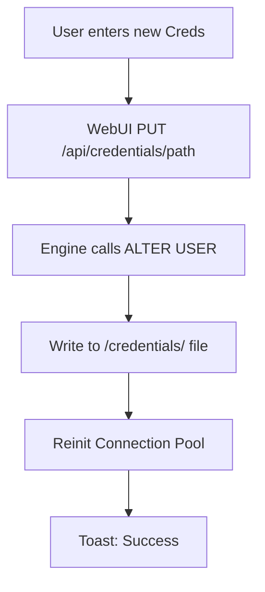

Relevant source files

The following files were used as context for generating this wiki page:

- [webui/templates/config.html](webui/templates/config.html)
- [webui/static/script.js](webui/static/script.js)
- [webui/app.py](webui/app.py)
- [scraper/scraper.py](scraper/scraper.py)
- [README.md](README.md)

# Scraper Configuration Interface

The Scraper Configuration Interface is a comprehensive web-based management tool provided by the `webui` module. It allows users to define, modify, and monitor scraping parameters for multiple e-commerce websites. The interface facilitates the setup of CSS selectors for product extraction, stealth settings to bypass bot protection, and advanced system-wide configurations including database credentials and scrape intervals.

This interface serves as the control plane, bridging the user's requirements with the underlying scraping engine and database. It interacts with the backend through a set of RESTful API endpoints, providing features like auto-detection of selectors and template-based site setup.

Sources: [webui/app.py:10-15](webui/app.py#L10-L15), [webui/templates/config.html:1-30](webui/templates/config.html#L1-L30), [README.md:15-30](README.md#L15-L30)

## Architecture and Data Flow

The configuration interface follows a proxy-based architecture. The WebUI (Flask) acts as a frontend and control layer, proxying requests to either the Scraper Engine (running on port 5001) for configuration and scraping tasks, or the Scraper API (running on port 8765) for product data and statistics.

The diagram shows the flow of requests from the User Interface through the WebUI proxy to the specialized backend services.
Sources: [webui/app.py:32-35](webui/app.py#L32-L35), [webui/app.py:90-100](webui/app.py#L90-L100), [scraper/scraper.py:840-850](scraper/scraper.py#L840-L850)

## Scraper Configuration Management

Users manage site-specific scraping rules via the `config.html` interface. Each configuration defines how the scraper interacts with a specific domain and its product listings.

### Configuration Fields
| Field | Description | Source |
|-------|-------------|--------|
| **Name** | Unique identifier for the site configuration. | [scraper.py:186](scraper.py#L186) |
| **Start URL** | The initial URL(s) where scraping begins. Supports multiple URLs. | [scraper.py:186](scraper.py#L186), [CHANGELOG.md:16](CHANGELOG.md#L16) |
| **Selectors** | CSS selectors for Product Container, Title, Price, and Link. | [scraper.py:187-190](scraper.py#L187-L190) |
| **Pagination** | Type (`query` or `subcategory`) and the category link selector. | [scraper.py:191-192](scraper.py#L191-L192) |
| **Stealth Mode** | Toggle to use Playwright Stealth to bypass Akamai/Cloudflare. | [scraper.py:202](scraper.py#L202) |
| **Proxy URL** | Optional site-specific SOCKS5/HTTP proxy. | [scraper.py:203](scraper.py#L203) |

Sources: [webui/templates/config.html:48-100](webui/templates/config.html#L48-L100), [scraper/scraper.py:184-210](scraper/scraper.py#L184-L210)

### Selector Auto-Detection
A key feature of the interface is the "Detect" capability. The engine uses a Playwright-based heuristic script to analyze a provided URL and automatically suggest CSS selectors for products, titles, and prices. It also detects bot protection services like Akamai or Cloudflare to recommend enabling Stealth Mode.

The sequence diagram illustrates the automated selector detection process triggered from the configuration UI.
Sources: [scraper/scraper.py:657-770](scraper/scraper.py#L657-L770), [webui/templates/config.html:265-300](webui/templates/config.html#L265-L300)

## System Settings and Credentials

The interface provides an "Advanced Settings" section to manage global scraper behavior and sensitive database credentials.

### Global Settings
The `settings` table in PostgreSQL stores system-wide parameters which are rendered dynamically in the UI:
*  **Concurrent Pages:** Number of simultaneous Playwright instances.
*  **Scrape Interval:** Seconds between full scraping runs.
*  **Alert Thresholds:** Minimum price drop percentage and absolute amount for notifications.
*  **Headless Mode:** Toggle for browser visibility (primarily for debugging).

Sources: [scraper/scraper.py:53-100](scraper/scraper.py#L53-L100), [webui/templates/config.html:132-150](webui/templates/config.html#L132-L150)

### Credential Management
The interface allows for the immediate rotation of PostgreSQL credentials. Changing the username or password via the UI updates the database user permissions and writes the new values to the `credentials` directory, followed by a re-initialization of the database connection pool.

Sources: [webui/app.py:240-250](webui/app.py#L240-L250), [scraper/scraper.py:808-860](scraper/scraper.py#L808-L860), [README.md:75-85](README.md#L75-L85)

## API Endpoints for Configuration

The WebUI communicates with the Scraper Engine via the following internal API routes:

| Endpoint | Method | Description |
|----------|--------|-------------|
| `/api/configs` | GET | Retrieves all active site configurations. |
| `/api/configs` | POST | Creates a new scraper configuration. |
| `/api/configs/<id>` | DELETE | Performs a hard delete of a config and its products. |
| `/api/detect` | POST | Triggers the heuristic selector detection. |
| `/api/settings` | GET/PUT | Manages global system settings. |
| `/api/credentials/<type>` | PUT | Updates DB username or password. |

Sources: [webui/app.py:130-255](webui/app.py#L130-L255), [scraper/scraper.py:590-650](scraper/scraper.py#L590-L650)

## Conclusion
The Scraper Configuration Interface centralizes the management of a complex scraping ecosystem. By combining manual selector entry, automated detection heuristics, and global system administration into a single responsive web portal, it enables rapid deployment and maintenance of multi-site price monitoring without requiring direct database or code manipulation.

Sources: [README.md:10-25](README.md#L10-L25), [webui/templates/config.html:420-430](webui/templates/config.html#L420-L430)
