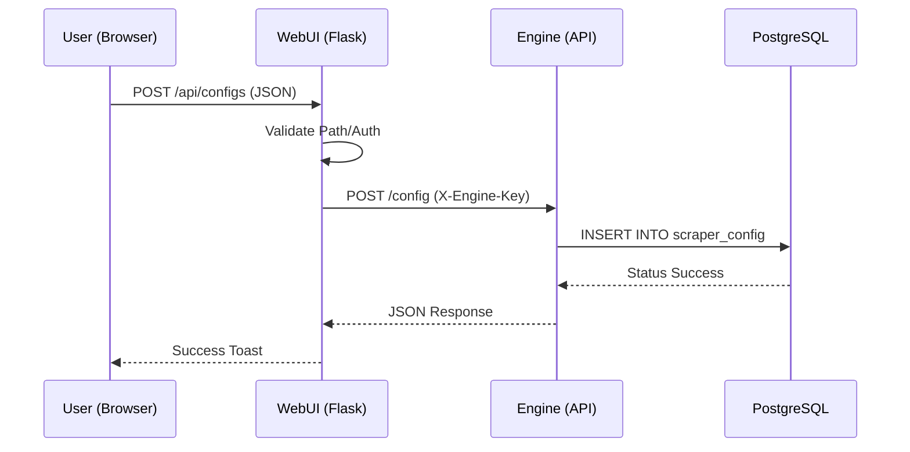
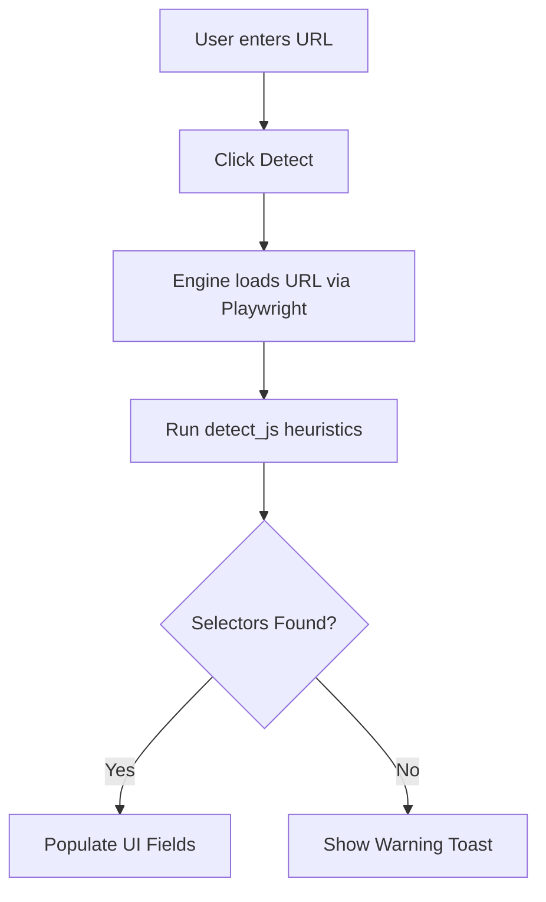

<details>
<summary>Relevant source files</summary>

The following files were used as context for generating this wiki page:

- [webui/templates/config.html](webui/templates/config.html)
- [webui/static/script.js](webui/static/script.js)
- [webui/app.py](webui/app.py)
- [scraper/scraper.py](scraper/scraper.py)
- [README.md](README.md)
</details>

# Scraper Configuration Interface

The Scraper Configuration Interface is a comprehensive web-based management module within the Web Scraper Platform. It allows users to define, modify, and monitor scraping parameters for multiple e-commerce sites. The interface bridges the gap between the frontend WebUI and the backend scraper engine, providing tools for selector auto-detection, template-based setup, and advanced system-wide settings management.

Through this interface, users can manage `scraper_config` entries in the PostgreSQL database, which dictate how the Playwright-based engine interacts with target websites. The system supports features such as stealth mode for bypassing bot protection, proxy configuration per site, and automatic discovery of subcategories.

Sources: [README.md:10-23](README.md#L10-L23), [webui/templates/config.html:1-50](webui/templates/config.html#L1-L50)

## System Architecture and Data Flow

The configuration interface operates as a three-tier architecture. The Frontend (HTML/JS) captures user input and sends requests to the WebUI Control Plane (Flask). The WebUI acts as a secure proxy, validating requests and forwarding them to the Scraper Engine (Flask/Waitress) which performs the actual database operations and site analysis.

### Configuration Request Flow

The following diagram illustrates the flow of a configuration update from the user interface to the database.



Sources: [webui/app.py:115-130](webui/app.py#L115-L130), [scraper/scraper.py:610-645](scraper/scraper.py#L610-L645), [webui/static/script.js:77-113](webui/static/script.js#L77-L113)

## Site Configuration Management

Users can create new scraper configurations manually or use pre-defined templates. Each configuration requires specific CSS selectors to identify product data on the target site.

### Key Configuration Fields

| Field | Description | Source File |
|-------|-------------|-------------|
| **Name** | Unique identifier for the site config | [scraper/scraper.py:236](scraper/scraper.py#L236) |
| **Base URL** | The starting point for the scraper | [scraper/scraper.py:237](scraper/scraper.py#L237) |
| **Product Selector** | CSS selector for the product container | [scraper/scraper.py:238](scraper/scraper.py#L238) |
| **Title/Price/Link** | Specific selectors for product attributes | [scraper/scraper.py:239-241](scraper/scraper.py#L239-L241) |
| **Stealth Mode** | Toggle for Akamai/Cloudflare bypass | [scraper/scraper.py:263](scraper/scraper.py#L263) |
| **Proxy URL** | Site-specific SOCKS5/HTTP proxy | [scraper/scraper.py:264](scraper/scraper.py#L264) |
| **Pagination Type** | 'query' (URL params) or 'subcategory' | [scraper/scraper.py:242](scraper/scraper.py#L242) |

### Selector Auto-Detection
The interface includes a "Detect" feature that uses Playwright heuristics to guess CSS selectors from a provided URL. It analyzes the DOM for patterns matching common product containers, titles, and price formats (e.g., matching "kr" or ":-").



Sources: [scraper/scraper.py:700-845](scraper/scraper.py#L700-L845), [webui/templates/config.html:230-265](webui/templates/config.html#L230-L265)

## Advanced System Settings

The interface provides an "Advanced Settings" section for global system configuration. These settings are stored in a dedicated `settings` table and control the engine's behavior and alert thresholds.

### Global Configuration Options

| Key | Type | Default | Description |
|-----|------|---------|-------------|
| `concurrent_pages` | int | 2 | Number of simultaneous scraping processes |
| `scrape_interval` | int | 3600 | Seconds between full scraping runs |
| `headless` | bool | True | Run browser without GUI |
| `min_drop_percent`| float| 5.0 | Alert threshold for price drops |
| `cooldown_hours` | int | 24 | Alert frequency limiter per product |

Sources: [scraper/scraper.py:53-95](scraper/scraper.py#L53-L95), [webui/templates/config.html:360-395](webui/templates/config.html#L360-L395)

## Security and Credentials

The Scraper Configuration Interface handles sensitive credentials for both the API and the database.

### Credential Management Features
*  **Database Credentials**: The UI allows updating the PostgreSQL username and password. These changes are applied immediately via `ALTER USER` commands and stored in the `/credentials` volume.
*  **API Key**: Generated on first startup and stored in `api_key`. All WebUI proxy requests to the engine require an `X-Engine-Key`.
*  **Path Validation**: The WebUI enforces regex-based path validation (`PATH_RE`) to validate that proxied request paths contain only valid URL path characters when proxying to the engine. This validates only the path string syntax and does not restrict destination hosts or provide SSRF protection against requests to private network ranges.

```python
# Path validation used in webui/app.py to validate proxied request paths
PATH_RE = re.compile(r"^/[A-Za-z0-9._~!$&'()*+,;=:@/%-]*$")

def _validate_path(path):
    if not isinstance(path, str) or not PATH_RE.fullmatch(path):
        raise ValueError("Invalid request path")
```

Sources: [webui/app.py:32](webui/app.py#L32), [webui/app.py:92-94](webui/app.py#L92-L94), [scraper/scraper.py:186-199](scraper/scraper.py#L186-L199), [README.md:65-75](README.md#L65-L75)

## Data Models

The configuration interface primarily interacts with the `scraper_config` and `settings` tables.

### Scraper Config Schema

The following SQL represents the full schema as created and migrated by `init_db()`:

```sql
CREATE TABLE scraper_config (
    id SERIAL PRIMARY KEY,
    name TEXT UNIQUE NOT NULL,
    base_url TEXT NOT NULL,
    product_selector TEXT NOT NULL,
    title_selector TEXT NOT NULL,
    price_selector TEXT NOT NULL,
    link_selector TEXT NOT NULL,
    pagination_type TEXT DEFAULT 'query',
    pagination_selector TEXT,
    max_pages INTEGER DEFAULT 50,
    enabled INTEGER DEFAULT 1,
    min_price INTEGER DEFAULT 0,
    max_price INTEGER DEFAULT 999999,
    categories TEXT DEFAULT '[]',
    created_at TIMESTAMP DEFAULT NOW(),
    updated_at TIMESTAMP DEFAULT NOW(),
    -- Migration-added columns (via ALTER TABLE in init_db):
    use_stealth INTEGER DEFAULT 0,
    proxy_url TEXT DEFAULT '',
    exclude_link_pattern TEXT DEFAULT '',
    url_scope TEXT DEFAULT '',
    detail_selector TEXT DEFAULT ''
);
```

Sources: [scraper/scraper.py:291-332](scraper/scraper.py#L291-L332), [README.md:144-165](README.md#L144-L165)

## Summary
The Scraper Configuration Interface is the central control hub for the platform, enabling dynamic site management without code changes. By combining template-based setup, heuristic selector detection, and global system settings, it provides a flexible environment for managing large-scale product monitoring across diverse e-commerce platforms.
