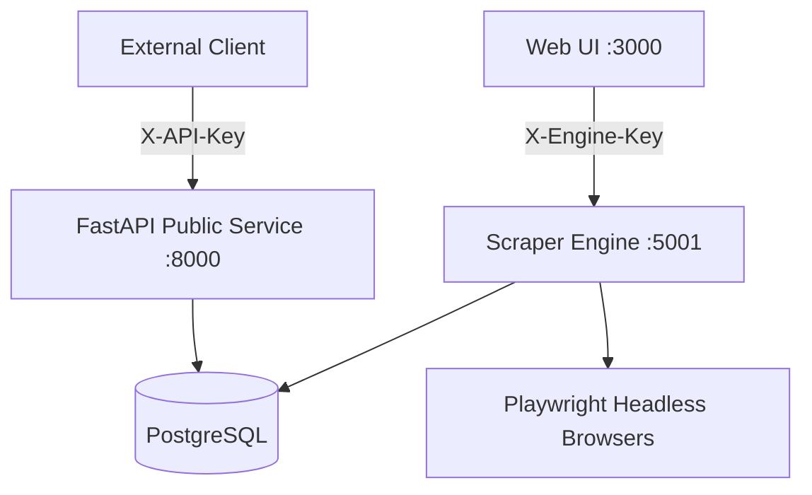
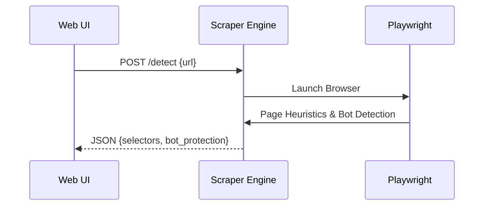

<details>
<summary>Relevant source files</summary>

The following files were used as context for generating this wiki page:

- [api/api.py](api/api.py)
- [scraper/scraper.py](scraper/scraper.py)
- [webui/app.py](webui/app.py)
- [README.md](README.md)
- [CLAUDE.md](CLAUDE.md)
</details>

# REST API Endpoints & Docs

## Introduction

The Web Scraper Platform provides a comprehensive REST API for programmatic access to scraped product data, price history, and system configurations. The API is divided into two primary interfaces: a public-facing FastAPI service (running on port 8000) for data consumption and an internal Scraper Engine API (running on port 5001) used for controlling the scraping logic and system settings.

This dual-layered architecture allows external services, such as a product describer or mobile application, to query price drops and product details while keeping the heavy orchestration of headless browsers and database migrations within the internal engine layer.

Sources: [api/api.py:73-79](api/api.py#L73-L79), [scraper/scraper.py:1020-1025](scraper/scraper.py#L1020-L1025), [README.md:82-88](README.md#L82-L88), [CLAUDE.md:12-25](CLAUDE.md#L12-L25)

## API Architecture and Security

The system employs a multi-tier API structure. The Web UI acts as a proxy for most engine-related commands, while the public API provides direct database access for data retrieval.

### Security Mechanisms

Both APIs implement mandatory authentication via API keys:
*  **Public API:** Requires an `X-API-Key` header. This key is auto-generated on the first startup and stored in the credentials directory.
*  **Engine API:** Requires an `X-Engine-Key` header for administrative tasks, configuration updates, and manual scrape triggers.



The diagram above shows the relationship between the external clients, the Web UI, and the two primary API services. 

Sources: [api/api.py:100-112](api/api.py#L100-L112), [scraper/scraper.py:794-813](scraper/scraper.py#L794-L813), [webui/app.py:84-106](webui/app.py#L84-L106), [README.md:104-110](README.md#L104-L110)

## Public API Endpoints (FastAPI)

The public API is designed for high-performance data retrieval using `ThreadedConnectionPool` for database interactions and Sentry for error tracking.

### Core Data Endpoints

| Endpoint | Method | Description | Parameters |
| :--- | :--- | :--- | :--- |
| `/products` | GET | List scraped products with pagination and search. | `limit`, `offset`, `search`, `missing_description` |
| `/products/{id}/history` | GET | Retrieve price history for a specific product. | `product_id` (path) |
| `/deals` | GET | Get recent price drops (last 7 days) with at least 1-day old baseline. | None |
| `/stats` | GET | System-wide statistics (product count, active configs). | None |
| `/health` | GET | Check API and database connectivity. | None |

Sources: [api/api.py:126-128](api/api.py#L126-L128), [api/api.py:145-163](api/api.py#L145-L163), [api/api.py:207-220](api/api.py#L207-L220), [api/api.py:223-260](api/api.py#L223-L260)

### Product Description Management
The API allows external AI services to update product descriptions based on scraped metadata.

```python
# From api/api.py:183-204
@app.put("/products/{product_id}/description")
def set_product_description(product_id: int, payload: ProductDescriptionUpdate):
    conn = get_db()
    try:
        cur = conn.cursor()
        cur.execute(
            "UPDATE products SET description = %s, description_why = %s, "
            "description_updated_at = NOW() WHERE id = %s",
            (payload.description, payload.why, product_id),
        )
        # ... logic
```

Sources: [api/api.py:183-204](api/api.py#L183-L204)

## Internal Engine API Endpoints (Flask)

The Engine API manages the scraping lifecycle, CSS selector detection, and system-wide settings. It is served by `waitress` and typically proxied through the Web UI.

### Scraper Configuration

| Endpoint | Method | Description |
| :--- | :--- | :--- |
| `/config` | GET | List all scraper configurations. |
| `/config` | POST | Create a new site scraper configuration. |
| `/config/{id}` | PUT | Update an existing site configuration. |
| `/config/{id}` | DELETE | Remove a configuration and its associated products. |
| `/detect` | POST | Auto-detect CSS selectors for a given URL using heuristics. |
| `/test` | POST | Perform a test scrape of the first 5 items for a config. |

Sources: [scraper/scraper.py:821-884](scraper/scraper.py#L821-L884), [scraper/scraper.py:887-943](scraper/scraper.py#L887-L943), [scraper/scraper.py:1020-1025](scraper/scraper.py#L1020-L1025)

### Control and Maintenance

The engine provides endpoints for manual triggers and sensitive credential management.

*  **Trigger Scrape:** `POST /scrape` starts a background thread to execute the scraping loop immediately.
*  **Selector Detection:** `POST /detect` uses Playwright to analyze a page and return suggested CSS selectors for title, price, and links.
*  **Database Credentials:** `PUT /credentials/password` and `PUT /credentials/username` allow hot-swapping DB access details.



This flow illustrates the auto-detection feature where the Engine utilizes Playwright to assist users in configuring new sites.

Sources: [scraper/scraper.py:946-1025](scraper/scraper.py#L946-L1025), [scraper/scraper.py:1126-1144](scraper/scraper.py#L1126-L1144), [webui/app.py:186-193](webui/app.py#L186-L193)

## Data Models and Schemas

### Product Model
The central data structure used across API responses.

| Field | Type | Description |
| :--- | :--- | :--- |
| `id` | SERIAL | Primary key. |
| `url` | TEXT | Unique product URL. |
| `title` | TEXT | Product name (truncated to 200 chars). |
| `current_price` | INTEGER | Last seen price in whole currency units. |
| `source_text` | TEXT | Raw extracted text for enrichment. |
| `description` | TEXT | AI-generated or enriched description. |
| `category` | TEXT | Derived category from URL path. |

Sources: [scraper/scraper.py:192-205](scraper/scraper.py#L192-L205), [api/api.py:145-155](api/api.py#L145-L155), [README.md:144-156](README.md#L144-L156)

## Conclusion

The REST API infrastructure provides a decoupled interface for both managing the scraping engine and consuming the resulting e-commerce data. By separating the FastAPI public service from the Flask/Waitress engine, the system ensures that high-volume data queries do not interfere with the resource-intensive browser automation tasks.

Sources: [api/api.py:1-25](api/api.py#L1-L25), [scraper/scraper.py:1146-1153](scraper/scraper.py#L1146-L1153)
