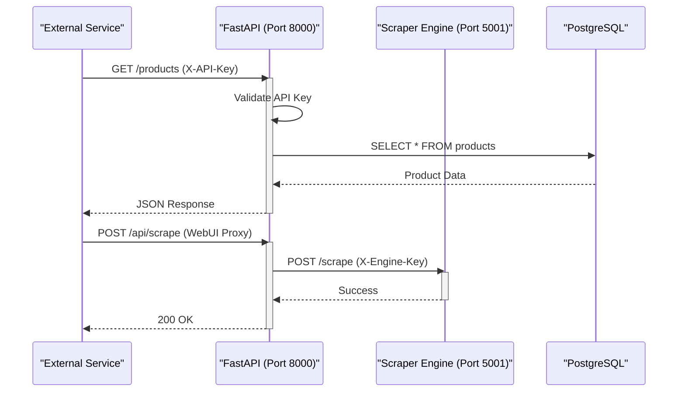

<details>
<summary>Relevant source files</summary>

The following files were used as context for generating this wiki page:

- [api/api.py](api/api.py)
- [README.md](README.md)
- [webui/app.py](webui/app.py)
- [scraper/scraper.py](scraper/scraper.py)
- [CLAUDE.md](CLAUDE.md)
</details>

# REST API Endpoints & Docs

The REST API serves as the programmatic interface for the Web Scraper Platform, providing access to scraped product data, price history, and system statistics. It is built using **FastAPI** and is designed to interact with a PostgreSQL database to serve data for the WebUI and other external consumption services, such as product-describers.

The API is architected to require authentication for all data-sensitive operations, ensuring that only authorized services can retrieve or modify product information. It operates alongside a dedicated Scraper Engine API (Flask-based) which handles configuration and execution of scraping tasks.

Sources: [api/api.py:34-40](api/api.py#L34-L40), [README.md:12-25](README.md#L12-L25), [CLAUDE.md:1-10](CLAUDE.md#L1-L10)

## Architecture and Authentication

The system utilizes two distinct API layers: a public-facing REST API (FastAPI) typically on port 8000 and an internal Scraper Engine API (Flask/Waitress) on port 5001.

### Security Implementation
Except for the `/health` and documentation endpoints, all requests must include an `X-API-Key` header. The API key is auto-generated on the first startup and stored in the credentials directory.



This diagram illustrates the flow of a standard data request versus a proxied engine command.

Sources: [api/api.py:87-95](api/api.py#L87-L95), [webui/app.py:61-75](webui/app.py#L61-L75), [README.md:104-108](README.md#L104-L108), [scraper/scraper.py:633-645](scraper/scraper.py#L633-L645)

## Primary REST Endpoints (Port 8000)

These endpoints provide programmatic access to the scraped data stored in PostgreSQL.

### Product Data Management
| Endpoint | Method | Description |
|----------|--------|-------------|
| `/products` | GET | List products with pagination and search filters. |
| `/products/{id}/history` | GET | Retrieve up to 100 recent price changes for a specific product. |
| `/products/{id}/description`| PUT | Update the generated description and "why" reasoning for a product. |
| `/deals` | GET | Get products with price drops in the last 7 days compared to 24h+ ago. |
| `/stats` | GET | Get global counters for products, 24h updates, and active configs. |

### Parameters for `/products`
| Parameter | Type | Default | Description |
|-----------|------|---------|-------------|
| `limit` | integer | 500 | Max records (min: 1, max: 10000). |
| `offset` | integer | 0 | Number of records to skip. |
| `search` | string | null | Case-insensitive search on product titles. |
| `missing_description`| boolean | false | Filter for products lacking a description. |

Sources: [api/api.py:112-140](api/api.py#L112-L140), [api/api.py:192-205](api/api.py#L192-L205), [api/api.py:214-250](api/api.py#L214-L250)

## Scraper Engine API (Port 5001)

The Scraper Engine API handles the operational logic of the scraping process, including configuration management and manual triggers.

### Configuration and Control Endpoints
| Endpoint | Method | Description |
|----------|--------|-------------|
| `/config` | GET | Returns all site scraping configurations. |
| `/config` | POST | Create a new site configuration. |
| `/config/{id}`| PUT | Update an existing site configuration. |
| `/config/{id}`| DELETE | Hard delete a configuration and its associated product data. |
| `/scrape` | POST | Triggers an asynchronous scraping run for all enabled sites. |
| `/detect` | POST | Uses heuristics to auto-detect CSS selectors for a given URL. |
| `/export` | GET | Generates a CSV export of all products and current prices. |

### Configuration Data Model
The configuration object passed to these endpoints follows the database schema for `scraper_config`.

```sql
-- Logical representation of the Scraper Config
scraper_config (
  name TEXT UNIQUE,
  base_url TEXT,
  product_selector TEXT,
  title_selector TEXT,
  price_selector TEXT,
  link_selector TEXT,
  use_stealth INTEGER,
  proxy_url TEXT
)
```

Sources: [scraper/scraper.py:648-745](scraper/scraper.py#L648-L745), [scraper/scraper.py:836-875](scraper/scraper.py#L836-L875), [README.md:144-180](README.md#L144-L180)

## Documentation and Health

The platform provides built-in documentation and health monitoring:
*  **Interactive Docs:** Available at `http://localhost:8000/docs` (Swagger UI) or `/redoc`.
*  **Health Check:** `GET /health` returns the connection status of the database and API.

### Health Response Example

```json
{
  "status": "healthy",
  "database": "connected",
  "timestamp": "2023-10-27T10:00:00Z"
}
```

Note: The REST API typically runs on port 8000 in Docker deployments, as specified in api/api.py's default configuration.

Sources: [api/api.py:46-51](api/api.py#L46-L51), [api/api.py:98-110](api/api.py#L98-L110), [api/api.py:284-286](api/api.py#L284-L286)

## Conclusion
The Web Scraper Platform provides a robust API split between data consumption and engine control. By separating the FastAPI data layer from the Flask-based scraper engine, the system ensures that high-frequency data reads do not interfere with resource-intensive browser-based scraping tasks. Proper authentication via `X-API-Key` and `X-Engine-Key` maintains security across the distributed services.
