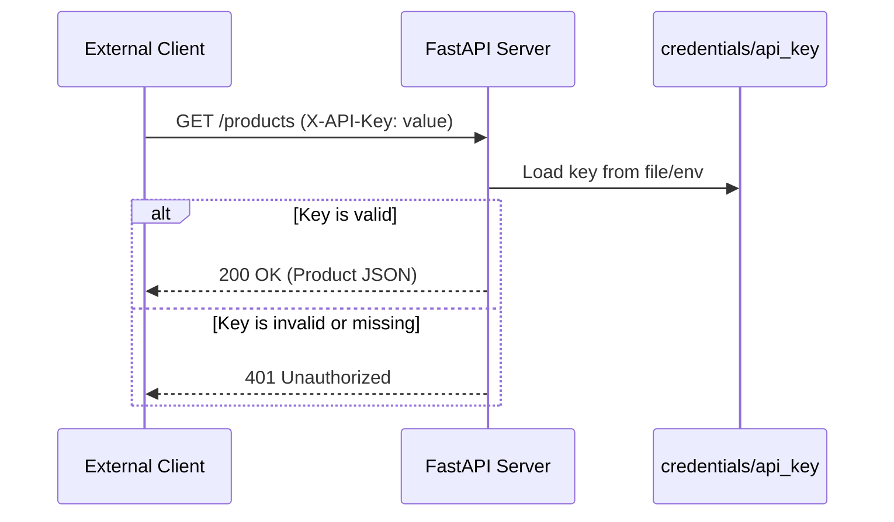
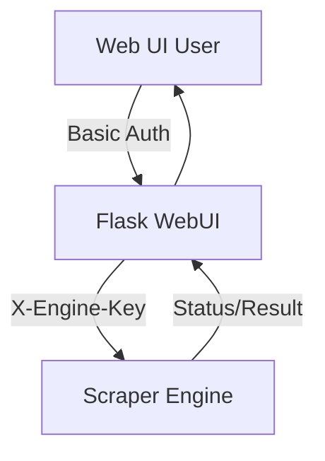

<details>
<summary>Relevant source files</summary>

The following files were used as context for generating this wiki page:

- [api/api.py](api/api.py)
- [scraper/scraper.py](scraper/scraper.py)
- [webui/app.py](webui/app.py)
- [README.md](README.md)
- [CLAUDE.md](CLAUDE.md)
</details>

# API Key Authentication

## Introduction
The Web Scraper Platform utilizes a robust API key authentication system to secure programmatic access to its REST API and internal communication between the Web UI and the Scraper Engine. This system ensures that only authorized clients and services can retrieve product data, search records, or trigger scraping operations.

Authentication is primarily handled through the `X-API-Key` header for external REST access and the `X-Engine-Key` for communication between the Web UI control plane and the Scraper Engine. These keys are auto-generated during the initial system startup to provide immediate security without manual configuration.

Sources: [README.md:12](README.md#L12), [README.md:58-64](README.md#L58-L64), [api/api.py:84-88](api/api.py#L84-L88)

## Key Generation and Storage
All credentials, including API keys, are automatically generated upon the first startup of the scraper container. These secrets are stored as flat files within a persistent credentials directory to ensure they survive container restarts.

### Automated Setup
The `scraper/scraper.py` module contains logic to initialize these credentials if they do not exist. It utilizes the Python `secrets` module to generate cryptographically secure tokens.

- **`api_key`**: A URL-safe 32-character token used for the REST API.
- **`engine_key`**: A URL-safe 32-character token used for internal engine communication.

Sources: [scraper/scraper.py:199-214](scraper/scraper.py#L199-L214), [README.md:83-88](README.md#L83-L88)

### Security Persistence
The system enforces strict security practices for credential management:
- **Environment Variables**: Secrets can be passed via environment variables (e.g., `API_KEY` or `API_KEY_FILE`).
- **File System**: If environment variables are not set, the system reads from `/credentials/api_key` or `/credentials/engine_key`.
- **Permissions**: The `entrypoint.sh` script sets restrictive permissions on the credentials directory at every startup to prevent unauthorized access.

Sources: [CLAUDE.md:43-46](CLAUDE.md#L43-L46), [webui/app.py:61-75](webui/app.py#L61-L75), [scraper/scraper.py:182-195](scraper/scraper.py#L182-L195)

## Authentication Mechanisms

The project implements two distinct authentication flows depending on the target service.

### REST API Authentication (`X-API-Key`)
The FastAPI-based REST API uses middleware to intercept incoming requests (excluding health and documentation endpoints). It validates the presence and accuracy of the `X-API-Key` header.



Sources: [api/api.py:84-91](api/api.py#L84-L91), [README.md:94-106](README.md#L94-L106)

### Scraper Engine Authentication (`X-Engine-Key`)
Communication between the Web UI and the Scraper Engine is secured using an `X-Engine-Key`. The Web UI acts as a proxy, injecting the required key into requests sent to the engine.



The Scraper Engine validates this key using a `before_request` hook in its Flask implementation, utilizing `hmac.compare_digest` to prevent timing attacks.

Sources: [webui/app.py:83-91](webui/app.py#L83-L91), [scraper/scraper.py:489-503](scraper/scraper.py#L489-L503)

## Configuration and Usage

### Required Headers
The following table summarizes the headers required for different components:

| Component | Header Name | Description | Source |
|-----------|-------------|-------------|--------|
| REST API | `X-API-Key` | Required for all endpoints except `/health`, `/docs`, and `/redoc`. | [api/api.py:84-91](api/api.py#L84-L91) |
| Scraper Engine | `X-Engine-Key` | Required for internal commands like `/scrape`, `/config`, and `/detect`. | [scraper/scraper.py:497-503](scraper/scraper.py#L497-L503) |

### Retrieving the API Key
After the first startup, the API key can be retrieved from the persistent volume:

```bash
cat /path/to/docker/data/scraper/credentials/api_key
```

Sources: [README.md:89-91](README.md#L89-L91)

## Conclusion
API Key authentication in the Web Scraper platform provides a zero-configuration security model. By auto-generating keys on first boot and enforcing header-based validation across both external and internal services, the system maintains a high security posture while remaining user-friendly for developers and automated services.
