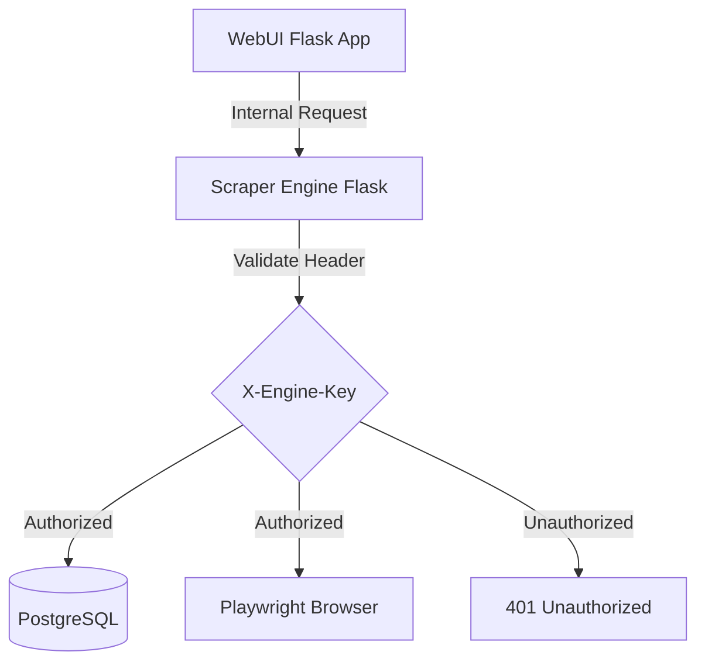
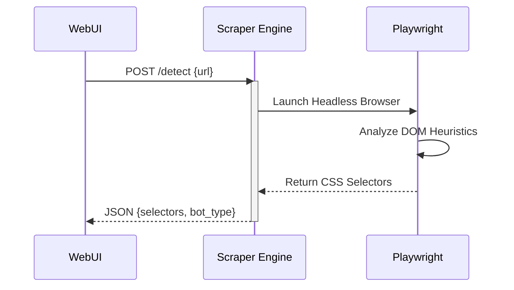

<details>
<summary>Relevant source files</summary>

The following files were used as context for generating this wiki page:

- [scraper/scraper.py](scraper/scraper.py)
- [webui/app.py](webui/app.py)
- [webui/templates/config.html](webui/templates/config.html)
- [scraper/enrich.py](scraper/enrich.py)
- [README.md](README.md)
</details>

# Internal Scraper Engine API

The Internal Scraper Engine API is a Flask-based REST service that acts as the core controller for the scraping platform. It manages the lifecycle of scraper configurations, provides heuristics for automated selector detection, and orchestrates the execution of Playwright-based scraping tasks. It is primarily consumed by the WebUI Control Plane to bridge user actions with the underlying database and browser automation tools.

This API is distinct from the public-facing REST API; while the public API provides access to scraped product data, the Internal Scraper Engine API handles the administrative and operational logic of the scraper itself, including database initialization and security credential management.

Sources: [scraper/scraper.py:20-40](scraper/scraper.py#L20-L40), [webui/app.py:12-25](webui/app.py#L12-L25), [README.md:45-55](README.md#L45-L55)

## Architecture and Security

The engine operates on port 5001 and is designed for internal communication within the Docker stack. It utilizes a `ThreadedConnectionPool` to manage interactions with the PostgreSQL database. Security is enforced via a mandatory `X-Engine-Key` header for all requests except `/health`. This key is automatically generated on first startup and stored in the credentials directory.

Sources: [scraper/scraper.py:125-140](scraper/scraper.py#L125-L140), [scraper/scraper.py:655-675](scraper/scraper.py#L655-L675), [webui/app.py:59-65](webui/app.py#L59-L65)



The diagram shows the request flow from the WebUI through the security validation layer to the core engine components. Sources: [scraper/scraper.py:660-675](scraper/scraper.py#L660-L675), [webui/app.py:67-75](webui/app.py#L67-L75)

## API Endpoints

### Configuration Management
The API provides CRUD operations for `scraper_config` records, which define how specific sites should be processed.

| Endpoint | Method | Description |
| :--- | :--- | :--- |
| `/config` | GET | Returns a list of all site configurations. |
| `/config` | POST | Creates a new scraper configuration. |
| `/config/<id>` | PUT | Updates an existing configuration by ID. |
| `/config/<id>` | DELETE | Performs a hard delete of a config and its associated products. |

Sources: [scraper/scraper.py:686-775](scraper/scraper.py#L686-L775), [webui/app.py:130-155](webui/app.py#L130-L155)

### Operational Control
These endpoints trigger active scraping processes or perform diagnostic tests.

*  **`/scrape` (POST):** Starts a background thread to execute the full scraping loop across all enabled configurations. It returns a 409 error if a scrape is already active.
*  **`/test` (POST):** Synchronously attempts to scrape the first five items from a provided URL and configuration. It is used to validate CSS selectors before saving.
*  **`/detect` (POST):** Executes a Playwright-based heuristic script to automatically identify product, title, price, and link selectors for a target URL. It also identifies bot protection systems like Akamai or Cloudflare.

Sources: [scraper/scraper.py:778-950](scraper/scraper.py#L778-L950), [webui/app.py:157-165](webui/app.py#L157-L165)



This sequence illustrates the auto-detection process where the engine uses a headless browser to guess site structures. Sources: [scraper/scraper.py:821-930](scraper/scraper.py#L821-L930), [webui/templates/config.html:150-180](webui/templates/config.html#L150-L180)

## Heuristic Detection Logic

The `/detect` endpoint utilizes a complex JavaScript payload injected into the browser. It identifies "product containers" by looking for elements like `<article>` or `<li>` that appear at least three times. For price detection, it uses a regular expression `/\d[\d\s]*\s*(kr|SEK|:-|,\d{2})/i` to find the shallowest DOM node containing price-like text.

Sources: [scraper/scraper.py:838-910](scraper/scraper.py#L838-L910)

```python
# Fixed price pattern used for extraction to prevent ReDoS
match = re.search(r'\d[\d\s]*(?:kr|:-|\.\d{2})?', parent_text)
```

Sources: [scraper/scraper.py:440-445](scraper/scraper.py#L440-L445)

## Global Settings and Credentials

The engine manages a `settings` table in PostgreSQL for global parameters that affect the scraping behavior and alert system.

| Setting Key | Type | Default | Description |
| :--- | :--- | :--- | :--- |
| `concurrent_pages` | int | 2 | Number of browser pages to scrape simultaneously. |
| `scrape_interval` | int | 3600 | Seconds between full scraping cycles. |
| `headless` | bool | True | Whether to run the browser without a visible window. |
| `proxy_url` | str | "" | Global SOCKS5/HTTP proxy for all requests. |
| `min_drop_percent` | float | 5.0 | Minimum percentage price drop that triggers an alert. |
| `min_drop_amount` | int | 100 | Minimum absolute price drop in kr that triggers an alert. |
| `cooldown_hours` | int | 24 | Hours before the same product can trigger another alert. |

Note: `use_stealth` is a per-site configuration option stored in the `scraper_config` table, not a global setting.

Sources: [scraper/scraper.py:54-96](scraper/scraper.py#L54-L96), [scraper/scraper.py:327](scraper/scraper.py#L327), [webui/templates/config.html:265-300](webui/templates/config.html#L265-L300)

### Credential Endpoints
The engine provides specific endpoints to modify its own database connectivity during runtime:
*  **`/credentials/username` (PUT):** Renames the PostgreSQL user using `ALTER USER`.
*  **`/credentials/password` (PUT):** Updates the database password and reinitializes the connection pool.

Sources: [scraper/scraper.py:1005-1065](scraper/scraper.py#L1005-L1065)

## Conclusion
The Internal Scraper Engine API serves as the orchestration layer for the platform, centralizing database management, security, and complex browser automation logic. By exposing these functions through a controlled REST interface, the system maintains a clear separation between the UI presentation and the resource-intensive scraping operations.

Sources: [scraper/scraper.py:1085-1100](scraper/scraper.py#L1085-L1100), [webui/app.py:220-235](webui/app.py#L220-L235)
