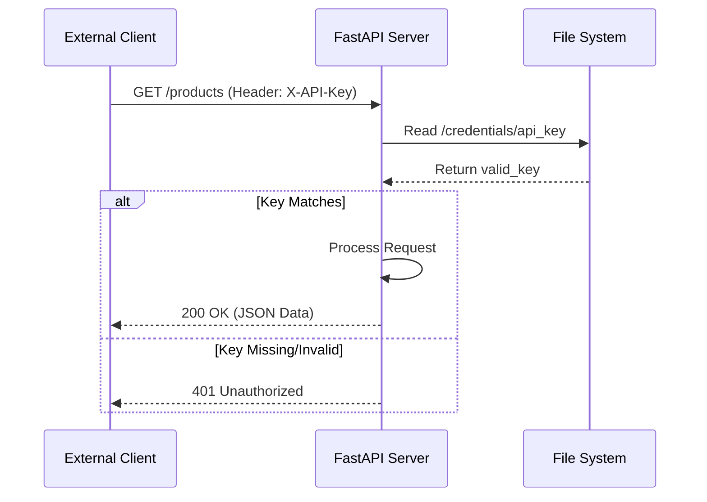
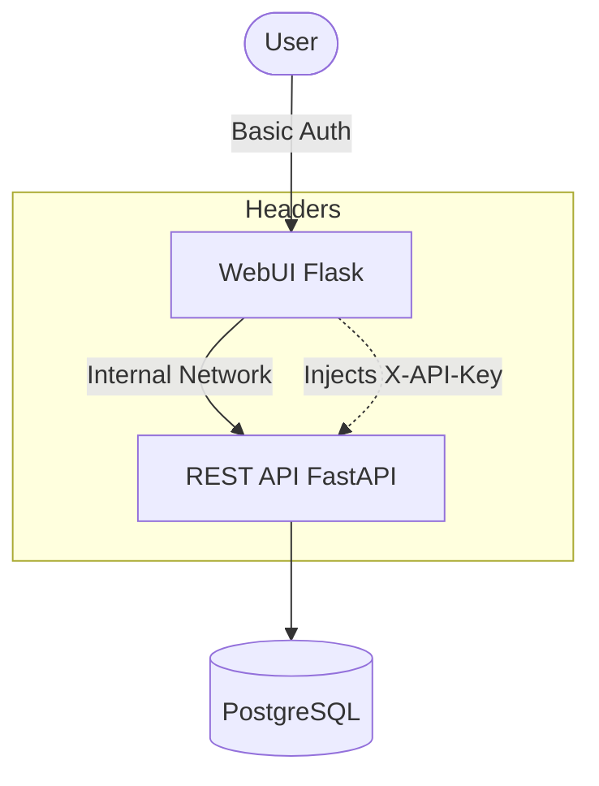

<details>
<summary>Relevant source files</summary>

The following files were used as context for generating this wiki page:

- [api/api.py](api/api.py)
- [scraper/scraper.py](scraper/scraper.py)
- [webui/app.py](webui/app.py)
- [README.md](README.md)
- [CLAUDE.md](CLAUDE.md)
</details>

# API Key Authentication

## Introduction
The Web Scraper Platform utilizes a token-based authentication system to secure its REST API endpoints. This system ensures that programmatic data access—such as retrieving product lists, searching for specific items, or accessing price drop alerts—is restricted to authorized clients. The authentication mechanism relies on a unique API key transmitted via HTTP headers, which acts as a pre-shared secret between the client and the API server.

Sources: [README.md:16-17](README.md#L16-L17), [api/api.py:91-96](api/api.py#L91-L96)

This security layer is critical because while the WebUI may use basic authentication for user access, the internal and external service integrations (such as the `product-describer`) require a consistent, machine-readable method to verify identity without session state.

Sources: [webui/app.py:86-98](webui/app.py#L86-L98), [CLAUDE.md:3-4](CLAUDE.md#L3-L4)

## Authentication Architecture
The system architecture for authentication is distributed across three main components: the Scraper Engine (responsible for key generation), the REST API (responsible for enforcement), and the WebUI (responsible for proxying requests).

### Key Generation and Storage
The API key is automatically generated during the first startup of the scraper container. It is stored as a plaintext file within the persistent credentials directory.

*  **Generation Logic**: If the `api_key` file does not exist, the system uses `secrets.token_urlsafe(32)` to create a high-entropy string.
*  **Storage Location**: The key is written to `/credentials/api_key` (or the path defined by `CREDENTIALS_DIR`).
*  **Retrieval**: On first generation, the key is logged to stdout (visible via `docker compose logs scraper`). After startup, administrators can retrieve it directly from the `/credentials/api_key` file.

Sources: [scraper/scraper.py:186-199](scraper/scraper.py#L186-L199), [README.md:65-72](README.md#L65-L72)

### Enforcement Mechanism
The REST API (FastAPI) implements authentication through a middle-ware layer. Every request—excluding health checks and documentation endpoints—is intercepted to verify the presence and validity of the `X-API-Key` header.



The diagram above illustrates the validation flow for incoming API requests.
Sources: [api/api.py:91-96](api/api.py#L91-L96), [README.md:83-84](README.md#L83-L84)

## Authentication Components

### Header Requirements
All authenticated requests must include the `X-API-Key` header. Failure to provide this header, or providing a value that does not match the stored secret, results in an `HTTP 401 Unauthorized` response.

| Header Name | Requirement | Description |
| :--- | :--- | :--- |
| `X-API-Key` | Required | The auto-generated 32-character urlsafe token. |

Sources: [README.md:83](README.md#L83), [api/api.py:95](api/api.py#L95)

### Excluded Endpoints
Certain endpoints are explicitly excluded from the API key requirement to allow for system monitoring and developer discovery.

| Endpoint | Purpose |
| :--- | :--- |
| `/health` | Connectivity and database status check. |
| `/docs` | Swagger UI documentation. |
| `/redoc` | Redoc documentation. |
| `/openapi.json` | Raw OpenAPI schema. |

Sources: [api/api.py:92](api/api.py#L92), [README.md:83](README.md#L83)

### Credential Resolution Logic
The system uses a hierarchical approach to find the API key, allowing for flexibility between environment variables and file-based secrets (Docker Secrets).

```python
# Path: webui/app.py or api/api.py
def get_api_key():
    global API_KEY
    if API_KEY is None:
        # 1. Try environment variable (or _FILE variant)
        # 2. Try file in credentials directory
        API_KEY = read_secret("API_KEY") or _read_credential("api_key")
    return API_KEY
```

Sources: [webui/app.py:68-73](webui/app.py#L68-L73), [api/api.py:78-83](api/api.py#L78-L83)

## Secure Internal Proxying
The WebUI (Flask) acts as a management plane. When a user interacts with the dashboard to view products or stats, the WebUI proxies these requests to the internal API server. To do this, the WebUI retrieves the same `api_key` from the shared credentials volume and injects it into the headers of its outgoing requests.



The diagram shows how the WebUI bridges user sessions to the API-key-protected backend.
Sources: [webui/app.py:101-107](webui/app.py#L101-L107), [README.md:46-48](README.md#L46-L48)

## Conclusion
API Key Authentication serves as the primary security boundary for the Web Scraper Platform's data layer. By automating the generation and secure storage of the `api_key` within a dedicated credentials volume, the platform balances ease of deployment with production-grade security. This mechanism ensures that sensitive scraping data and system statistics remain accessible only to the authorized WebUI and verified third-party integrations.

Sources: [README.md:65-72](README.md#L65-L72), [scraper/scraper.py:165-177](scraper/scraper.py#L165-L177)
