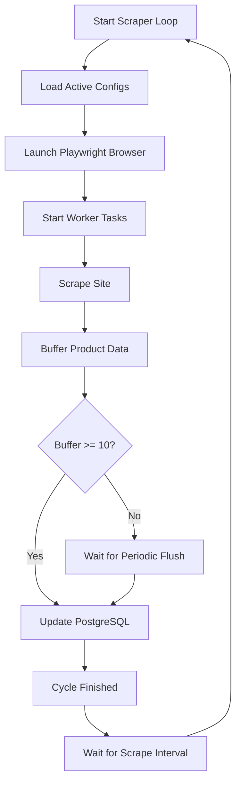
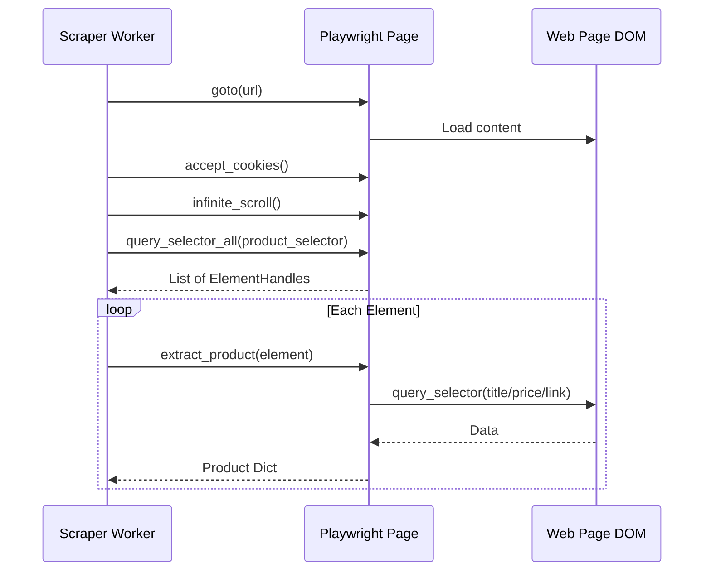

Relevant source files

The following files were used as context for generating this wiki page:

- [scraper/scraper.py](scraper/scraper.py)
- [scraper/enrich.py](scraper/enrich.py)
- [webui/app.py](webui/app.py)
- [fetcher/fetcher.py](fetcher/fetcher.py)
- [README.md](README.md)
- [CLAUDE.md](CLAUDE.md)

# Background Scraper Worker

The Background Scraper Worker is the core execution engine of the platform, responsible for automated data collection from e-commerce websites. It operates as a multi-threaded, asynchronous process that navigates target URLs, extracts product information using CSS selectors, and manages persistent storage in a PostgreSQL database.

The worker is designed for production environments, featuring built-in support for proxy rotation, stealth mode to bypass bot protection (e.g., Akamai, Cloudflare), and exponential backoff for failed requests. It works in conjunction with the [REST API](#api-examples) and [WebUI](#services-docker) to provide a complete scraping lifecycle from configuration to data consumption.

Sources: [scraper/scraper.py:1-40](scraper/scraper.py#L1-L40), [README.md:10-25](README.md#L10-L25), [CLAUDE.md:5-15](CLAUDE.md#L5-L15)

## System Architecture

The scraper worker utilizes `playwright` for headless browser automation and `asyncio` for managing concurrent scraping tasks. It follows a modular architecture where configurations are loaded from the database, and scraped data is buffered before being flushed to the database to optimize I/O performance.

### Logic Flow Diagram
The following diagram illustrates the lifecycle of a scraping run, from initialization to data persistence.

Sources: [scraper/scraper.py:480-530](scraper/scraper.py#L480-L530), [scraper/scraper.py:534-550](scraper/scraper.py#L534-L550)

## Core Components

### 1. Scraper Engine (`scraper/scraper.py`)
This is the primary worker script. it handles the main execution loop (`scraper_loop`), manages the database connection pool, and coordinates browser contexts.

*  **`run_scraper()`**: The orchestrator that launches the browser, creates semaphores for concurrency control, and maps worker tasks to site configurations.
*  **`scrape_site()`**: Executes the specific scraping logic for a site, supporting both standard query-based pagination and advanced subcategory auto-discovery.
*  **`flush_buffer()`**: A critical performance function that batch-inserts `write_buffer` contents into the `products` and `price_history` tables.

Sources: [scraper/scraper.py:480-515](scraper/scraper.py#L480-L515), [scraper/scraper.py:320-350](scraper/scraper.py#L320-L350), [scraper/scraper.py:433-470](scraper/scraper.py#L433-L470)

### 2. Enrichment Worker (`scraper/enrich.py`)
A specialized worker designed to perform "one-shot" or resumable deep-scrapes of individual product pages. While the main scraper focuses on listing pages (titles and prices), the enrichment worker visits specific product URLs to extract detailed descriptions and ground truth data.

*  **Heuristics**: It uses JSON-LD `Product.description`, `og:description`, and standard meta tags to extract descriptions without needing per-site CSS selectors.
*  **Concurrency**: Uses an `asyncio.Semaphore` to manage parallel page loads, defaulting to 3 concurrent renders.

Sources: [scraper/enrich.py:10-40](scraper/enrich.py#L10-L40), [scraper/enrich.py:130-150](scraper/enrich.py#L130-L150)

### 3. Stateless Fetcher (`fetcher/fetcher.py`)
A distributed "muscle" component designed for unified architectures where the scraping logic is separated from data storage. It leases jobs from a central engine, renders pages with Playwright, and reports results back via a REST API.

Sources: [fetcher/fetcher.py:1-25](fetcher/fetcher.py#L1-L25)

## Data Extraction Logic

The worker employs sophisticated heuristics and CSS selector logic to identify product data within complex DOM structures.

### Extraction Sequence Diagram
This diagram shows how the worker interacts with a web page to extract a single product.

Sources: [scraper/scraper.py:270-310](scraper/scraper.py#L270-L310), [scraper/scraper.py:320-400](scraper/scraper.py#L320-L400)

### Supported Selectors
| Component | Description | Logic |
|-----------|-------------|-------|
| **Product Container** | The wrapping element for a product card. | Defined by `product_selector` in `scraper_config`. |
| **Title** | The name of the product. | Defined by `title_selector`; falls back to container text. |
| **Price** | The current price in SEK. | Extracted via `price_selector` and cleaned using `extract_price()` regex. |
| **Link** | The URL to the product detail page. | Defined by `link_selector` or derived from `<a>` tags. |

Sources: [scraper/scraper.py:270-305](scraper/scraper.py#L270-L305), [scraper/scraper.py:230-245](scraper/scraper.py#L230-L245)

## Configuration and Settings

Worker behavior is controlled via the `settings` table in PostgreSQL, which can be modified through the WebUI.

| Setting | Type | Default | Description |
|---------|------|---------|-------------|
| `concurrent_pages` | int | 2 | Number of parallel browser pages. |
| `scrape_interval` | int | 3600s | Delay between full scraping cycles. |
| `headless` | bool | True | Whether to run the browser in headless mode. |
| `proxy_url` | str | '' | Global SOCKS5/HTTP proxy for all requests. |
| `min_drop_percent` | float | 5.0% | Threshold for price drop alerts. |

Sources: [scraper/scraper.py:45-85](scraper/scraper.py#L45-L85), [README.md:95-105](README.md#L95-L105)

## Security and Stealth

The worker implements several features to avoid detection and maintain operational security:
*  **Stealth Mode**: Uses `playwright_stealth` to mask automation fingerprints, particularly for bypassing Akamai and Cloudflare.
*  **Proxy Support**: Supports both global and per-site proxy configurations (SOCKS5/HTTP).
*  **SSRF Protection**: Includes a `_validate_scrape_url` function that blocks requests to private/internal IP ranges (e.g., `127.0.0.1`, `192.168.x.x`).
*  **Credentials Management**: Secrets are managed via an `entrypoint.sh` script that enforces restrictive file permissions on the `/credentials` directory at startup.

Sources: [scraper/scraper.py:115-145](scraper/scraper.py#L115-L145), [scraper/scraper.py:510-525](scraper/scraper.py#L510-L525), [CLAUDE.md:30-40](CLAUDE.md#L30-L40)

## Conclusion
The Background Scraper Worker provides a robust, scalable foundation for the platform's data acquisition. By combining Playwright's browser automation with a buffered database persistence model and configurable stealth features, it ensures reliable data collection across a wide variety of e-commerce targets while minimizing resource overhead.
