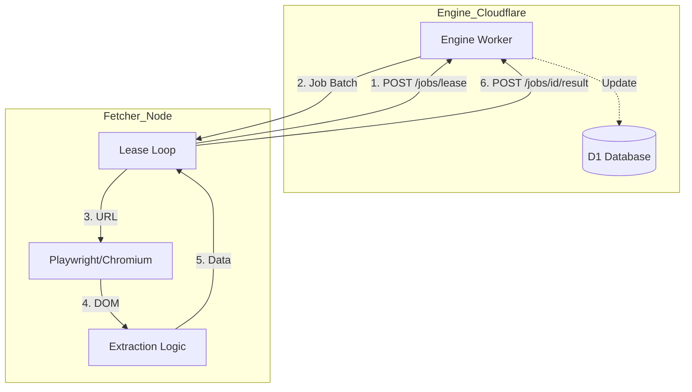
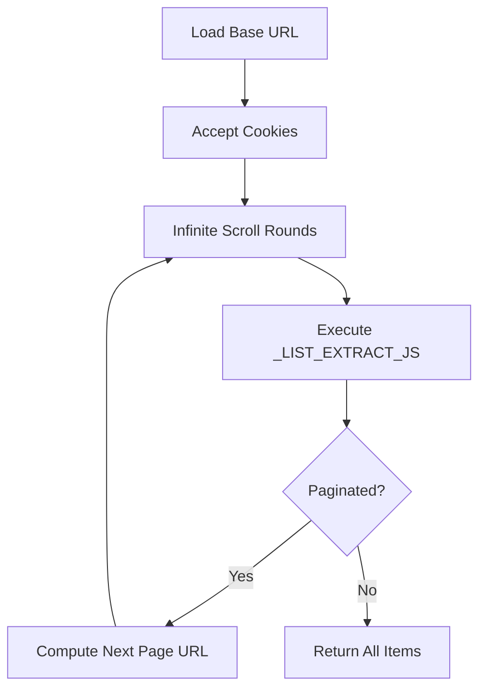

<details>
<summary>Relevant source files</summary>

The following files were used as context for generating this wiki page:

- [fetcher/fetcher.py](fetcher/fetcher.py)
- [scraper/scraper.py](scraper/scraper.py)
- [scraper/enrich.py](scraper/enrich.py)
- [README.md](README.md)
- [CLAUDE.md](CLAUDE.md)
</details>

# URL Fetcher Module

The URL Fetcher Module represents the stateless "muscle" of the scraping architecture, designed to perform high-performance web rendering and data extraction. Within the unified architecture, this module offloads rendering tasks from the core database and management logic, functioning as a distributed worker that executes jobs leased from a central engine.

Its primary purpose is to visit product and listing pages, handle client-side rendering (SPA), and extract structured data such as titles, prices, and source text. By remaining stateless and communicating via a REST API, the fetcher can be deployed across various environments without requiring direct database access.

Sources: [fetcher/fetcher.py:1-20](fetcher/fetcher.py#L1-L20), [CLAUDE.md:1-15](CLAUDE.md#L1-L15)

## System Architecture

The fetcher operates in a loop, leasing batches of jobs from a central "Engine" and reporting results back via authenticated POST requests. It utilizes Playwright with Chromium to handle complex web pages that require JavaScript execution or have bot protection.

### Component Relationship
The following diagram illustrates the interaction between the Fetcher and the central Engine.



The fetcher performs utgoing HTTPS requests only, ensuring it holds no persistent data locally.
Sources: [fetcher/fetcher.py:12-32](fetcher/fetcher.py#L12-L32), [fetcher/fetcher.py:321-345](fetcher/fetcher.py#L321-L345)

## Core Extraction Logic

The fetcher handles two distinct types of jobs: `detail` (product pages) and `list` (category or search pages).

### Product Detail Extraction (`detail`)
For product pages, the module employs a heuristic hierarchy to find the most accurate description and product metadata. It prioritizes JSON-LD structured data before falling back to Open Graph (og) tags or standard meta descriptions.

| Priority | Strategy | Description |
| :--- | :--- | :--- |
| 1 | `detail_selector` | User-defined CSS selector for specific content. |
| 2 | `JSON-LD` | Extraction from `application/ld+json` (Product type). |
| 3 | `Open Graph` | Metadata from `og:description` property. |
| 4 | `Meta Tag` | Standard HTML `description` meta tag. |

Sources: [fetcher/fetcher.py:101-161](fetcher/fetcher.py#L101-L161), [scraper/enrich.py:65-98](scraper/enrich.py#L65-L98)

### Listing Page Crawl (`list`)
The listing extraction mirrors the core scraper logic but executes within the headless browser. It supports "Infinite Scroll" by triggering window scroll events to load lazy-loaded content.



Sources: [fetcher/fetcher.py:164-211](fetcher/fetcher.py#L164-L211), [scraper/scraper.py:469-520](scraper/scraper.py#L469-L520)

## Configuration and Environment

The module is configured primarily through environment variables, allowing for flexible deployment.

| Variable | Default | Purpose |
| :--- | :--- | :--- |
| `ENGINE_URL` | N/A | URL of the central worker (e.g., Cloudflare Worker). |
| `INGEST_API_KEY` | N/A | Authentication key passed in `X-API-Key` header. |
| `FETCHER_CONCURRENCY` | 3 | Number of simultaneous browser contexts/pages. |
| `LEASE_BATCH` | 10 | Number of jobs to lease in a single request. |
| `RENDER_WAIT_MS` | 12000 | Max time to wait for client-side content (SPAs). |
| `HEADLESS` | 1 | Set to "0" to see the browser window during debug. |

Sources: [fetcher/fetcher.py:32-41](fetcher/fetcher.py#L32-L41), [README.md:95-105](README.md#L95-L105)

## Browser Management and Stealth

To avoid detection by bot protection services like Akamai or Cloudflare, the module incorporates several techniques:
*  **Stealth Mode**: Uses `playwright-stealth` to mask browser automation signals.
*  **Behavioral Simulation**: Random delays between actions (1-3s) and specific browser arguments (`--disable-blink-features=AutomationControlled`).
*  **Cookie Handling**: An `accept_cookies` function identifies and clicks common consent buttons to reveal content.

```python
# fetcher/fetcher.py:255-267
async def accept_cookies(page):
    for sel in (
        "#CybotCookiebotDialogBodyLevelButtonLevelOptinAllowAll",
        "button#onetrust-accept-btn-handler",
        "button:has-text('Acceptera alla')",
        "button:has-text('Godkänn alla')",
    ):
        try:
            el = await page.query_selector(sel)
            if el:
                await el.click(timeout=2000)
                break
        except PlaywrightError:
            continue
```

Sources: [fetcher/fetcher.py:255-267](fetcher/fetcher.py#L255-L267), [scraper/scraper.py:440-455](scraper/scraper.py#L440-L455), [scraper/scraper.py:620-630](scraper/scraper.py#L620-L630)

## Data Models

### Job Lease Request
When requesting jobs, the fetcher sends the number of available slots.
Sources: [fetcher/fetcher.py:246-249](fetcher/fetcher.py#L246-L249)

### Product Result Object
The result sent back to the engine contains extracted metadata.
*  **title**: String (truncated to 200 chars in some contexts).
*  **price**: Integer (rounded to nearest whole currency unit).
*  **source_text**: String (truncated to 1200 chars).
*  **category**: String (derived from breadcrumbs or URL).
Sources: [fetcher/fetcher.py:120-161](fetcher/fetcher.py#L120-L161), [scraper/enrich.py:101-105](scraper/enrich.py#L101-L105)

The URL Fetcher Module provides a scalable, stateless solution for data extraction, ensuring the main application remains responsive while complex rendering tasks are distributed across worker nodes.
