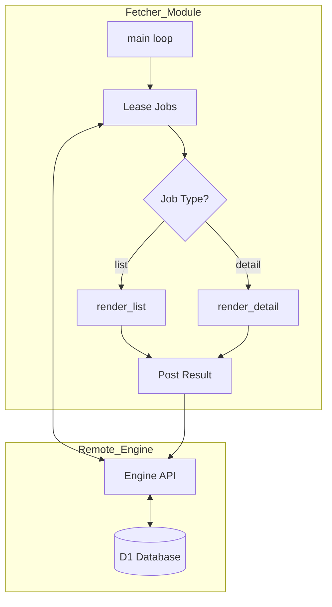
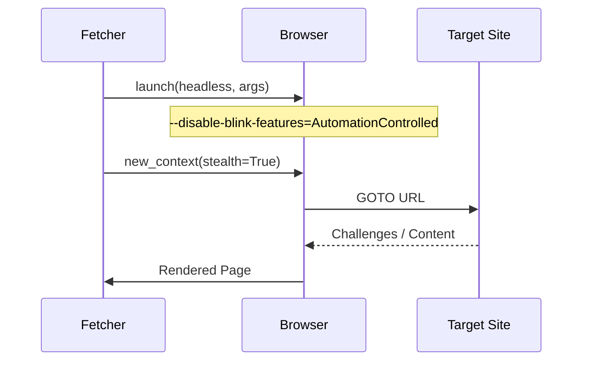

<details>
<summary>Relevant source files</summary>

The following files were used as context for generating this wiki page:

- [fetcher/fetcher.py](fetcher/fetcher.py)
- [scraper/scraper.py](scraper/scraper.py)
- [scraper/enrich.py](scraper/enrich.py)
- [README.md](README.md)
- [CLAUDE.md](CLAUDE.md)
- [AGENTS.md](AGENTS.md)
</details>

# URL Fetcher Module

## Introduction
The **URL Fetcher Module** serves as the "stateless muscle" of the scraping architecture. Its primary purpose is to execute high-fidelity web rendering and data extraction using Playwright without maintaining local state or database connections. It operates by leasing rendering jobs from a central engine, processing them, and reporting results back, making it highly portable and resilient to server failures.

Within the project, the fetcher handles two distinct job types: `list` jobs for crawling category pages to discover products, and `detail` jobs for deep extraction of product descriptions and metadata from individual product pages. This separation allows for efficient scaling of the scraping workload across multiple environments using an `ENGINE_URL` and `INGEST_API_KEY`.
Sources: [fetcher/fetcher.py:1-26](fetcher/fetcher.py#L1-L26), [CLAUDE.md:6-10](CLAUDE.md#L6-L10)

## Architecture and Data Flow

The module follows a lease-based job processing pattern. It communicates with a remote Cloudflare Worker engine via a REST API to retrieve work batches.



*The diagram above illustrates the stateless interaction between the URL Fetcher and the remote Engine.*

### Job Execution Logic
1.  **Leasing:** The fetcher requests a batch of $N$ jobs (default 10) from the engine.
2.  **Rendering:** Using Playwright, the fetcher navigates to target URLs, handles cookie consent dialogs, and performs infinite scrolling to ensure all content is loaded.
3.  **Extraction:** Custom JavaScript is injected into the browser context to extract structured data (JSON-LD) or DOM elements based on CSS selectors.
4.  **Reporting:** Results are serialized and posted back to the engine.

Sources: [fetcher/fetcher.py:316-348](fetcher/fetcher.py#L316-L348), [fetcher/fetcher.py:183-200](fetcher/fetcher.py#L183-L200)

## Technical Components

### Configuration and Environment Variables
The fetcher is configured via environment variables to allow deployment in containerized environments like Docker.

| Variable | Type | Default | Description |
| :--- | :--- | :--- | :--- |
| `ENGINE_URL` | String | | The endpoint of the central management worker. |
| `INGEST_API_KEY` | String | | Authentication key for the Engine API. |
| `FETCHER_CONCURRENCY`| Integer| 3 | Number of simultaneous browser instances. |
| `LEASE_BATCH` | Integer| 10 | Number of jobs to lease per request. |
| `RENDER_WAIT_MS` | Integer| 12000 | Max time to wait for client-side content to render. |
| `HEADLESS` | Boolean | True | Whether to run the browser in headless mode. |

Sources: [fetcher/fetcher.py:28-40](fetcher/fetcher.py#L28-L40), [README.md:105-115](README.md#L105-L115)

### Data Extraction Heuristics
The fetcher employs a prioritized extraction strategy to retrieve product information, specifically for the `source_text` field used in product descriptions.

1.  **JSON-LD:** Attempts to parse `application/ld+json` for `Product` nodes.
2.  **Detail Selector:** Uses site-specific CSS selectors if provided in the job configuration.
3.  **Open Graph:** Extracts `og:description` meta tags.
4.  **Standard Meta:** Extracts the standard `description` meta tag as a final fallback.

```python
# From fetcher/fetcher.py:108-115
if !out.source_text && product && product.description) out.source_text = clean(product.description);
if (!out.source_text) {
  const og = document.querySelector('meta[property="og:description"]');
  if (og && og.content) out.source_text = clean(og.content);
}
```

Sources: [fetcher/fetcher.py:91-135](fetcher/fetcher.py#L91-L135), [scraper/enrich.py:68-100](scraper/enrich.py#L68-L100)

## Scraper Integration and Security

### SSRF Protection
To prevent Server-Side Request Forgery (SSRF), the module utilizes a validation utility that checks target URLs against private network ranges (e.g., `10.0.0.0/8`, `127.0.0.0/8`). This ensures the fetcher cannot be used to probe internal infrastructure.
Sources: [scraper/scraper.py:104-129](scraper/scraper.py#L104-L129)

### Stealth and Anti-Bot Measures
The fetcher incorporates `playwright-stealth` and custom browser arguments to bypass bot protection services like Akamai, Cloudflare, and PerimeterX.



Sources: [fetcher/fetcher.py:341-350](fetcher/fetcher.py#L341-L350), [scraper/scraper.py:84-95](scraper/scraper.py#L84-L95), [scraper/scraper.py:772-785](scraper/scraper.py#L772-L785)

## Database Interaction (Central Engine Only)
While the fetcher is stateless, the central engine it reports to maintains the following schema derived from the project's core storage logic.

| Table | Key Fields | Purpose |
| :--- | :--- | :--- |
| `products` | `url`, `current_price`, `source_text` | Stores extracted product data. |
| `price_history` | `product_id`, `price`, `timestamp` | Tracks price changes over time. |
| `scraper_config` | `product_selector`, `title_selector` | Stores selectors for different sites. |

Sources: [README.md:158-200](README.md#L158-L200), [scraper/scraper.py:207-280](scraper/scraper.py#L207-L280)

## Summary
The URL Fetcher Module is a robust, horizontal-scaling component designed for distributed web scraping. By leveraging Playwright for full-page rendering and a centralized job management system, it effectively handles complex e-commerce sites while maintaining a minimal security and resource footprint on the local host. Its logic is synchronized with `scraper.py` and `enrich.py` to ensure consistency across the scraping platform.
Sources: [fetcher/fetcher.py:1-20](fetcher/fetcher.py#L1-L20), [AGENTS.md:5-15](AGENTS.md#L5-L15)
