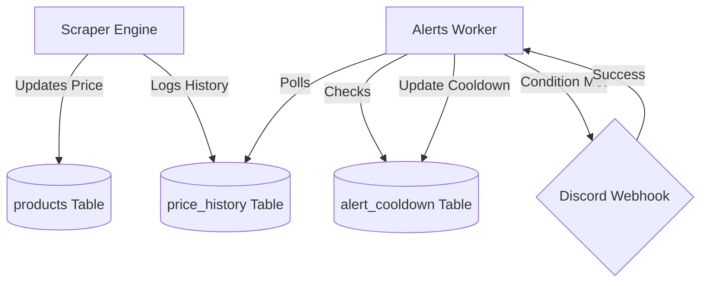
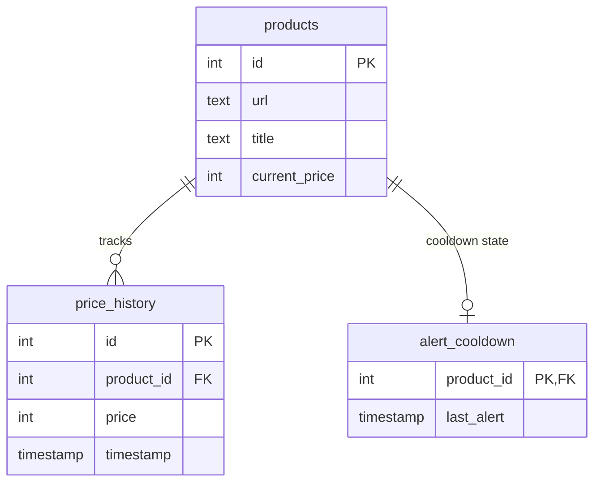

Relevant source files

The following files were used as context for generating this wiki page:

- [scraper/scraper.py](scraper/scraper.py)
- [README.md](README.md)
- [CLAUDE.md](CLAUDE.md)
- [AGENTS.md](AGENTS.md)
- [CHANGELOG.md](CHANGELOG.md)
- [scraper/enrich.py](scraper/enrich.py)

# Background Alerts Worker

The Background Alerts Worker is a critical component of the Web Scraper Platform designed to monitor scraped product data for significant price drops and dispatch notifications. It operates as a background process within the scraper service, periodically evaluating the `price_history` and `products` tables to identify deals that meet user-defined thresholds.

The worker is integrated into the core scraper logic and utilizes PostgreSQL for persistence and state management. It specifically addresses the need for proactive price monitoring, ensuring that users are alerted to discount opportunities via external integrations like Discord webhooks.

Sources: [README.md:16](README.md#L16), [scraper/scraper.py:84-93](scraper/scraper.py#L84-L93), [CLAUDE.md:23-28](CLAUDE.md#L23-L28)

## System Architecture

The alerts worker functions within a multi-process environment managed by Supervisor. It relies on the shared PostgreSQL database to determine when to trigger alerts and to record cooldown periods to prevent notification fatigue.

### Data Flow for Alerting
The following diagram illustrates how price data moves from the scraper through the database to trigger an alert.

The Alerts Worker periodically queries the database to compare current prices against historical data points.
Sources: [scraper/scraper.py:270-307](scraper/scraper.py#L270-L307), [README.md:143-150](README.md#L143-L150)

## Configuration and Thresholds

The behavior of the Alerts Worker is governed by global settings stored in the `settings` table. These settings allow for fine-tuning the frequency of checks and the sensitivity of the alert triggers.

| Setting | Type | Default | Description |
|---------|------|---------|-------------|
| `check_interval` | int | 1800s | Seconds between price-drop checks. |
| `min_drop_percent` | float | 5.0% | Minimum percentage drop required to trigger an alert. |
| `min_drop_amount` | int | 100 kr | Minimum absolute price drop in currency units. |
| `cooldown_hours` | int | 24h | Delay before the same product can trigger another alert. |

Sources: [scraper/scraper.py:84-97](scraper/scraper.py#L84-L97)

## Database Integration

The worker interacts with several key tables to manage alert state and logic.

### Alert Logic Schema
The `alert_cooldown` table is essential for maintaining state, ensuring that users do not receive repetitive notifications for the same price drop.

Sources: [README.md:143-162](README.md#L143-L162), [scraper/scraper.py:270-290](scraper/scraper.py#L270-L290)

### Logic Flow
The worker evaluates potential alerts using the following logic sequence:
1. **Fetch Candidate Deals:** Queries `products` where the `current_price` is significantly lower than the previous record in `price_history`.
2. **Apply Thresholds:** Validates if the drop exceeds both `min_drop_percent` and `min_drop_amount`.
3. **Verify Cooldown:** Checks if the `product_id` exists in `alert_cooldown` with a `last_alert` timestamp older than the configured `cooldown_hours`.
4. **Dispatch:** Sends a notification to the Discord webhook URL stored in the credentials directory.

Sources: [scraper/scraper.py:88-97](scraper/scraper.py#L88-L97), [README.md:44-50](README.md#L44-L50), [CHANGELOG.md:129-131](CHANGELOG.md#L129-L131)

## Error Handling and Resilience

The Background Alerts Worker is designed to handle transient failures, such as missing database tables or network issues when calling webhooks.

*  **Graceful Startup:** The worker is capable of handling scenarios where the `settings` table has not yet been initialized by the main scraper process.
*  **Exception Reporting:** Unexpected errors during alert evaluation are reported to a centralized GitHub issue tracker if a `GITHUB_ERROR_REPORT_TOKEN` is provided.
*  **Process Management:** supervisor ensures the worker is restarted if it crashes, while `entrypoint.sh` manages secure permissions for the credentials used by the worker.

Sources: [scraper/scraper.py:34-45](scraper/scraper.py#L34-L45), [CLAUDE.md:33-40](CLAUDE.md#L33-L40), [CHANGELOG.md:129-131](CHANGELOG.md#L129-L131)

## Conclusion
The Background Alerts Worker serves as the proactive monitoring layer of the platform. By utilizing historical price data and configurable thresholds, it transforms a passive scraping tool into an active deal-finding engine, providing immediate value through automated Discord notifications while maintaining system stability through robust database-backed cooldown mechanisms.
