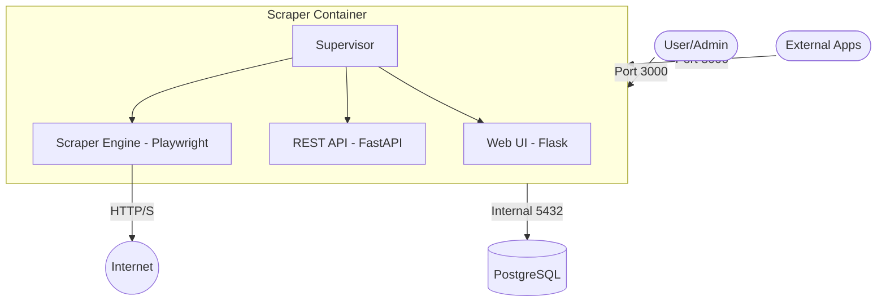

<details>
<summary>Relevant source files</summary>

The following files were used as context for generating this wiki page:

- [README.md](README.md)
- [CONTRIBUTING.md](CONTRIBUTING.md)
- [CLAUDE.md](CLAUDE.md)
- [AGENTS.md](AGENTS.md)
- [scraper/scraper.py](scraper/scraper.py)
- [CHANGELOG.md](CHANGELOG.md)
</details>

# Docker Compose Deployment

The Docker Compose deployment for the Web Scraper Platform provides a production-ready, containerized environment that orchestrates the scraping engine, web interface, REST API, and PostgreSQL database. This architecture is designed to be "one-click" deployable, managing service dependencies, volume persistence, and automatic credential generation through a single command.

The deployment consolidates the application logic—including the Scraper, Web UI, and REST API—into a single core image managed by Supervisor, while maintaining a separate container for the database to ensure data persistence and security.
Sources: [README.md:10](README.md#L10), [README.md:38](README.md#L38), [CLAUDE.md:37-41](CLAUDE.md#L37-L41), [CHANGELOG.md:143](CHANGELOG.md#L143)

## Core Services

The architecture consists of two primary containers that work in tandem to provide the full platform functionality.

| Container | Port(s) | Role | Description |
|-----------|---------|------|-------------|
| `postgres` | 5432 | Database | Production-grade PostgreSQL storage for product data, price history, and configurations. |
| `scraper` | 3000, 8000 | Application | Unified service running the Web UI (Port 3000), REST API (Port 8000), and Scraper Engine. |

Sources: [README.md:46-51](README.md#L46-L51), [CHANGELOG.md:143](CHANGELOG.md#L143)

### Service Interaction Flow

The following diagram illustrates the relationship between the deployed containers and the external environment.



The Scraper container uses `supervisord` to manage the lifecycle of the Web UI, API, and scraping processes simultaneously.
Sources: [CLAUDE.md:4-10](CLAUDE.md#L4-L10), [CLAUDE.md:37-41](CLAUDE.md#L37-L41), [AGENTS.md:37-41](AGENTS.md#L37-L41)

## Deployment Configuration

The deployment relies on a `.env` file for core environment variables, while advanced application settings are stored directly in the database.

### Required Environment Variables
A minimal `.env` configuration requires three specific variables to define data locations and localization.

| Variable | Description |
|----------|-------------|
| `DOCKER` | The absolute path on the host machine where persistent volumes (database, logs, credentials) are stored. |
| `DOMAIN` | The hostname for the deployment (optional, used for custom setups). |
| `TZ` | The timezone for the containers (e.g., `Europe/Stockholm`). |

Sources: [README.md:21-25](README.md#L21-L25), [README.md:86-90](README.md#L86-L90)

### Persistent Volumes
Data is persisted in the host directory defined by the `${DOCKER}` variable across several subdirectories:
*  `${DOCKER}/scraper/postgres`: Database files.
*  `${DOCKER}/scraper/logs`: Application and scraping logs.
*  `${DOCKER}/scraper/playwright-cache`: Headless browser cache for improved performance.
*  `${DOCKER}/scraper/credentials`: Auto-generated secrets including API keys and DB passwords.

Sources: [README.md:28-31](README.md#L28-L31)

## Credential Management and Security

The platform implements an automatic security bootstrapping process on the first startup.

1.  **Auto-Generation**: On initial deployment, the `scraper` and `postgres` containers generate `api_key` and `db_password` files if they do not exist.
2.  **Storage**: These secrets are stored in the `${DOCKER}/scraper/credentials/` directory.
3.  **Permissions**: The `entrypoint.sh` script sets restrictive permissions on the credentials directory at every container startup to prevent unauthorized access.
4.  **Retrieval**: Administrators can retrieve the generated API key by reading the file in the persistent volume or by checking container logs.

```bash
# Example retrieval of the generated API key
cat /path/to/docker/data/scraper/credentials/api_key
```

Sources: [README.md:55-71](README.md#L55-L71), [CLAUDE.md:44-45](CLAUDE.md#L44-L45), [scraper/scraper.py:155-167](scraper/scraper.py#L155-L167)

## Deployment Lifecycle

To initiate the deployment, the environment must be prepared with necessary directories and configuration files.

### Standard Startup Procedure

```bash
# 1. Prepare environment
cp .env.example .env
mkdir -p ${DOCKER}/scraper/{postgres,logs,playwright-cache,credentials}

# 2. Launch services
docker compose up -d

# 3. Verify status
docker compose ps
docker compose logs -f scraper
```

Sources: [CONTRIBUTING.md:27-37](CONTRIBUTING.md#L27-L37), [README.md:18-38](README.md#L18-L38)

### Database Maintenance
The platform supports automated daily backups using a `pg_dump` sidecar service. This service, when added to the `docker-compose.yml`, performs the following:
*  Connects to the `postgres` service using the auto-generated password.
*  Creates a daily `.dump` file in `${DOCKER}/scraper/backup`.
*  Automatically deletes backups older than 7 days.
Sources: [README.md:95-121](README.md#L95-L121)

## Troubleshooting Deployment

Common deployment issues often relate to file permissions or initialization states.

| Issue | Resolution |
|-------|------------|
| **Postgres won't start** | Ensure the database volume has the correct UID/GID: `sudo chown -R 999:999 ${DOCKER}/scraper/postgres`. |
| **API returns 401** | Verify the `X-API-Key` header matches the key found in `${DOCKER}/scraper/credentials/api_key`. |
| **Services Fail to start** | Check logs via `docker compose logs` for specific Supervisor process failures. |

Sources: [CONTRIBUTING.md:13](CONTRIBUTING.md#L13), [README.md:126-140](README.md#L126-L140)

The Docker Compose deployment provides a robust foundation for the Web Scraper Platform by automating the complex setup of headless browsers, database synchronization, and security bootstrapping into a manageable two-container stack.
