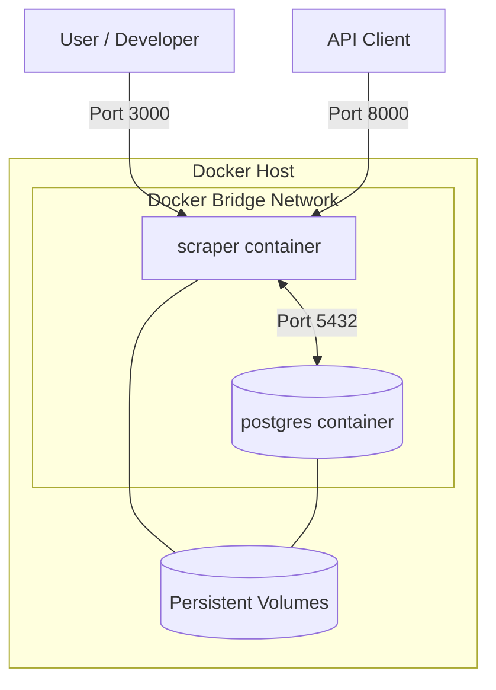
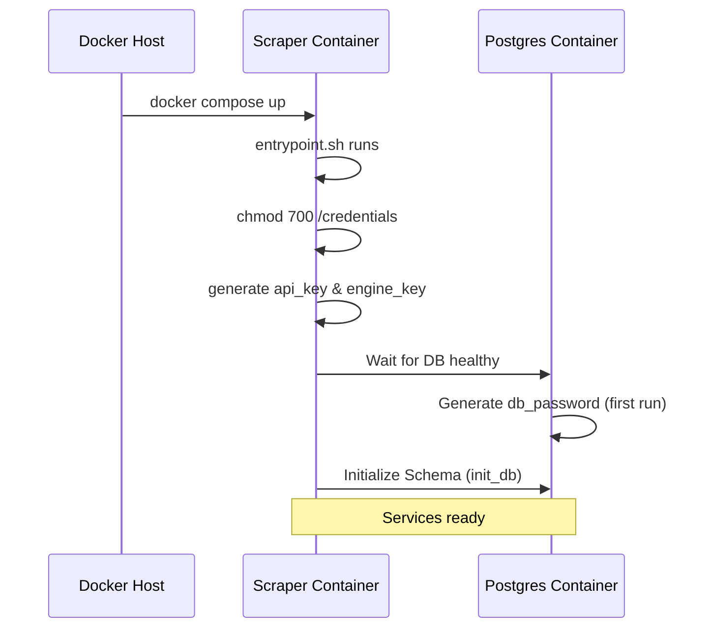

Relevant source files

The following files were used as context for generating this wiki page:

- [README.md](README.md)
- [CONTRIBUTING.md](CONTRIBUTING.md)
- [CLAUDE.md](CLAUDE.md)
- [AGENTS.md](AGENTS.md)
- [scraper/scraper.py](scraper/scraper.py)
- [CHANGELOG.md](CHANGELOG.md)

# Docker Compose Deployment

The Docker Compose deployment provides a production-ready, containerized environment for the Web Scraper Platform. It orchestrates multiple services including a PostgreSQL database for persistent storage, a Scraper engine for data extraction, a REST API for programmatic access, and a WebUI for monitoring and configuration. This deployment model is designed to be "start-and-forget," with automatic credential generation and health monitoring.

Sources: [README.md:9-19](README.md#L9-L19), [CLAUDE.md:8-13](CLAUDE.md#L8-L13)

## System Architecture

The deployment leverages a multi-container architecture where the application logic and database are isolated into separate service containers. The `scraper` container is a consolidated image that runs the Web UI, REST API, and Scraper modules, while the `postgres` container manages the relational data.

The diagram shows the high-level relationship between the user, the application container, the database, and the persistent storage volumes.
Sources: [README.md:46-51](README.md#L46-L51), [CLAUDE.md:23-30](CLAUDE.md#L23-L30), [CHANGELOG.md:129-131](CHANGELOG.md#L129-L131)

### Service Definitions

| Container | Internal Port | External Port | Description |
|-----------|---------------|---------------|-------------|
| `postgres` | 5432 | 5432 | PostgreSQL database; internal connection for the app, optional local access. |
| `scraper` | 3000 | 3000 | Flask-based Web UI for configuration and monitoring. |
| `scraper` | 8000 | 8000 | FastAPI REST API for product data consumption. |

Sources: [README.md:46-51](README.md#L46-L51), [CLAUDE.md:8-13](CLAUDE.md#L8-L13), [CHANGELOG.md:92-94](CHANGELOG.md#L92-L94)

## Configuration and Environment

Deployment is driven by a `.env` file and specific directory structures on the host machine. Minimal configuration requires only three variables, while all advanced scraper settings (intervals, proxies, stealth mode) are managed via the WebUI and stored in the database.

### Required Environment Variables
| Variable | Description |
|----------|-------------|
| `DOCKER` | The absolute path on the host where container volumes/data will be stored. |
| `DOMAIN` | The hostname for the deployment (optional). |
| `TZ` | System timezone (e.g., `Europe/Stockholm`). |

Sources: [README.md:30-34](README.md#L30-L34), [README.md:81-87](README.md#L81-L87)

### Volume Structure
The deployment requires specific directories under the `${DOCKER}/scraper/` path to ensure persistence and security:
*  `postgres/`: Database files (requires ownership by UID 999).
*  `logs/`: Application and scraping logs.
*  `playwright-cache/`: Headless browser cache.
*  `credentials/`: Auto-generated secrets (API keys, DB passwords).

Sources: [README.md:36-38](README.md#L36-L38), [README.md:112-114](README.md#L112-L114), [scraper/scraper.py:114-118](scraper/scraper.py#L114-L118)

## Initialization and Security

The deployment features an automated initialization sequence. On the first startup, the containers generate necessary credentials and set restrictive permissions.

This sequence illustrates the startup flow and secret generation.
Sources: [README.md:58-69](README.md#L58-L69), [CLAUDE.md:32-34](CLAUDE.md#L32-L34), [scraper/scraper.py:133-146](scraper/scraper.py#L133-L146)

### Credential Management
Credentials are never stored in images or source control. They are generated and stored in the `credentials/` volume:
*  **API Key**: Used for `X-API-Key` header authentication on REST endpoints. Logged to stdout on first generation for initial retrieval.
*  **Database Password**: Generated by the postgres container. Logged to stdout on first generation.
*  **Engine Key**: Used for internal WebUI-to-Engine authentication. Generated silently (not logged).
*  **WebUI Password**: Used for Basic Auth on the WebUI. Generated silently if not already present.
*  **Discord Webhook**: A manually created file in the credentials directory for alerts.

Sources: [README.md:58-69](README.md#L58-L69), [scraper/scraper.py:126-146](scraper/scraper.py#L126-L146), [scraper/scraper.py:612-663](scraper/scraper.py#L612-L663)

## Maintenance and Operations

### Deployment Commands
Common operations for managing the stack:
*  `docker compose up -d`: Start the stack in detached mode.
*  `docker compose ps`: Verify service status.
*  `docker compose logs scraper`: View operational logs and scraping activity.
*  `docker compose build`: Test image builds after configuration changes.

Sources: [CONTRIBUTING.md:27-37](CONTRIBUTING.md#L27-L37), [README.md:40-44](README.md#L40-L44)

### Optional Daily Backups
The platform supports an optional `pgdump` service within `docker-compose.yml`. This service performs a daily `pg_dump` of the PostgreSQL database, keeps backups for 7 days, and uses Docker secrets/volumes for secure access to the database password.

Sources: [README.md:97-108](README.md#L97-L108)

The Docker Compose deployment ensures a consistent environment for the Scraper Platform across development and production, centralizing configuration while maintaining security through automated secret handling and volume isolation.
