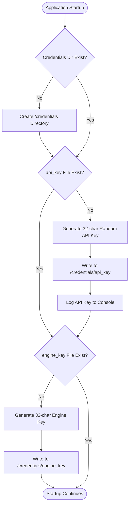
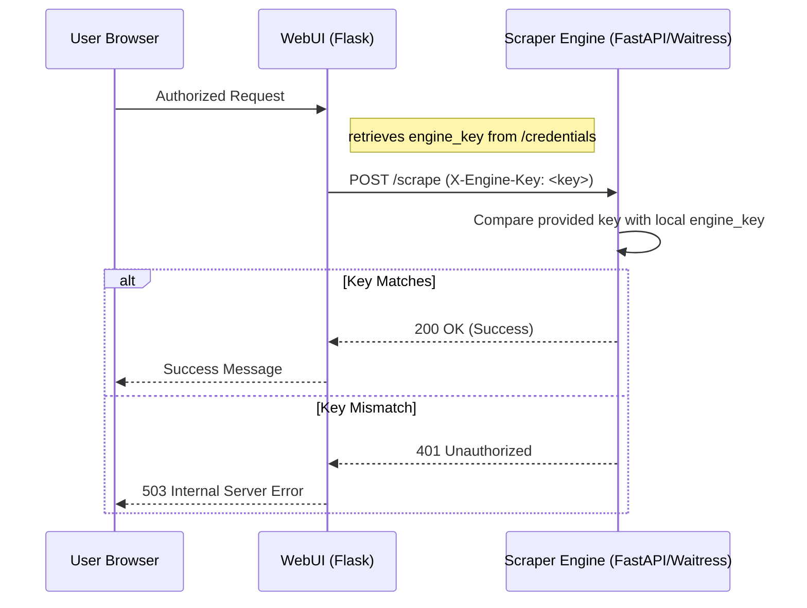

<details>
<summary>Relevant source files</summary>

The following files were used as context for generating this wiki page:

- [SECURITY.md](SECURITY.md)
- [CLAUDE.md](CLAUDE.md)
- [AGENTS.md](AGENTS.md)
- [README.md](README.md)
- [webui/app.py](webui/app.py)
- [scraper/scraper.py](scraper/scraper.py)
- [CHANGELOG.md](CHANGELOG.md)
</details>

# Secure Secrets Management

Secure Secrets Management in this platform ensures that sensitive information such as database credentials, API keys, and webhooks are handled with high security to prevent unauthorized access and data leaks. The system relies on a multi-layered approach involving environment variables, file-based secrets, and automated credential generation.

The scope of this system includes protecting communication between the WebUI, REST API, and Scraper Engine, as well as securing the underlying PostgreSQL database. It emphasizes the principle of never storing credentials within version control or Docker images.

Sources: [SECURITY.md:14-17](SECURITY.md#L14-L17), [CLAUDE.md:37-40](CLAUDE.md#L37-L40), [README.md:103-107](README.md#L103-L107)

## Secret Storage and Retrieval

The system employs a dual-lookup strategy for secrets, checking both standard environment variables and specific secret files. This allows for compatibility with Docker Secrets and traditional environment configurations.

### Secret Resolution Logic
The application uses specific helper functions to resolve secrets at runtime. It prioritizes files located in the `CREDENTIALS_DIR` (defaulting to `/credentials`) or paths specified via environment variables ending in `_FILE`.

```python
def read_secret(env_var, default=""):
    path = os.getenv(f"{env_var}_FILE")
    if path and os.path.exists(path):
        with open(path) as f:
            return f.read().strip()
    return os.getenv(env_var, default)

def _read_credential(name):
    path = os.path.join(os.getenv("CREDENTIALS_DIR", "/credentials"), name)
    if os.path.exists(path):
        with open(path) as f:
            return f.read().strip()
    return ""
```

Sources: [webui/app.py:65-78](webui/app.py#L65-L78), [scraper/scraper.py:160-175](scraper/scraper.py#L160-L175)

### Managed Secret Types
The platform manages several critical secrets automatically or through configuration:

| Secret Name | Purpose | Storage Location |
| :--- | :--- | :--- |
| `db_password` | PostgreSQL authentication | `DOCKER/scraper/credentials/db_password` |
| `api_key` | REST API authentication | `DOCKER/scraper/credentials/api_key` |
| `engine_key` | Internal WebUI-to-Engine auth | `DOCKER/scraper/credentials/engine_key` |
| `discord_webhook` | Price alert notifications | `DOCKER/scraper/credentials/discord_webhook` |

Sources: [README.md:103-118](README.md#L103-L118), [scraper/scraper.py:178-191](scraper/scraper.py#L178-L191)

## Automated Credential Generation

Upon first startup, the system automatically generates secure, random credentials if they do not already exist. This ensures that every deployment has unique security parameters without requiring manual intervention during the initial setup.



This diagram illustrates the automated workflow used to bootstrap security on a fresh installation.
Sources: [scraper/scraper.py:178-191](scraper/scraper.py#L178-L191), [README.md:103-107](README.md#L103-L107), [CHANGELOG.md:111-114](CHANGELOG.md#L111-L114)

## Component Authentication

Authentication is required for communication between all major service components. The system uses specific headers to validate requests.

### REST API Authentication
All endpoints (except `/health`) require the `X-API-Key` header. The system validates this key against the value stored in the `api_key` file or environment variable.
Sources: [README.md:122-123](README.md#L122-L123), [webui/app.py:112-117](webui/app.py#L112-L117)

### Internal Engine Authentication
The WebUI communicates with the Scraper Engine (port 5001) using an internal `X-Engine-Key`. This prevents unauthorized external requests from triggering scraper actions or modifying configurations.



The sequence shows how the internal engine key secures cross-component communication.
Sources: [webui/app.py:90-97](webui/app.py#L90-L97), [scraper/scraper.py:590-600](scraper/scraper.py#L590-L600)

## Database Security

The PostgreSQL database is secured using dynamic user management and encrypted password updates.

### Permission Management
Permissions are strictly enforced at the container level. The `entrypoint.sh` script (and historically an init-container) sets restrictive permissions on the credentials directory at every startup to prevent unauthorized read access.
Sources: [CLAUDE.md:37-38](CLAUDE.md#L37-L38), [CHANGELOG.md:107-110](CHANGELOG.md#L107-L110), [AGENTS.md:27-28](AGENTS.md#L27-L28)

### Credential Updates via WebUI
Users can update the database username and password through the WebUI. These changes are applied immediately to the database using `ALTER USER` commands, and the local credential files are updated to maintain persistence across restarts.

```python
@app.route('/credentials/password', methods=['PUT'])
def change_db_password():
    # ... validation ...
    cur.execute(pgsql.SQL("ALTER USER {} WITH PASSWORD %s").format(
        pgsql.Identifier(get_db_user())), (new_pw,))
    write_credential('db_password', new_pw)
    reinit_db_pool()
```

Sources: [scraper/scraper.py:928-946](scraper/scraper.py#L928-L946), [webui/app.py:228-239](webui/app.py#L228-L239)

## Best Practices and Prohibitions

To maintain the integrity of the Secure Secrets Management system, certain standards are enforced across the codebase and for contributors.

*  **Environment Variables:** Always use environment variables for runtime secrets. Sources: [SECURITY.md:14](SECURITY.md#L14)
*  **Version Control:** Never commit `.env` files or hardcoded credentials to the repository. Sources: [SECURITY.md:15](SECURITY.md#L15), [CLAUDE.md:40](CLAUDE.md#L40)
*  **Agent Restrictions:** AI agents are explicitly forbidden from modifying secrets or changing GitHub organization settings. Sources: [AGENTS.md:41-42](AGENTS.md#L41-L42)
*  **Shell Safety:** All shell scripts must use `set -euo pipefail` to ensure they exit on errors during secret handling. Sources: [CLAUDE.md:41](CLAUDE.md#L41)

## Conclusion
The Secure Secrets Management system provides a robust framework for protecting sensitive data through automated generation, secure storage in local files with restricted permissions, and mandatory header-based authentication between components. By decoupling credentials from the application code and images, it ensures that deployments remain secure and easily manageable.
