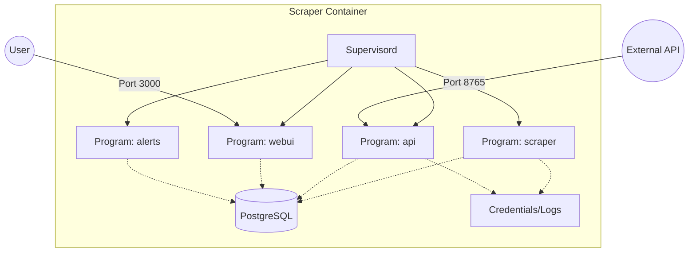

<details>
<summary>Relevant source files</summary>

The following files were used as context for generating this wiki page:

- [supervisord.conf](supervisord.conf)
- [CLAUDE.md](CLAUDE.md)
- [AGENTS.md](AGENTS.md)
- [README.md](README.md)
- [scraper/scraper.py](scraper/scraper.py)
</details>

# Process Management with Supervisord

Process management in the Scraper platform is handled by **Supervisord**, a system that monitors and controls the various long-running microservices within the application container. The architecture consolidates multiple application services—including the scraper engine, REST API, Web UI, and alert logic—into a single container image while maintaining process isolation and automatic recovery.

Sources: [supervisord.conf:1-33](supervisord.conf#L1-L33), [CLAUDE.md:25-31](CLAUDE.md#L25-L31), [README.md:129-131](README.md#L129-L131)

## Architecture and Service Orchestration

The platform utilizes a multi-process architecture within a single Docker container. Supervisord acts as the init system (running with `nodaemon=true`) to ensure that if any sub-process crashes, it is automatically restarted. This setup allows the project to run specialized environments for different tasks: a Flask-based Web UI, a FastAPI-based REST API, and asynchronous Python scripts for scraping and alerting.

Sources: [supervisord.conf:1-6](supervisord.conf#L1-L6), [CLAUDE.md:10-14](CLAUDE.md#L10-L14), [README.md:129-131](README.md#L129-L131)

### Process Interaction Diagram
The following diagram illustrates how Supervisord manages the lifecycle of the four primary application processes and their shared dependencies.



This diagram shows Supervisord as the parent process orchestrating four distinct programs that interact with a shared PostgreSQL database and filesystem.
Sources: [supervisord.conf:8-33](supervisord.conf#L8-L33), [README.md:129-135](README.md#L129-L135)

## Managed Service Definitions

Each service managed by Supervisord is defined with specific execution commands, working directories, and logging configurations. All processes run under the `appuser` security context.

| Program | Command | Directory | Purpose |
| :--- | :--- | :--- | :--- |
| **scraper** | `python /app/scraper/scraper.py` | N/A | Core scraping engine and database synchronization. |
| **api** | `uvicorn api:app --host 0.0.0.0 --port 8765` | `/app/api` | REST API for programmatic data access. |
| **webui** | `gunicorn -w 2 -b 0.0.0.0:3000 --timeout 120 webui.app:app` | `/app` | Flask-based dashboard and configuration interface. |
| **alerts** | `python /app/alerts/alerts.py` | N/A | Monitors price drops and sends Discord notifications. |

Sources: [supervisord.conf:1-33](supervisord.conf#L1-L33), [CLAUDE.md:10-23](CLAUDE.md#L10-L23), [README.md:83-93](README.md#L83-L93)

## Lifecycle and Reliability Configuration

Supervisord is configured to ensure high availability of the scraper platform through specific restart policies and log redirection.

### Restart Policy
All defined programs use the following reliability settings:
- `autostart=true`: Processes begin immediately when Supervisord starts.
- `autorestart=true`: Supervisord will automatically restart a process if it exits unexpectedly.

Sources: [supervisord.conf:10-11, 19-20, 27-28, 32-33](supervisord.conf#L10-L11)

### Logging and Streams
To maintain compatibility with Docker logging conventions (`docker logs`), Supervisord redirects all process output to the container's standard streams:
- `stdout_logfile=/dev/stdout`
- `stderr_logfile=/dev/stderr`
- `logfile_maxbytes=0`: Disables log rotation within the container to prevent data loss in external logging drivers.

Sources: [supervisord.conf:3, 12-15, 21-24, 29-30](supervisord.conf#L3)

## Security and Permissions
The process management layer works in tandem with the container's entrypoint logic. Before Supervisord takes control, the system sets restrictive permissions on the credentials directory to ensure that secrets like the `api_key` and `db_password` are protected. Supervisord then executes as `appuser` to adhere to the principle of least privilege.

Sources: [CLAUDE.md:33-36](CLAUDE.md#L33-L36), [supervisord.conf:6](supervisord.conf#L6), [scraper/scraper.py:101-104](scraper/scraper.py#L101-L104)

## Execution Flow
The sequence below demonstrates the startup order and process supervision.

```mermaid
sequenceDiagram
    participant EP as entrypoint.sh
    participant SUP as Supervisord
    participant SCR as Scraper Engine
    participant API as REST API
    participant UI as Web UI
    participant ALT as Alert Logic

    EP->>EP: Set credentials permissions
    EP->>SUP: Start Supervisord (nodaemon)
    activate SUP
    SUP->>SCR: Launch scraper.py
    SUP->>API: Launch uvicorn (port 8765)
    SUP->>UI: Launch gunicorn (port 3000)
    SUP->>ALT: Launch alerts.py
    
    Note over SUP: Monitoring processes...
    
    SCR--xSUP: Process Crash
    SUP->>SCR: Autorestart process
    deactivate SUP
```

This sequence highlights the transition from initial setup to the active supervision phase where Supervisord monitors and recovers failed services.
Sources: [CLAUDE.md:33-40](CLAUDE.md#L33-L40), [supervisord.conf:8-33](supervisord.conf#L8-L33)

## Conclusion
Process management via Supervisord provides a robust foundation for the Scraper platform, enabling it to run complex, multi-stack services (FastAPI, Flask, and raw Python) within a unified environment. By centralizing process control, the system ensures that transient failures in individual components like the scraping engine or the API do not lead to total system downtime.
