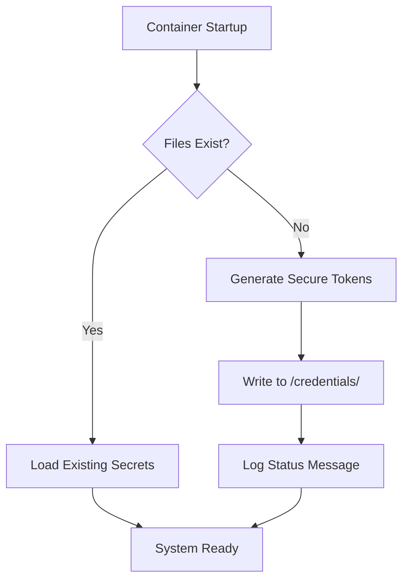
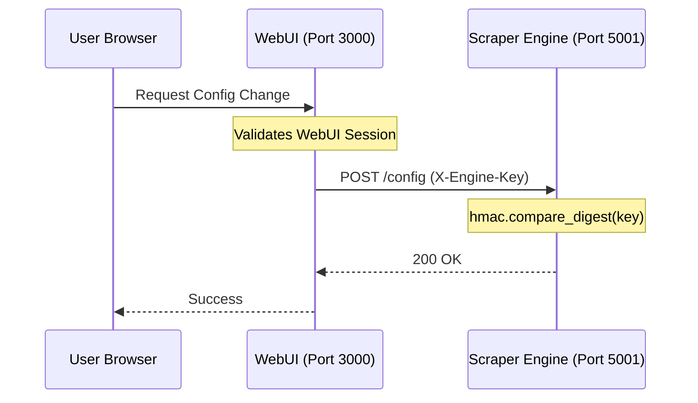

<details>
<summary>Relevant source files</summary>

The following files were used as context for generating this wiki page:

- [README.md](README.md)
- [SECURITY.md](SECURITY.md)
- [CLAUDE.md](CLAUDE.md)
- [AGENTS.md](AGENTS.md)
- [scraper/scraper.py](scraper/scraper.py)
- [webui/app.py](webui/app.py)
- [webui/templates/config.html](webui/templates/config.html)
</details>

# Secure Secrets Management

## Introduction
The Scraper platform implements a robust security architecture focused on the automated generation, restricted storage, and strictly controlled access of sensitive credentials. The system is designed to be "production-ready" by ensuring that secrets like database passwords and API keys are never hardcoded, committed to version control, or stored within Docker images.

The scope of secrets management includes database authentication, REST API authorization, WebUI access control, and internal communication between the WebUI and the Scraper Engine. By leveraging environment variables and a dedicated credentials directory with restrictive filesystem permissions, the project mitigates the risk of credential leakage.

## Automated Credential Lifecycle
Secrets are automatically generated upon the first startup of the application. This ensures that every deployment has unique credentials without requiring manual intervention from the operator.

### Generation Logic
The `init_credentials` function in the scraper module handles the creation of the REST API key and the internal engine key using cryptographically secure tokens. On first generation, the API key is logged to stdout for initial retrieval; subsequently it must be read from the credentials file.
Sources: [scraper/scraper.py:166-179](scraper/scraper.py#L166-L179), [scraper/scraper.py:186-199](scraper/scraper.py#L186-L199), [README.md:68-76](README.md#L68-L76)



The following table describes the primary secrets managed by the system:

| Secret | Generated By | Storage Location | Usage |
| :--- | :--- | :--- | :--- |
| `db_password` | Postgres Container | `/credentials/db_password` | PostgreSQL authentication |
| `api_key` | Scraper Container | `/credentials/api_key` | REST API `X-API-Key` authentication |
| `engine_key` | Scraper Container | `/credentials/engine_key` | Internal WebUI-to-Engine auth |
| `webui_password` | Manual/Auto | `/credentials/webui_password` | WebUI Basic Auth |

Sources: [README.md:78-84](README.md#L78-L84), [scraper/scraper.py:166-179](scraper/scraper.py#L166-L179), [webui/app.py:65-80](webui/app.py#L65-L80)

## Storage and Permissions
Secrets are stored in a persistent volume typically mapped to `DOCKER/scraper/credentials/`. The project enforces strict filesystem security at every startup.

### Filesystem Protection
The `entrypoint.sh` script is responsible for setting restrictive permissions on the credentials directory. This ensures that even if the host system is compromised, the secrets remain accessible only to the specific application processes.
Sources: [CLAUDE.md:43](CLAUDE.md#L43), [AGENTS.md:36](AGENTS.md#L36)

### Reading Mechanisms
The system uses a tiered approach to reading secrets, prioritizing file-based secrets (compatible with Docker Secrets) over standard environment variables.
Sources: [webui/app.py:46-52](webui/app.py#L46-L52), [scraper/scraper.py:146-152](scraper/scraper.py#L146-L152)

```python
def read_secret(env_var, default=""):
    path = os.getenv(f"{env_var}_FILE")
    if path and os.path.exists(path):
        with open(path) as f:
            return f.read().strip()
    return os.getenv(env_var, default)
```

Sources: [scraper/scraper.py:146-152](scraper/scraper.py#L146-L152), [webui/app.py:46-52](webui/app.py#L46-L52)

## Authentication Architecture
The platform utilizes several authentication layers to protect different entry points.

### REST API Security
All REST API endpoints (except `/health`) require the `X-API-Key` header. The system performs constant-time string comparisons using `hmac.compare_digest` to prevent timing attacks.
Sources: [README.md:88](README.md#L88), [webui/app.py:82-96](webui/app.py#L82-L96)

### Internal Engine Authentication
The WebUI communicates with the Scraper Engine (running on port 5001) using a separate `X-Engine-Key`. This prevents unauthorized external requests from directly triggering scraper actions or modifying configurations.
Sources: [webui/app.py:65-72](webui/app.py#L65-L72), [scraper/scraper.py:539-550](scraper/scraper.py#L539-L550)



Sources: [webui/app.py:65-72](webui/app.py#L65-L72), [scraper/scraper.py:546-550](scraper/scraper.py#L546-L550)

## Credential Rotation and Management
Users can manage and rotate credentials directly through the WebUI under the **Advanced Settings** section.

### Supported Operations
- **Database Username Rotation**: Renames the PostgreSQL user immediately.
- **Database Password Rotation**: Updates the PostgreSQL user password and re-initializes the application's internal connection pool.
- **Discord Webhook**: Users can manually provide a Discord webhook URL for price alerts by creating the `discord_webhook` file in the credentials directory.

Sources: [webui/templates/config.html:125-144](webui/templates/config.html#L125-L144), [scraper/scraper.py:819-858](scraper/scraper.py#L819-L858), [README.md:84](README.md#L84)

## Security Best Practices Compliance
The repository explicitly defines security policies and development constraints:
1. **No Version Control**: `.env` files and credentials must never be committed. Sources: [SECURITY.md:16](SECURITY.md#L16), [AGENTS.md:52](AGENTS.md#L52)
2. **Environment Isolation**: Secrets are injected via environment variables or file paths. Sources: [SECURITY.md:15](SECURITY.md#L15)
3. **Restricted Agent Access**: AI agents are forbidden from modifying secrets or GitHub organization settings. Sources: [AGENTS.md:47](AGENTS.md#L47)
4. **Vulnerability Reporting**: Private reporting via GitHub's private reporting feature is mandated over public issues. Sources: [SECURITY.md:8-12](SECURITY.md#L8-L12)

## Summary
Secure Secrets Management in the Scraper platform is characterized by its "set and forget" automation. By combining automated generation, restrictive filesystem permissions, and multi-layered header-based authentication, the system provides a secure environment for web scraping and price monitoring without placing an undue burden on the end user for credential configuration.
