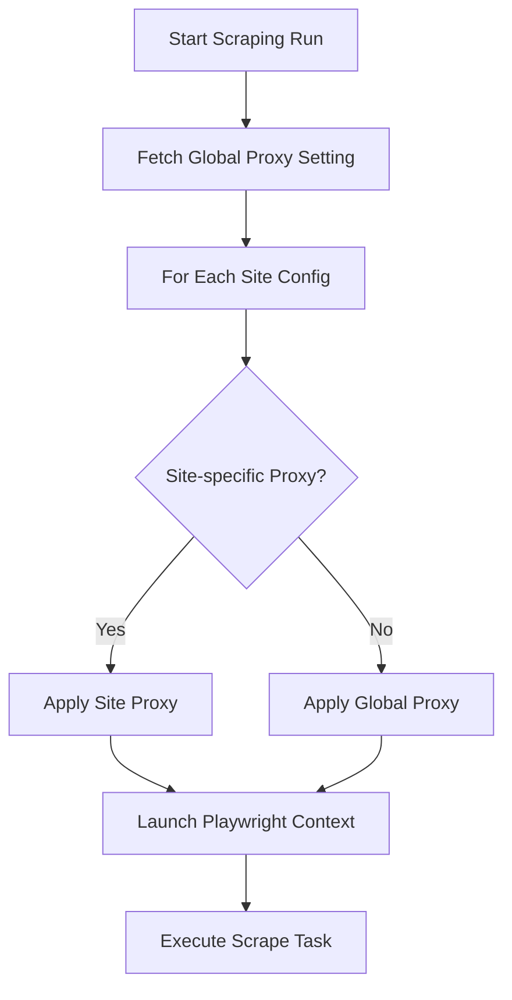
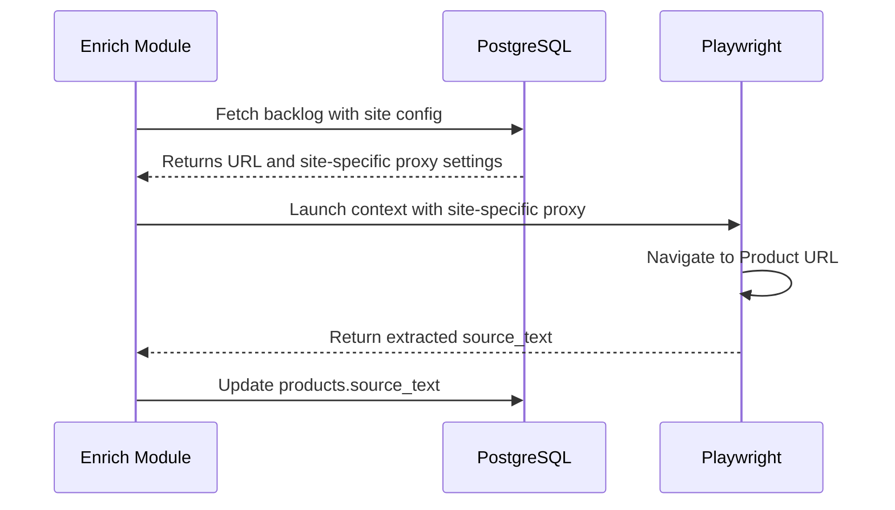

<details>
<summary>Relevant source files</summary>

The following files were used as context for generating this wiki page:

- [scraper/scraper.py](scraper/scraper.py)
- [webui/templates/config.html](webui/templates/config.html)
- [scraper/enrich.py](scraper/enrich.py)
- [README.md](README.md)
- [CHANGELOG.md](CHANGELOG.md)
</details>

# SOCKS5/HTTP Proxy Support

The Web Scraper Platform provides a robust proxy infrastructure to ensure reliable data extraction and prevent IP-based blocking. The system supports both SOCKS5 and HTTP proxy protocols, which can be applied globally across all scraping tasks or configured specifically for individual site targets. This flexibility is critical for bypassing anti-bot measures such as Akamai, Cloudflare, and PerimeterX.

The proxy logic is integrated directly into the Playwright-based scraping engine, allowing for seamless rotation and identity management. By routing traffic through external nodes, the platform minimizes the risk of the host server's IP being blacklisted by e-commerce providers.

Sources: [README.md:12](README.md#L12), [scraper/scraper.py:65-72](scraper/scraper.py#L65-L72), [scraper/scraper.py:616-620](scraper/scraper.py#L616-L620)

## Proxy Architecture and Flow

The platform utilizes a hierarchical proxy resolution strategy. When a scraping job is initiated, the system first checks if a specific proxy is defined for the target site's configuration. If no site-specific proxy exists, it falls back to a global proxy setting defined in the system settings.

### Proxy Selection Logic

The following diagram illustrates how the scraper determines which proxy to use for a given request:



The selection logic ensures that high-priority or sensitive sites can use dedicated proxy resources while general scraping uses a shared pool.
Sources: [scraper/scraper.py:643-662](scraper/scraper.py#L643-L662)

## Configuration and Implementation

Proxies are configured via the WebUI or directly in the database. The platform supports standard URI formats for proxy definition, including optional authentication credentials.

### Configuration Parameters

| Parameter | Type | Scope | Description |
|-----------|------|-------|-------------|
| `proxy_url` | String | Global | The default SOCKS5/HTTP proxy for all scraping requests. |
| `proxy_url` | String | Per-Site | Overrides the global proxy for a specific site configuration. |

Sources: [scraper/scraper.py:65-72](scraper/scraper.py#L65-L72), [scraper/scraper.py:203](scraper/scraper.py#L203), [webui/templates/config.html:79-81](webui/templates/config.html#L79-L81)

### Code Implementation Details

The implementation leverages the `proxy` parameter in the Playwright `browser.new_context()` method. A helper function, `_make_proxy`, is used to format the URL and log the proxy usage (with credentials masked for security).

```python
# scraper/scraper.py:616-620
def _make_proxy(url):
    if not url:
        return None
    display = url.split('@')[-1] if '@' in url else url
    logger.info(f"Using proxy: {display}")
    return {"server": url}
```

Sources: [scraper/scraper.py:616-620](scraper/scraper.py#L616-L620)

When creating a worker for a specific configuration, the system applies the proxy as follows:

```python
# scraper/scraper.py:643-655
async def worker(cfg):
    site_proxy = _make_proxy(cfg.get('proxy_url') or global_proxy_url)
    context = await browser.new_context(
        # ... other browser settings ...
        proxy=site_proxy,
    )
```

Sources: [scraper/scraper.py:643-655](scraper/scraper.py#L643-L655)

## Integration with Stealth Mode

Proxy support is often used in conjunction with "Stealth Mode" to bypass advanced bot protection. While proxies hide the source IP, Stealth Mode (using `playwright-stealth`) modifies browser fingerprints to appear as a regular user. Per-site configurations allow enabling both features simultaneously for problematic sites like `Komplett.se`, which is known to require proxies and stealth to bypass Akamai protection.

Sources: [CHANGELOG.md:46-51](CHANGELOG.md#L46-L51), [webui/templates/config.html:150-155](webui/templates/config.html#L150-L155), [scraper/scraper.py:643-660](scraper/scraper.py#L643-L660)

## Enrichment and Product Detail Processing

The proxy configuration is also respected by the `enrich.py` module, which performs one-shot, resumable product-page enrichment. This ensures that even when visiting individual product pages to extract detailed source text, the platform maintains its anonymity and respects site-specific routing rules.



Sources: [scraper/enrich.py:114-124](scraper/enrich.py#L114-L124), [scraper/enrich.py:141-150](scraper/enrich.py#L141-L150)

## Summary

Proxy support in the Web Scraper Platform is a dual-layered system providing both global and granular control. By integrating this support directly into the Playwright lifecycle across both the main scraper and the enrichment module, the platform ensures consistent anonymity and reliability across all data acquisition workflows. This architecture allows users to optimize proxy costs by only using expensive residential proxies for sites that strictly enforce IP-based rate limits or geo-blocking.

Sources: [scraper/scraper.py:643-662](scraper/scraper.py#L643-L662), [scraper/enrich.py:141-150](scraper/enrich.py#L141-L150)
